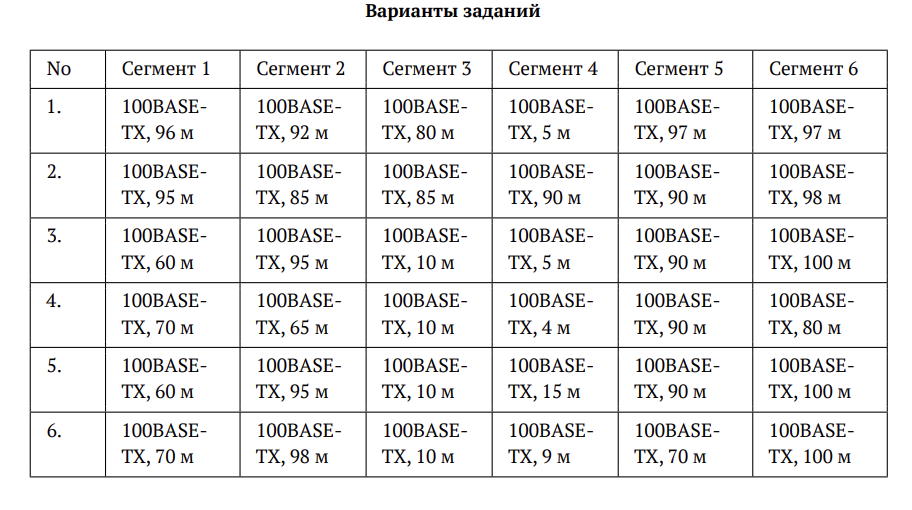
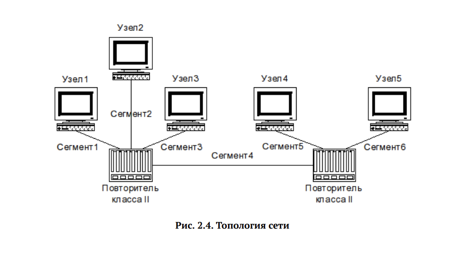
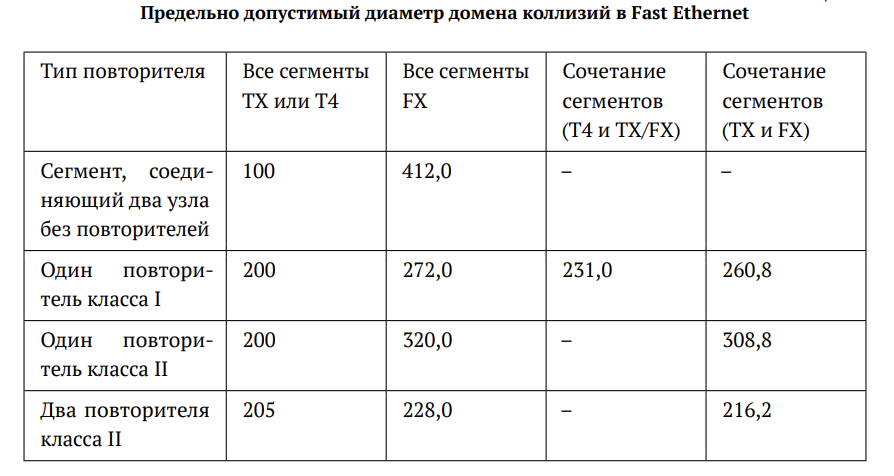
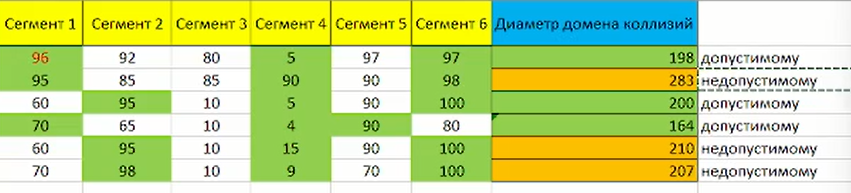
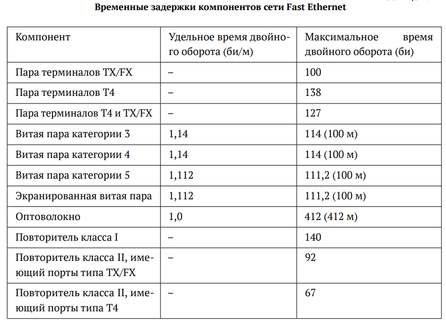

---
## Author
author:
  name:  БАХИ СИДИ АЛИ ТЕМАССИНИ
  degrees: Student (3 курс)
  orcid: ""
  email: 1032234211@pfur.ru
  affiliation:
    - name: Российский университет дружбы народов
      country: Российская Федерация
      postal-code: 117198
      city: Москва
      address: ул. Миклухо-Маклая, д. 6
## Title
title: Лабораторная работа №2
subtitle: "Дисциплина: Сетевые технологии"
license: CC BY
date: today
date-format: "YYYY-MM-DD" # Example: 2025-09-06
---

## Цели и задачи

- Цель данной работы — изучение принципов технологий Ethernet и Fast Ethernet и практическое освоение методик оценки работоспособности сети, построенной на базе технологии Fast Ethernet.

# Задание

## Задание

- Оценить работоспособность 100-мегабитной сети Fast Ethernet в соответствии с первой и второй моделями.

{ #fig:1 width=60% }

## Задание

{ #fig:2 width=60% }

# Выполнение лабораторной работы

## Первая модель

{ #fig:3 width=80% }

## Первая модель

{ #fig:4 width=80% }

## Вторая модель

- В нашей конфигурации все сегменты 100BASE-TX.

{ #fig:5 width=40% }

## Время двойного оборота на сегментах

{ #fig:6 width=60% }

## Вторая модель

- Время двойного оборота двух повторителей класса II (92 би/м)
- Время пары терминалов с интерфейсами TX (100 би/м)
- 4 битовых интервала для учета задержек 

{ #fig:7 width=80% }

## Вывод

- В ходе выполнения лабораторной работы были изучены принципы технологий Ethernet и Fast Ethernet. Также были практически освоены методики оценки работоспособности сети, построенной на базе технологии Fast Ethernet.