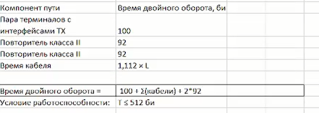
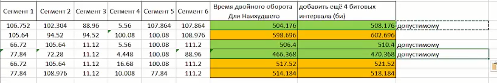

---
## Author
author:
  name: БАХИ СИДИ АЛИ ТЕМАССИНИ
  degrees: Student (3 курс)
  orcid: ""
  email: 1032234211@pfur.ru
  affiliation:
    - name: Российский университет дружбы народов
      country: Российская Федерация
      postal-code: 117198
      city: Москва
      address: ул. Миклухо-Маклая, д. 6

## Title
title: "Отчёт по лабораторной работе №2"
subtitle: "Дисциплина: Сетевые технологии"
license: "CC BY"
---

# Цель работы

Цель данной работы — изучение принципов технологий Ethernet и Fast Ethernet и практическое освоение методик оценки работоспособности сети, построенной на базе технологии Fast Ethernet.

# Задание

В данной лабораторной работе требуется оценить работоспособность 100-мегабитной сети Fast Ethernet в соответствии с первой и второй моделями.

Нам даны конфигурации сети (рис. [-@fig:1]) и топология сети (рис. [-@fig:2]).

{ #fig:1 width=80% }

{ #fig:2 width=80% }

# Выполнение лабораторной работы

Для начала оценим работоспособность с помощью первой модели. Требуется высчитать диаметр домена коллизий и сравнить его с референтным значением. Так как по условию у нас имеются два повторителя класса II и все сегменты TX (а именно 100BASE-TX), то в соответствии с таблицей (рис. [-@fig:3]) получаем, что предельно допустимый диаметр домена коллизий в Fast Ethernet 205 м.

{ #fig:3 width=80% }

Посчитаем суммы длин сегментов в каждой строке и сравним их с референтным значением. Результаты меньше 205 м отмечаем зеленым - это работоспособные сети (1, 3 и 4) (рис. [-@fig:4]).

{ #fig:4 width=80% }

Теперь оценим работоспособность сети с помощью второй модели. Для этого требуется найти наихудшие пути в домене коллизий, определить сегменты. В нашей конфигурации все сегменты 100BASE-TX и используется витая пара категории 5. Рассчитаем время для двойного оборота на сегментах, умножая длину сегмента на удельное время двойного оборота 1,112 би/м, исходя из таблицы (рис. [-@fig:5]).

{ #fig:5 width=80% }

Для каждой строки перемножим значения сегментов наихудшего пути и удельное время двойного оборота сегментов, полученные значения сложим (рис. [-@fig:6]).

{ #fig:6 width=80% }

Затем к получившейся сумме добавим время двойного оборота двух повторителей класса II (92 би/м для каждого) и пары терминалов с интерфейсами TX (100 би/м). Также добавим 4 битовых интервала для учета задержек и сравним результат с числом 512. Результаты меньше 512 указывают нам на работоспособные сети (выделены зеленым) (рис. [-@fig:7]).

{ #fig:7 width=80% }

В результате рабочими остаются те же варианты сетей, что и по первой модели (сети 1, 3 и 4).

# Выводы

В ходе выполнения лабораторной работы были изучены принципы технологий Ethernet и Fast Ethernet. Также были практически освоены методики оценки работоспособности сети, построенной на базе технологии Fast Ethernet.

