---
## Author
author:
  name:  БАХИ СИДИ АЛИ ТЕМАССИНИ
  degrees: Student (3 курс)
  orcid: ""
  email: 1032234211@pfur.ru
  affiliation:
    - name: Российский университет дружбы народов
      country: Российская Федерация
      postal-code: 117198
      city: Москва
      address: ул. Миклухо-Маклая, д. 6
## Title
title: Лабораторная работа №3
subtitle: "Дисциплина: Сетевые технологии"
license: CC BY
date: today
date-format: "YYYY-MM-DD" # Example: 2025-09-06
---

## Цели и задачи

- Изучение посредством Wireshark кадров Ethernet, анализ PDU протоколов транспортного и прикладного уровней стека TCP/IP.

# Выполнение лабораторной работы

# MAC-адресация

## ipconfig

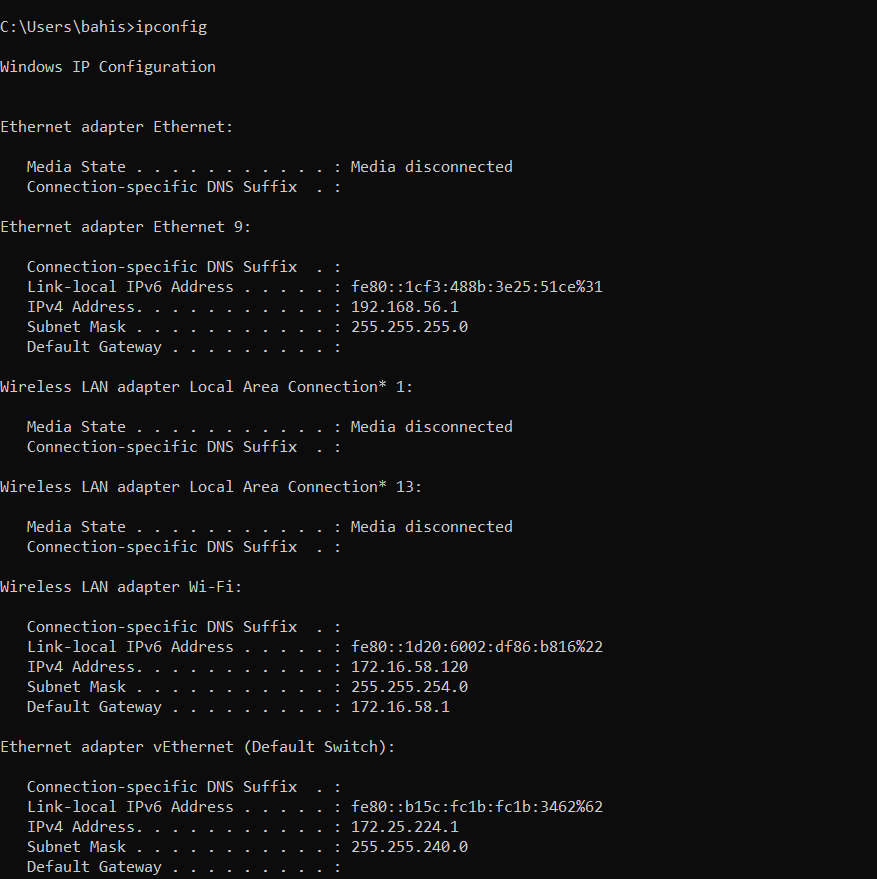{#fig:1 width=45%}

## ipconfig /all

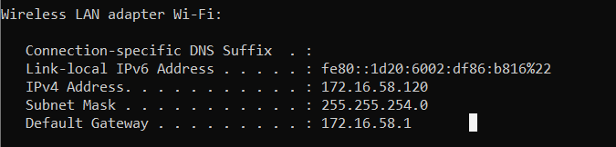{#fig:2 width=45%}

#  Анализ кадров канального уровня в Wireshark

## Wireshark

{#fig:3 width=70%}

## Пинг

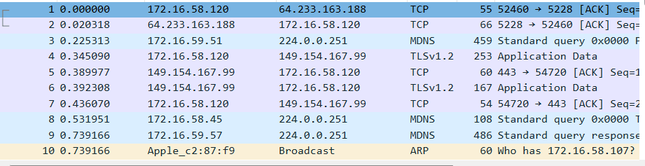{#fig:4 width=70%}

## Фильтр ICMP

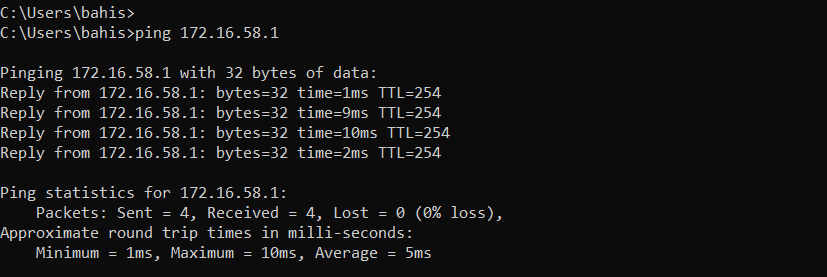{#fig:5 width=70%}

## Фильтр ICMP

{#fig:6 width=80%}

## Фильтр ARP

{#fig:7 width=50%}

## Пинг

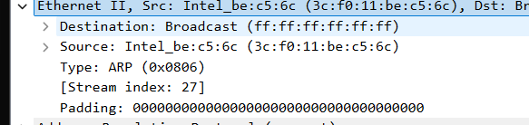{#fig:8 width=80%}

## Фильтр ICMP

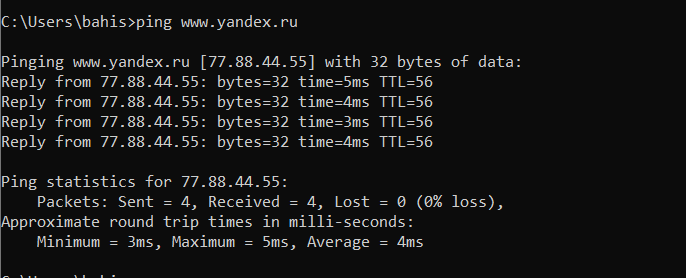{#fig:9 width=80%}

## Фильтр ICMP

{#fig:10 width=80%}

## Фильтр ICMP

{#fig:11 width=50%}

# Анализ протоколов транспортного уровня в Wireshark

## http://info.cern.ch/

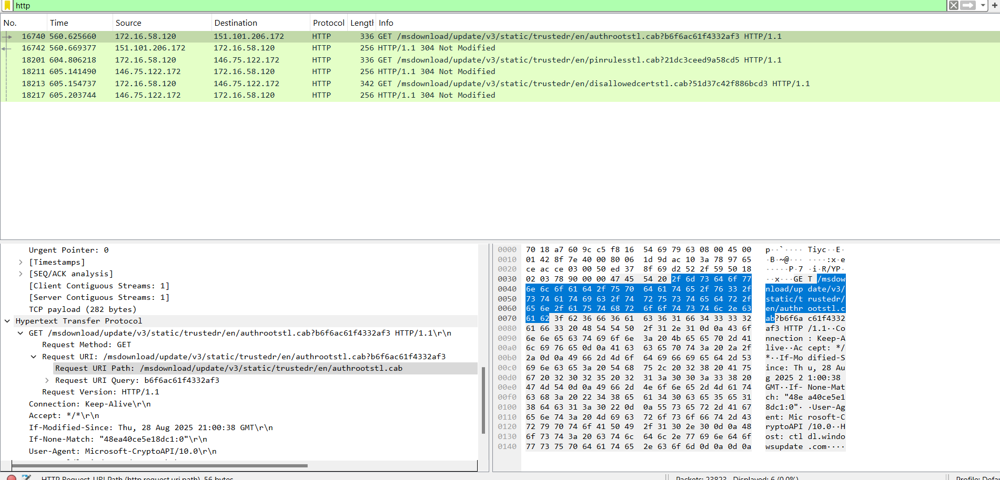{#fig:12 width=70%}

## http://info.cern.ch/

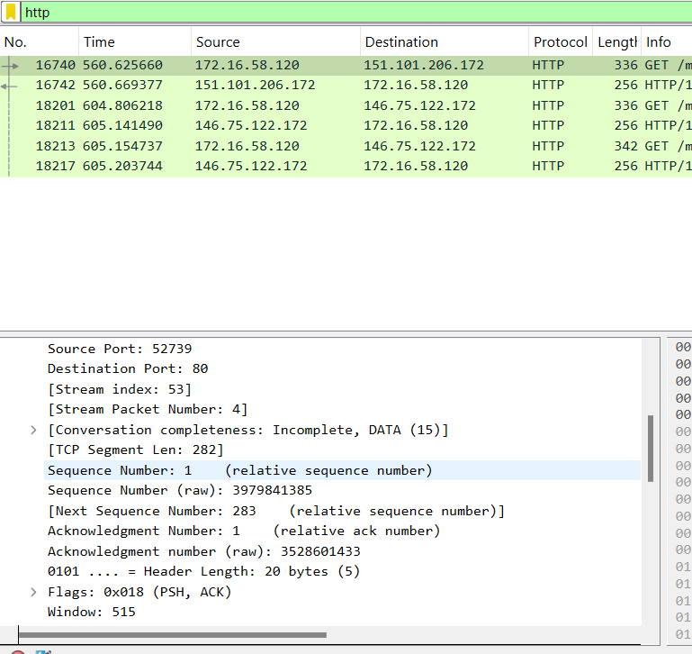{#fig:13 width=70%}

## Фильтр dns

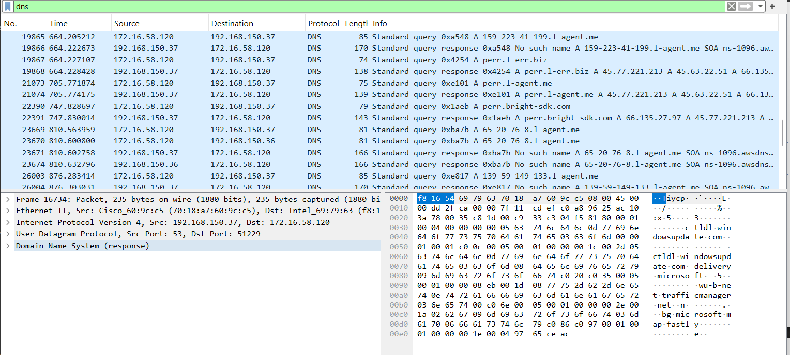{#fig:14 width=70%}

## Фильтр dns

{#fig:15 width=50%}

## Фильтр quic

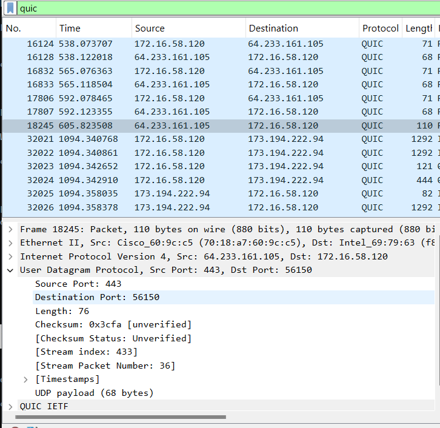{#fig:16 width=70%}

# Анализ handshake протокола TCP в Wireshark

## handshake

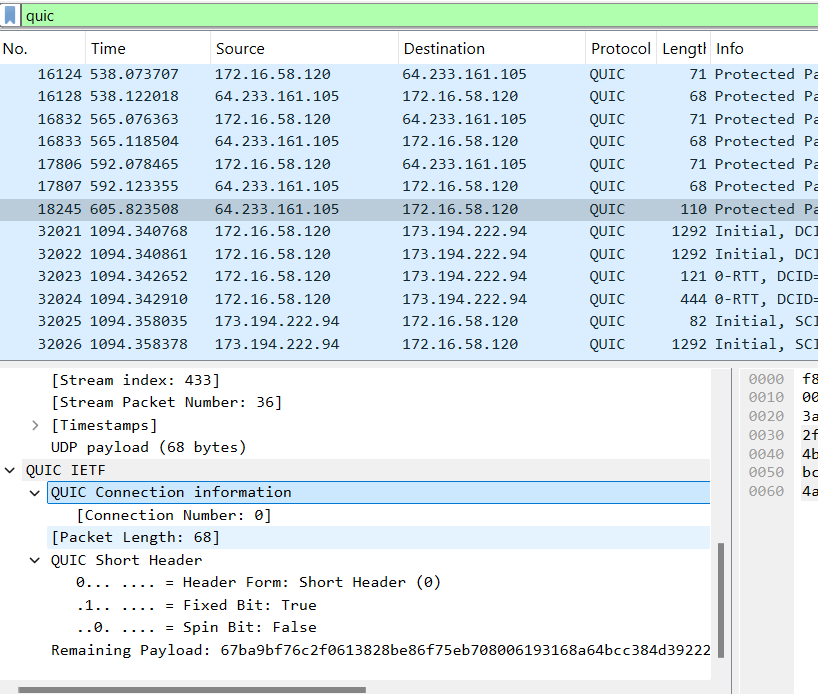{#fig:17 width=70%}

## handshake

{#fig:18 width=70%}

## handshake

{#fig:19 width=70%}

## График потока

{#fig:20 width=70%}

## Вывод

- В результате выполнения работы были изучены посредством Wireshark кадры Ethernet, произведен анализ PDU протоколов транспортного и прикладного уровней стека TCP/IP.