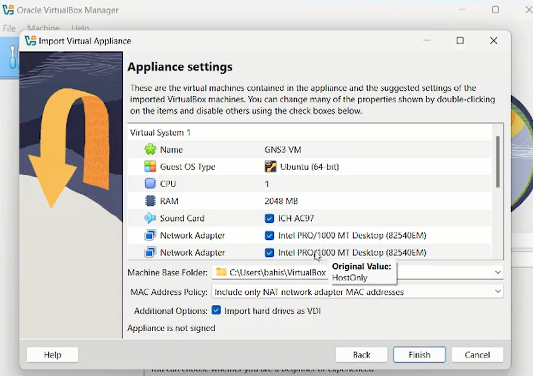
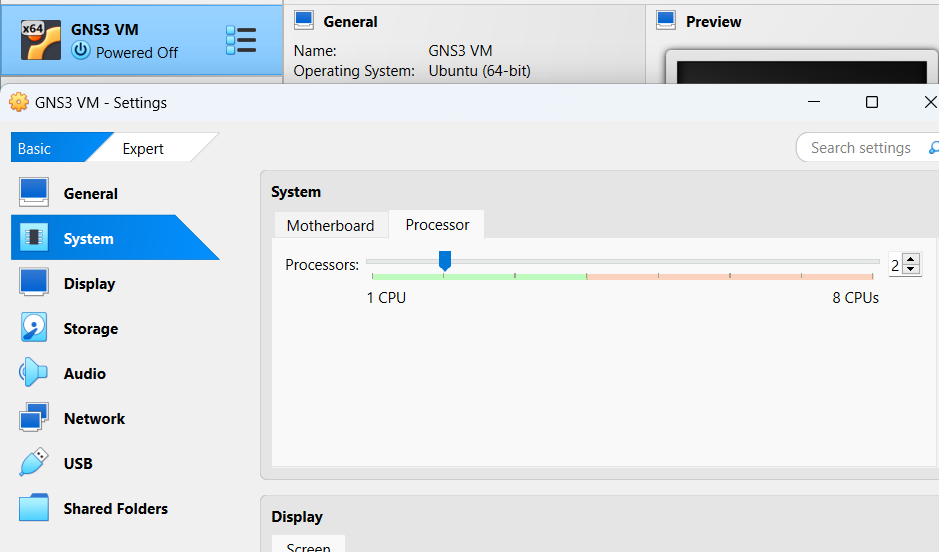
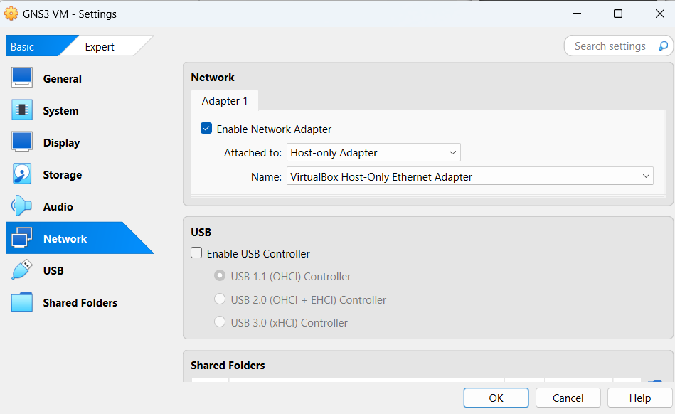
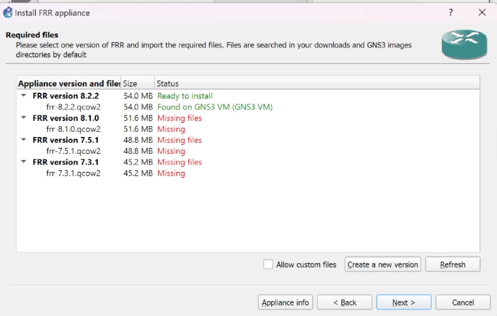
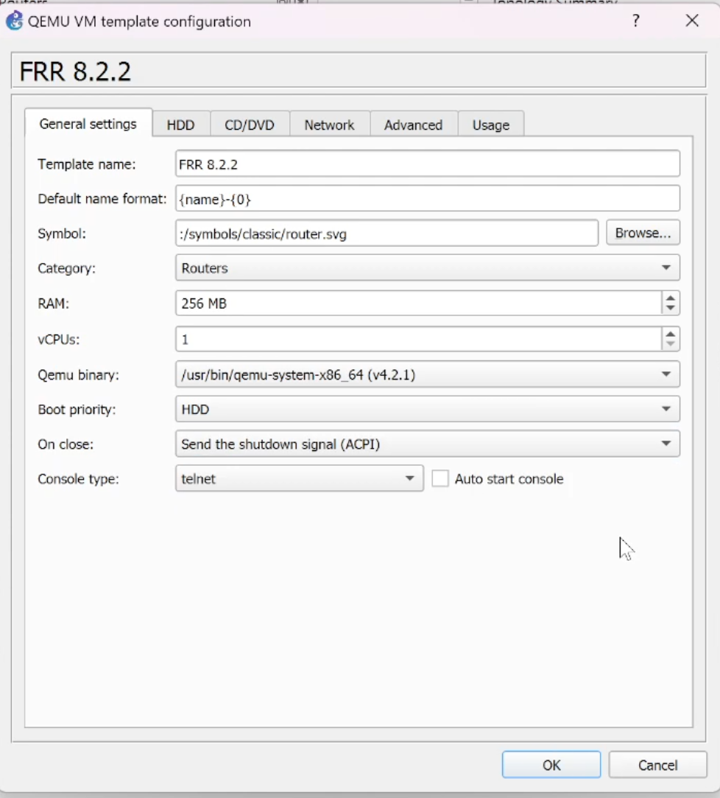
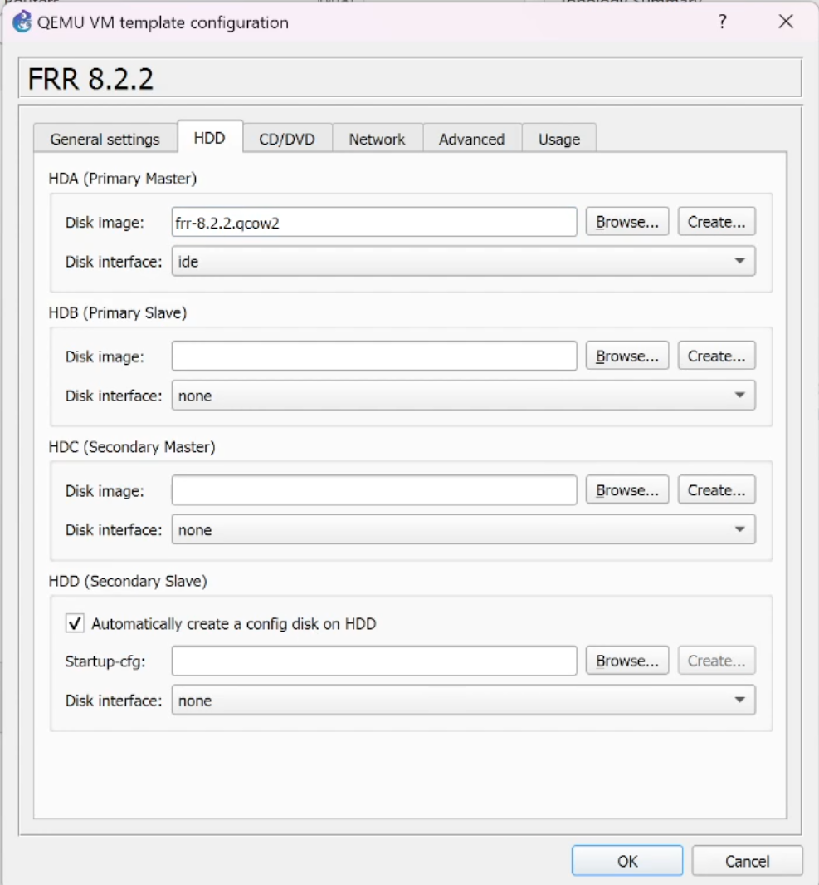
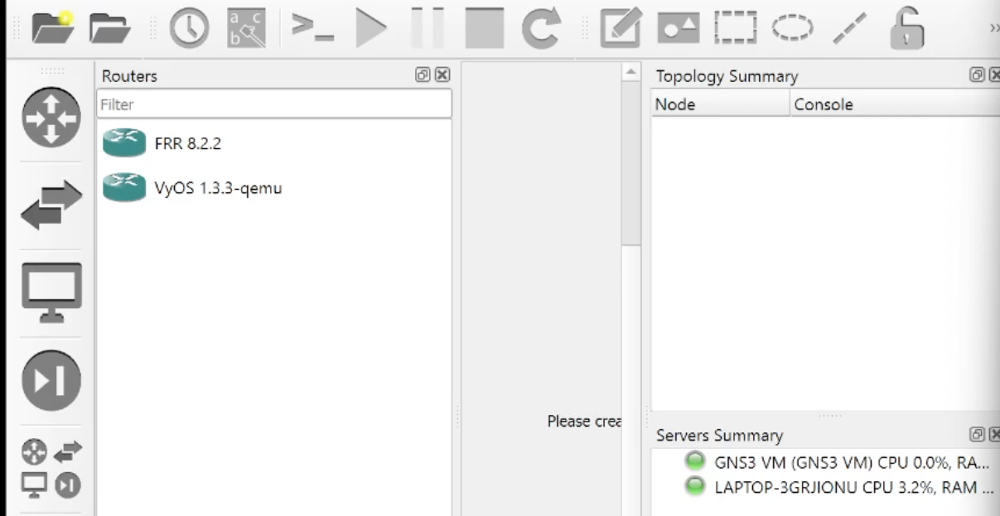

---
## Author
author:
  name:  БАХИ СИДИ АЛИ ТЕМАССИНИ
  degrees: Student (3 курс)
  orcid: ""
  email: 1032234211@pfur.ru
  affiliation:
    - name: Российский университет дружбы народов
      country: Российская Федерация
      postal-code: 117198
      city: Москва
      address: ул. Миклухо-Маклая, д. 6
## Title
title: Лабораторная работа №4
subtitle: "Дисциплина: Сетевые технологии"
license: CC BY
date: today
date-format: "YYYY-MM-DD" # Example: 2025-09-06
---

## Цель работы

**Цель работы:**

Установка и настройка GNS3 и сопутствующего программного обеспечения.

## Задание

1. Установить GNS3-all-in-one, GNS3 VM, проверить корректность запуска.

2. Импортировать в GNS3 образ маршрутизатора FRR.

3. Импортировать в GNS3 образ маршрутизатора VyOS.

## Выполнение лабораторной работы

**Установка GNS3**

**Установка GNS3-all-in-one**

{#fig:1 width=60%}

## Установка GNS3-all-in-one

{#fig:2 width=60%}

## Установка GNS3 VM для VirtualBox

{#fig:3 width=30%}

## Настройка ВМ

{#fig:4 width=70%}

## Настройка ВМ

{#fig:5 width=70%}

## Настройка ВМ

{#fig:6 width=60%}

## Запуск экземпляра GNS3 в VirtualBox

{#fig:7 width=50%}

## Подключение к серверу

{#fig:8 width=60%}

## Подключение к серверу

{#fig:9 width=80%}

## Подключение образа оборудования в GNS3

 **Добавление образа маршрутизатора FRR**

{#fig:10 width=60%}

## Добавление образа маршрутизатора FRR

{#fig:11 width=70%}

## Настройка образа

{#fig:12 width=40%}

## Настройка образа

{#fig:13 width=40%}

## Добавление образа маршрутизатора VyOS

{#fig:14 width=70%}

## Настройка образа

{#fig:15 width=40%}

## Настройка образа

{#fig:16 width=70%}

## Выводы

- В результате выполнения работы была произведена установка и настройка GNS3 и сопутствующего программного обеспечения.