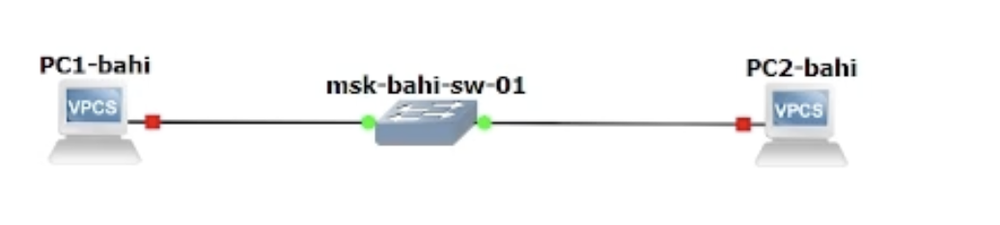
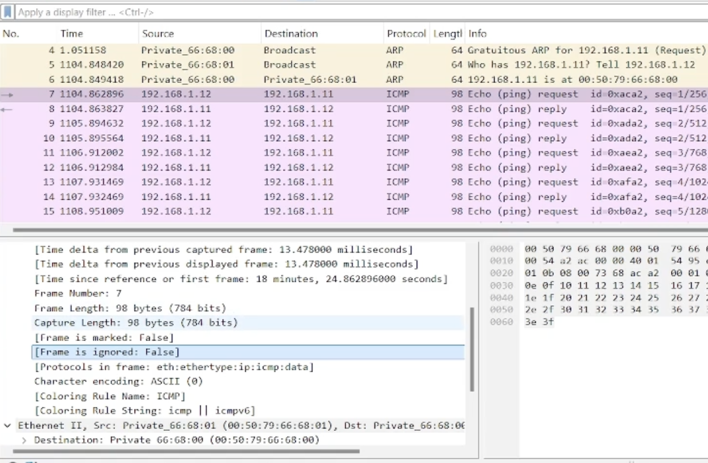
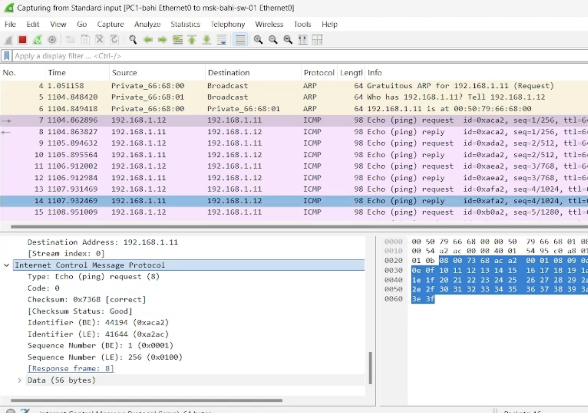
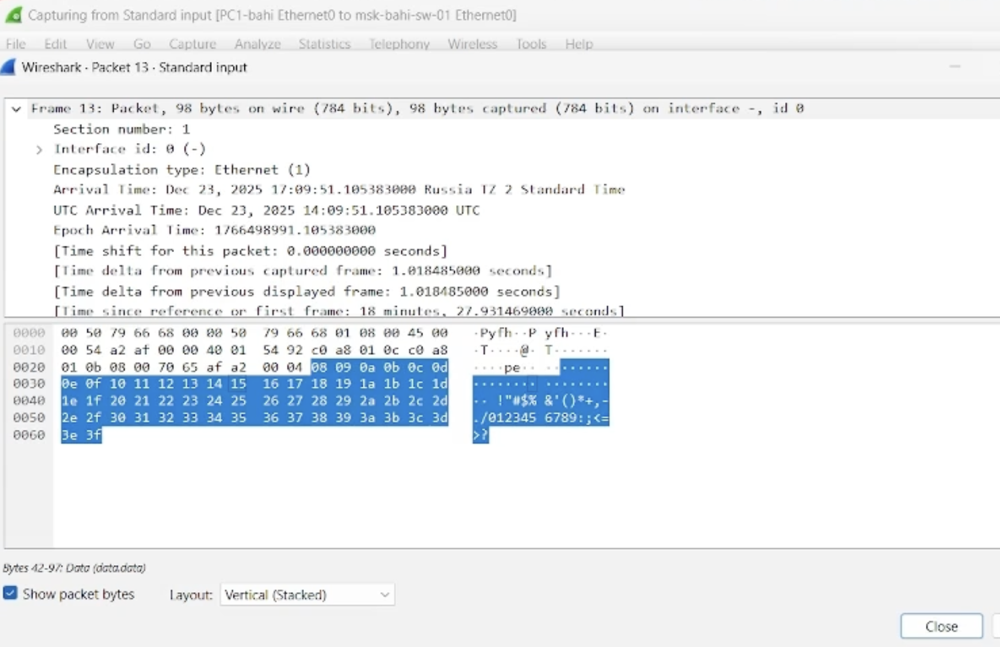
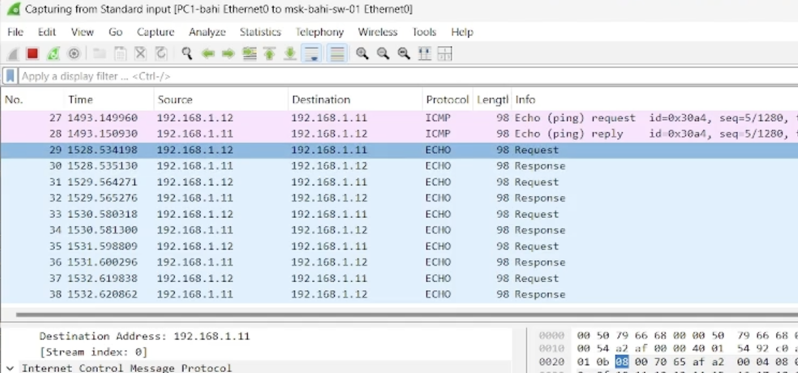
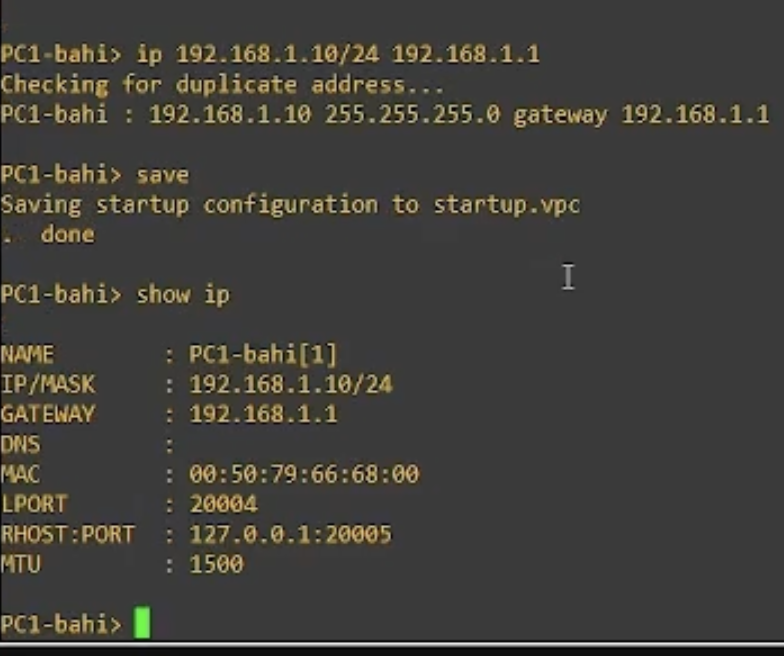
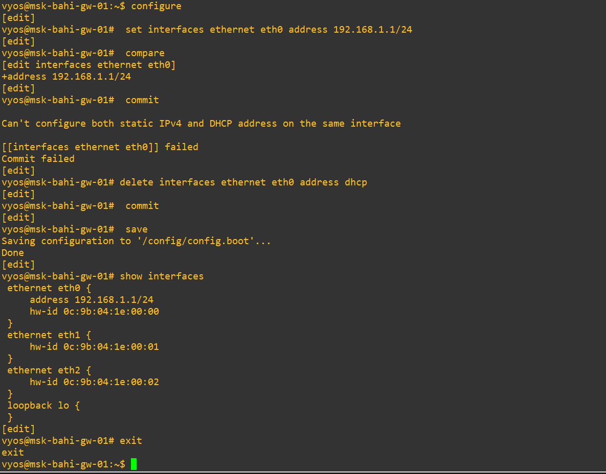

---
## Author
author:
  name: БАХИ СИДИ АЛИ ТЕМАССИНИ
  degrees: Student (3 курс)
  orcid: ""
  email: 1032234211@pfur.ru
  affiliation:
    - name: Российский университет дружбы народов
      country: Российская Федерация
      postal-code: 117198
      city: Москва
      address: ул. Миклухо-Маклая, д. 6
## Title
title: Лабораторная работа №5
subtitle: "Дисциплина: Сетевые технологии"
license: CC BY
date: today
date-format: "YYYY-MM-DD" # Example: 2025-09-06
---

## Цель работы

- Построение простейших моделей сетей в GNS3
- Использование коммутатора и маршрутизаторов FRR и VyOS
- Анализ сетевого трафика с помощью Wireshark

## Запуск GNS3 и создание топологии

- Запущены GNS3 VM и GNS3
- Создан новый проект
- Размещены коммутатор Ethernet и два узла VPCS
- Устройства переименованы по шаблону
- Отображены интерфейсы соединений

## Настройка IP-адресации PC-1

- Открыт терминал PC-1
- Назначен IPv4-адрес `192.168.1.11/24`
- Указан шлюз `192.168.1.1`
- Конфигурация сохранена

## Настройка IP-адресации PC-2

- Назначен IPv4-адрес `192.168.1.12/24`
- Выполнена проверка доступности PC-1
- Получен ICMP эхо-ответ

## Проверка связи между PC-1 и PC-2

- Выполнен `ping` с PC-1 на PC-2
- Получены 5 ICMP-ответов
- Связность подтверждена

## Остановка узлов проекта

- Все устройства проекта остановлены
- Подготовка к захвату трафика

## Запуск захвата трафика в Wireshark

- Включён Start capture на линии PC-1 ↔ коммутатор
- Запущены все узлы
- Захват трафика активен

## Анализ ARP-пакетов

- Зафиксированы ARP / Gratuitous ARP
- MAC назначения: broadcast `ff:ff:ff:ff:ff:ff`
- Длина кадра: 64 байта

## ICMP Echo Request (PC-2 → PC-1)

- Выполнен одиночный ICMP-запрос
- Использована опция `-1`
- Проверка базовой связности

## Анализ ICMP в Wireshark

- MAC-адреса: unicast
- Протокол: ICMP
- Источник: `192.168.1.12`
- Назначение: `192.168.1.11`

## UDP Echo Request

- Выполнен UDP-эхо-запрос
- Использована опция `-2`
- Проверка работы UDP

## Анализ UDP-пакетов

- Протокол: UDP
- Порт источника: динамический
- Порт назначения: `7 (Echo)`

## TCP Echo Request

- Выполнен TCP-эхо-запрос
- Использована опция `-3`
- Установлено TCP-соединение

## TCP: этап SYN

- Начало трёхэтапного рукопожатия
- Флаг SYN
- Начальный Sequence Number

## TCP: этап SYN-ACK

- Ответ принимающей стороны
- Подтверждение запроса

## TCP: этап ACK

- Завершение установки соединения
- TCP-соединение установлено

## Топология с маршрутизатором FRR

- Добавлен маршрутизатор FRR
- Включён захват трафика
- Узлы переименованы

## IP-адресация PC-1 (FRR)

- Назначен адрес `192.168.1.10/24`
- Указан шлюз `192.168.1.1`
- Проверка конфигурации

## IP-адресация FRR

- Настроен интерфейс маршрутизатора
- Проверена конфигурация

## Проверка связи PC-1 ↔ FRR

- ICMP-эхо-запросы успешны
- Связность подтверждена

## Анализ ICMP (FRR)

- Протокол: ICMP
- MAC-адреса: unicast
- IP-источник: PC-1
- IP-назначение: FRR

## Топология с маршрутизатором VyOS

- Добавлен маршрутизатор VyOS
- Включён захват трафика
- Узлы запущены

## IP-адресация PC-1 (VyOS)

- Назначен IPv4-адрес
- Подготовка к тестированию

## Вход в систему VyOS

- Логин: `vyos`
- Пароль: `vyos`
- Переход в CLI

## Настройка интерфейса eth0 (VyOS)

- Удалён DHCP
- Назначен адрес `192.168.1.1/24`
- Выполнены `commit` и `save`

## Проверка связи PC-1 ↔ VyOS

- Выполнен `ping`
- Получены 5 ICMP-ответов

## Анализ ICMP (VyOS)

- Протокол: ICMP
- Источник: PC-1
- Назначение: VyOS

## Выводы

- Смоделированы сети с FRR и VyOS
- Проверена IP-связность
- Проанализированы ARP, ICMP, UDP, TCP
- Подтверждена корректность конфигурации

