---
## Author
author:
  name: БАХИ СИДИ АЛИ ТЕМАССИНИ
  degrees: Student (3 курс)
  orcid: ""
  email: 1032234211@pfur.ru
  affiliation:
    - name: Российский университет дружбы народов
      country: Российская Федерация
      postal-code: 117198
      city: Москва
      address: ул. Миклухо-Маклая, д. 6

## Title
title: "Отчёт по лабораторной работе №5"
subtitle: "Дисциплина: Сетевые технологии"
license: "CC BY"
---
## Цель работы

Построить простейшие модели сетей на базе коммутатора и маршрутизаторов FRR и VyOS в GNS3, проанализировать трафик посредством Wireshark.

## Анализ трафика в GNS3 посредством Wireshark

Для начала запустим GNS3 VM и GNS3, а также создадим новый проект.
В рабочей области GNS3 разместим коммутатор Ethernet и два VPCS. В меню Configure изменим название устройства, включив в имя устройства имя моей учётной записи. Коммутатору присвоим название `msk-bahi-sw-01`. Соединим VPCS с коммутатором и отобразим обозначение интерфейсов соединения ([рис. @fig-01]).

{#fig-01 width=70%}

Зададим IP-адреса VPCS. Для этого с помощью меню, вызываемого правой кнопкой мыши, запустим Start PC-1, затем вызовем его терминал Console. Для просмотра синтаксиса возможных для ввода команд можно набрать `/?`. Для задания IP-адреса 192.168.1.11 в сети 192.168.1.0/24 введем команду:
`ip 192.168.1.11/24 192.168.1.1`.
Для сохранения конфигурации введем команду `save` ([рис. @fig-02]).

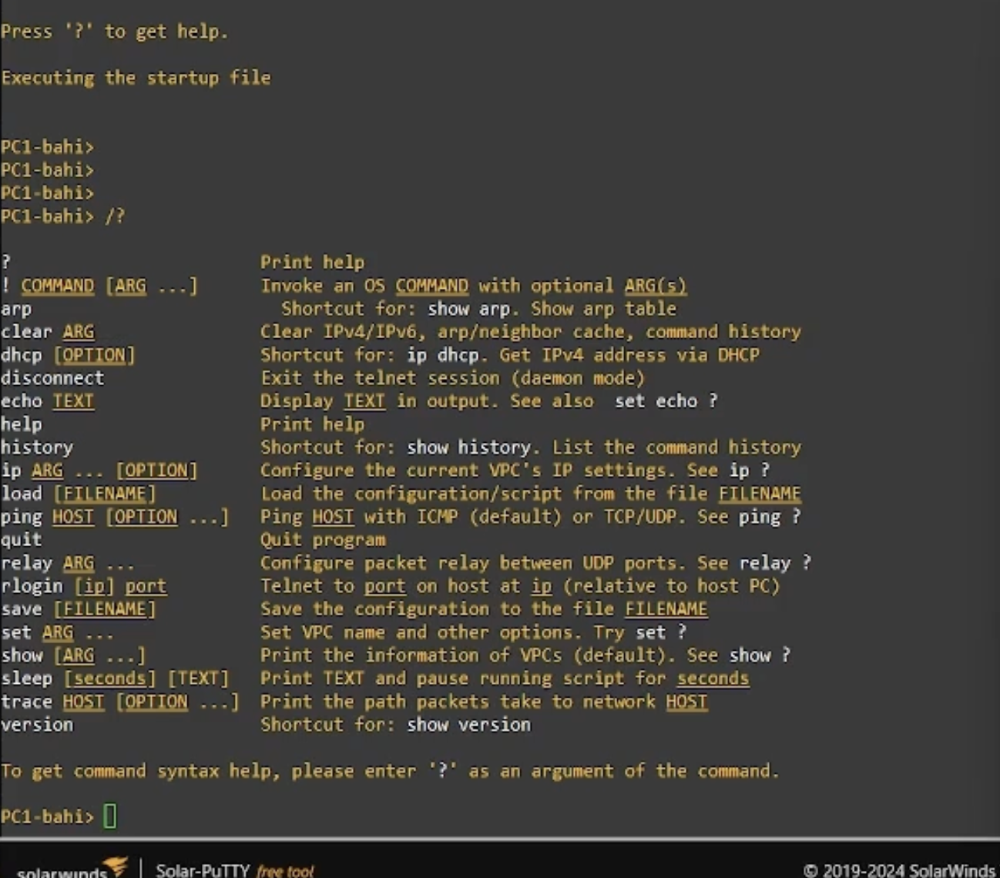{#fig-02 width=70%}

Аналогичным образом зададим IP-адрес 192.168.1.12 для PC-2. После этого выполним проверку доступности PC-1 с помощью команды `ping`. Получаем эхо-ответ от PC-1, что подтверждает корректность настройки сети ([рис. @fig-03]).

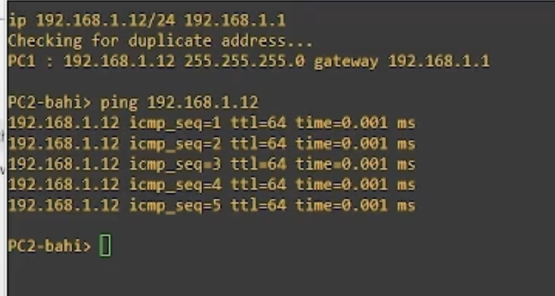{#fig-03 width=70%}

Проверим работоспособность соединения между PC-1 и PC-2. В терминале PC-1 выполним команду `ping 192.168.1.12`. Получаем эхо-ответ от PC-2, возвращены 5 ICMP-пакетов, что свидетельствует о корректной передаче данных между узлами ([рис. @fig-04]).

{#fig-04 width=70%}

Остановим в проекте все узлы ([рис. @fig-05]).

{#fig-05 width=70%}

Запустим анализатор трафика на соединении между PC-1 и коммутатором. Для этого щёлкнем правой кнопкой мыши по соединению и выберем пункт **Start capture**. После запуска Wireshark в проекте GNS3 на линии соединения появляется значок захвата. Затем запустим все узлы проекта ([рис. @fig-06]).

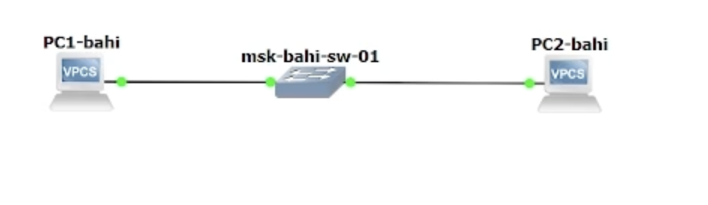{#fig-06 width=70%}

В окне Wireshark отображаются ARP-пакеты ([рис. @fig-07]). В поле физического уровня видно, что длина кадра составляет **64 байта (512 бит)**. На канальном уровне отображаются MAC-адреса источника и назначения: адрес назначения является **широковещательным (ff:ff:ff:ff:ff:ff)**, адрес источника — **глобально уникальным (factory default)** и индивидуальным. Тип передаваемого пакета — **gratuitous ARP**, что соответствует процессу объявления IP-адресов узлами при запуске.

{#fig-07 width=70%}

В терминале PC-2 посмотрим информацию по опциям команды `ping`. Затем выполним один эхо-запрос в ICMP-режиме к узлу PC-1. Для этого используем опцию `-1` ([рис. @fig-08]).

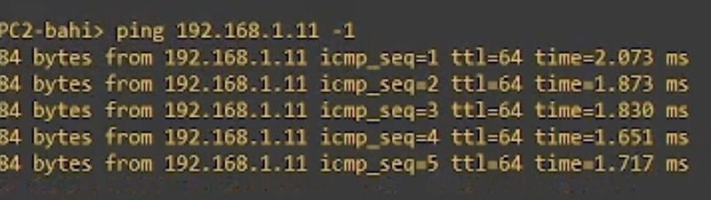{#fig-08 width=70%}

Далее откроем Wireshark и проанализируем эхо-запрос по протоколу ICMP ([рис. @fig-09]) и ([рис. @fig-010]). На канальном уровне видны MAC-адреса источника и получателя, которые являются **глобально уникальными и индивидуальными (unicast)**, что определяется по нулевым значениям LG и IG битов. На сетевом уровне указан протокол ICMP, а также IP-адрес источника **192.168.1.12 (PC-2)** и адрес назначения **192.168.1.11 (PC-1)**.

{#fig-09 width=70%}

{#fig-010 width=70%}

Далее выполним эхо-запрос в UDP-режиме к узлу PC-1, используя опцию `-2` ([рис. @fig-011]).

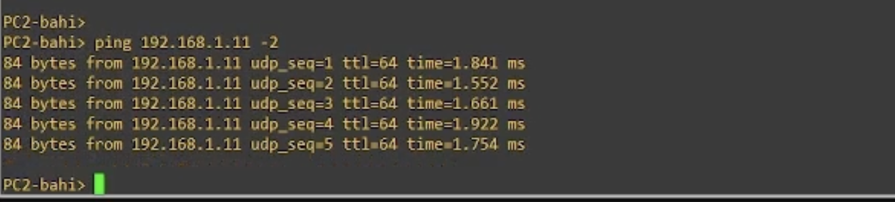{#fig-011 width=70%}

В Wireshark проанализируем переданные пакеты UDP ([рис. @fig-012]) и ([рис. @fig-013]). На канальном уровне MAC-адреса источника и получателя являются **глобально уникальными и индивидуальными**. На сетевом уровне используется протокол UDP, IP-адрес источника — **192.168.1.12 (PC-2)**, IP-адрес назначения — **192.168.1.11 (PC-1)**. На транспортном уровне указаны UDP-порты: порт источника — **19241**, порт назначения — **7 (Echo)**.

{#fig-012 width=70%}

{#fig-013 width=70%}

Затем выполним эхо-запрос в TCP-режиме к узлу PC-1, используя опцию `-3`. В результате устанавливается TCP-соединение, передаются данные и соединение корректно закрывается, что подтверждается выводом терминала PC-2 ([рис. @fig-014]).

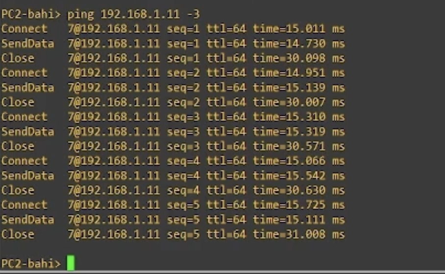{#fig-014 width=70%}

Далее откроем Wireshark и проанализируем эхо-запрос по протоколу TCP. На канальном уровне отображаются MAC-адреса источника и получателя, которые являются **глобально уникальными и индивидуальными (unicast)**, что определяется по нулевым значениям LG и IG битов. На сетевом уровне указан протокол TCP, а также IP-адрес источника **192.168.1.12 (PC-2)** и IP-адрес назначения **192.168.1.11 (PC-1)**.

На транспортном уровне TCP видны порты: порт источника — **28458**, порт назначения — **7 (Echo)**. Также можно проследить процесс установки соединения по механизму **трёхэтапного рукопожатия (three-way handshake)**. На первом этапе передаётся сегмент с установленным флагом **SYN** ([рис. @fig-015]), при этом порядковому номеру (Sequence Number) присваивается начальное значение **ISS**, которое в данном случае определяется автоматически стеком TCP (относительное значение Seq = 0).

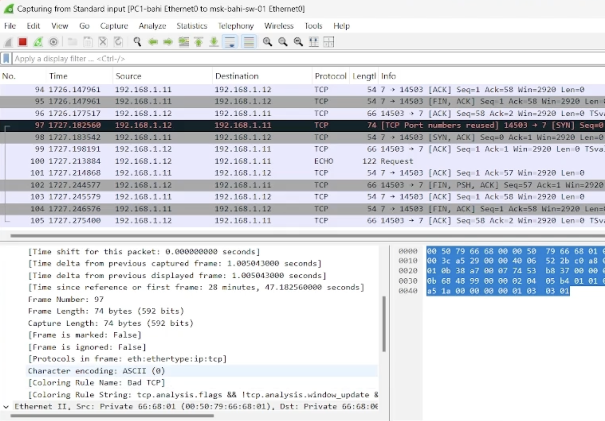{#fig-015 width=70%}

На втором этапе принимающая сторона отвечает сегментом с установленными флагами **SYN и ACK**, подтверждая получение запроса и предлагая свои параметры соединения ([рис. @fig-016]).

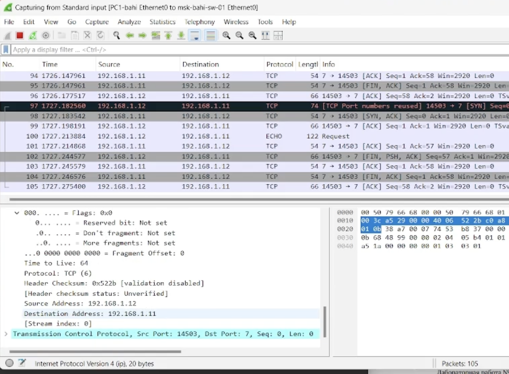{#fig-016 width=70%}

На третьем этапе инициатор соединения отправляет сегмент с установленным флагом **ACK**, тем самым подтверждая получение ответа и завершая установление TCP-соединения ([рис. @fig-017]).

{#fig-017 width=70%}

После завершения анализа можно остановить захват трафика в Wireshark.

## Моделирование простейшей сети на базе маршрутизатора FRR в GNS3

Теперь нам необходимо построить в GNS3 топологию сети ([рис. @fig-018]), состоящей из маршрутизатора FRR, коммутатора Ethernet и оконечного устройства. Изменим отображаемые названия устройств. Коммутатору присвоим имя `msk-bahi-sw-01`, маршрутизатору — `msk-bahi-gw-01`, оконечному устройству VPCS — `PC1-bahi`. Включим захват трафика на соединении между коммутатором и маршрутизатором. После этого запустим все устройства проекта и откроем их консоли.

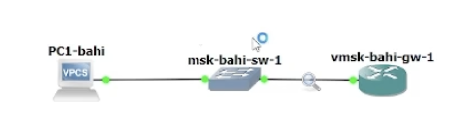{#fig-018 width=70%}

Настроим IP-адресацию для интерфейса узла PC1 ([рис. @fig-019]). В терминале VPCS выполним следующие команды:

```
ip 192.168.1.10/24 192.168.1.1
save
show ip
```

{#fig-019 width=70%}

Далее настроим IP-адресацию для интерфейса локальной сети маршрутизатора FRR. Проверим корректность конфигурации маршрутизатора и назначенных IP-адресов ([рис. @fig-020]).

{#fig-020 width=70%}

Проверим работоспособность соединения. Узел PC1 успешно отправляет ICMP эхо-запросы на IP-адрес маршрутизатора **192.168.1.1**, получая эхо-ответы, что подтверждает корректную настройку сети ([рис. @fig-021]).

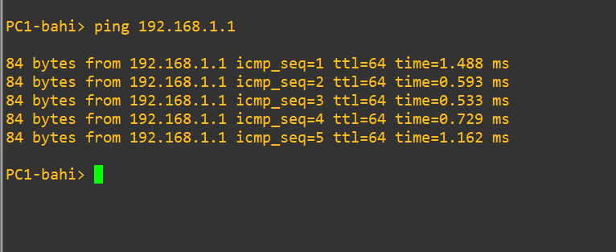{#fig-021 width=70%}

В окне Wireshark проанализируем захваченный трафик ([рис. @fig-022]). На канальном уровне отображаются MAC-адреса источника и получателя, которые являются **глобально уникальными и индивидуальными (unicast)**, что определяется по нулевым значениям LG и IG битов. На сетевом уровне используется протокол **ICMP**, при этом IP-адрес источника — **192.168.1.10 (PC-1)**, IP-адрес назначения — **192.168.1.1 (маршрутизатор FRR)**.

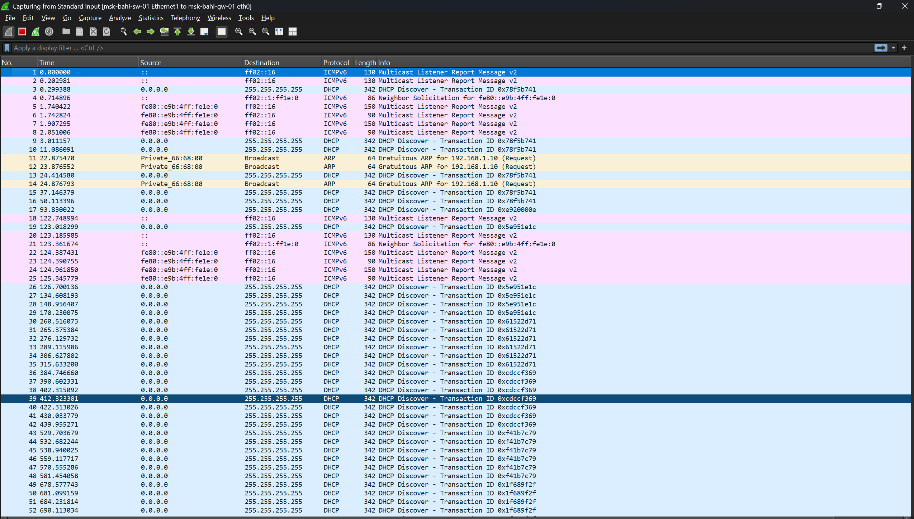{#fig-022 width=70%}

После завершения анализа остановим захват пакетов в Wireshark и выключим все устройства проекта.


## Моделирование простейшей сети на базе маршрутизатора VyOS в GNS3

В рабочей области GNS3 разместим VPCS, коммутатор Ethernet и маршрутизатор VyOS. Изменим отображаемые названия устройств. Коммутатору присвоим название msk-bahi-sw-01, маршрутизатору — по принципу msk-bahi-gw-01, VPCS — по принципу PC1-bahi. Включим захват трафика на соединении между коммутатором и маршрутизатором ([рис. @fig-023]) (появится значок лупы). Запустим все устройства проекта и откроем консоль всех устройств проекта.
 
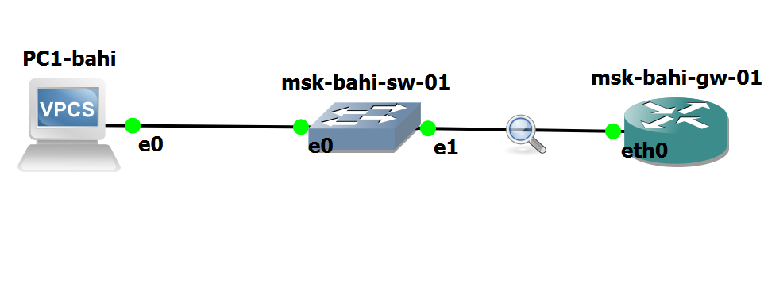{#fig-023 width=70%}

Откроем окно терминала PC-1 и настроим IP-адресацию для интерфейса этого узла ([рис. @fig-024]).
 
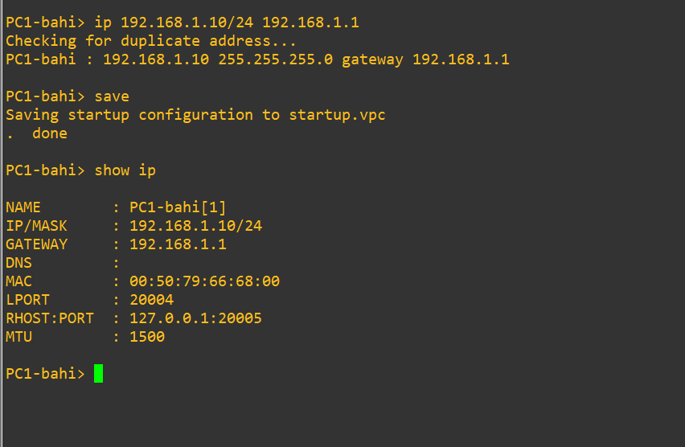{#fig-024 width=70%}

Настроим маршрутизатор VyOS ([рис. @fig-025]). После загрузки маршрутизатора в консоли отображается процесс инициализации системы, после чего появляется приглашение входа. Выполним вход в систему, указав логин `vyos` и пароль `vyos`. После успешной аутентификации открывается рабочий режим командной строки с приглашением `$`.

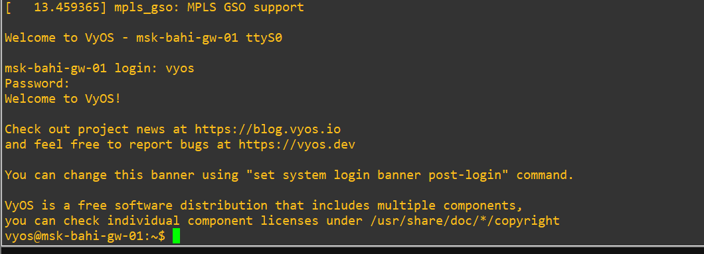{#fig-025 width=70%}

Далее перейдём в режим конфигурирования с помощью команды `configure`. При попытке задать IP-адрес интерфейсу eth0 вне режима конфигурирования система возвращает сообщение об ошибке, после чего настройка выполняется корректно в режиме `[edit]`. Назначим IP-адрес `192.168.1.1/24` интерфейсу `eth0` маршрутизатора. В процессе применения конфигурации возникает сообщение о невозможности одновременного использования статического IPv4-адреса и DHCP на одном интерфейсе, поэтому предварительно удаляется DHCP-настройка.

После этого изменения успешно применяются с помощью команды `commit` и сохраняются командой `save` ([рис. @fig-026]). Для проверки конфигурации выполним команду `show interfaces`, которая подтверждает назначение IP-адреса интерфейсу `eth0`. Завершаем настройку, оставаясь в режиме конфигурирования ([рис. @fig-0261]).

{#fig-026 width=70%}

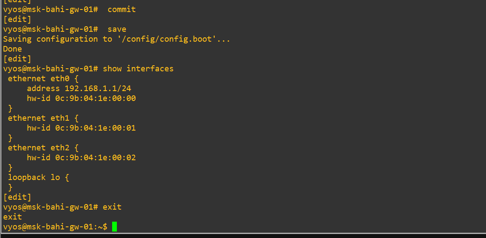{#fig-0261 width=70%}

Теперь проверим подключение. Узел **PC1** успешно отправляет ICMP эхо-запросы на IP-адрес маршрутизатора **192.168.1.1**. Для проверки выполним пинг маршрутизатора ([рис. @fig-027]). В результате получены эхо-ответы, что подтверждается возвратом **5 ICMP-пакетов**.

{#fig-027 width=70%}

В окне Wireshark проанализируем захваченный трафик ([рис. @fig-028]). На канальном уровне отображаются MAC-адреса источника и получателя, которые являются **глобально уникальными и индивидуальными (unicast)**, что определяется по нулевым значениям LG и IG битов. На сетевом уровне используется протокол **ICMP**, при этом IP-адрес источника — **192.168.1.10 (PC-1)**, IP-адрес назначения — **192.168.1.1 (маршрутизатор VyOS)**.

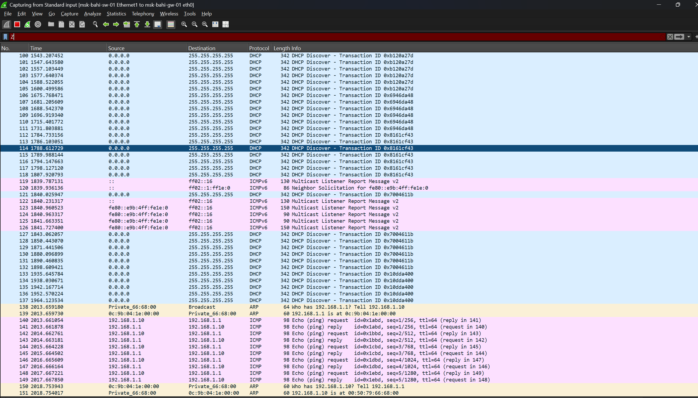{#fig-028 width=70%}


## Выводы

В ходе выполнения лабораторной работы были построены и настроены простейшие модели локальных сетей в среде GNS3 с использованием коммутатора Ethernet, маршрутизаторов **FRR** и **VyOS**, а также оконечных узлов VPCS. Была выполнена настройка IP-адресации сетевых интерфейсов, проверена связность узлов с помощью ICMP эхо-запросов и проанализирована корректность работы сети.

С использованием анализатора трафика **Wireshark** были исследованы протоколы **ARP**, **ICMP**, **UDP** и **TCP**, рассмотрена структура кадров и пакетов на канальном, сетевом и транспортном уровнях модели OSI, а также проанализирован процесс установления TCP-соединения. Полученные результаты подтверждают корректность выполненной конфигурации и работоспособность смоделированных сетей.
