---
## Author
author:
  name: Бахи сиди али темассини
  degrees: Student (3 курс)
  orcid: ""
  email: 1032234211@pfur.ru
  affiliation:
    - name: Российский университет дружбы народов
      country: Российская Федерация
      postal-code: 117198
      city: Москва
      address: ул. Миклухо-Маклая, д. 6
## Title
title: Лабораторная работа №8
subtitle: "Дисциплина: Сетевые технологии"
license: CC BY
date: today
date-format: "YYYY-MM-DD" # Example: 2025-09-06
---

# Цель работы

## Цель работы

- Изучение принципов маршрутизации
- Работа с IPv4 и IPv6
- Настройка сетевого оборудования

# Настройка динамической маршрутизации в сетях IPv4 и IPv6

## Развёртывание моделируемой сети в GNS3

- Запуск GNS3 VM и GNS3
- Создание нового проекта
- Размещение маршрутизаторов FRR, коммутаторов и VPCS
- Формирование кольцевой топологии из 4 маршрутизаторов
- Подключение:

  - PC1 → sw-01 → gw-01
  - PC2 → sw-02 → gw-03
- Переименование устройств:

  - `msk-user-sw-0x`
  - `msk-user-gw-0x`
  - `PCx-bahi`
- Включение захвата трафика:

  - sw-01 ↔ gw-01
  - sw-02 ↔ gw-03

## 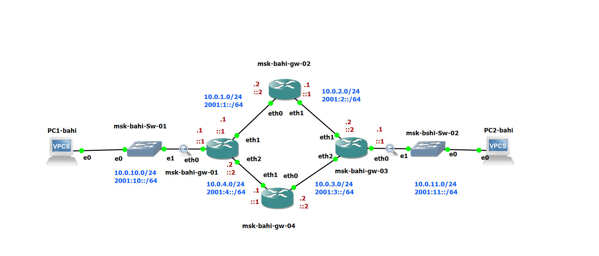

## Назначение IPv4-адресов оконечным устройствам

- Настройка IPv4-адресов на PC1 и PC2
- PC1:

  - IP: `10.0.10.10/24`
  - Gateway: `10.0.10.1`
- PC2:

  - IP: `10.0.11.10/24`
  - Gateway: `10.0.11.1`
- Сохранение конфигурации
- Проверка командой `show ip`

## 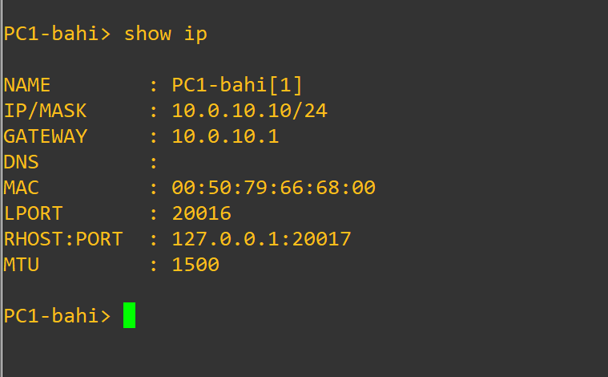
## 

## Настройка IPv4-адресации на msk-user-gw-01

- Назначение IPv4-адресов:

  - eth0
  - eth1
  - eth2
- Активация интерфейсов (`no shutdown`)
- Сохранение конфигурации
- Проверка `show running-config`

## 

## Настройка IPv4-адресации на msk-user-gw-02

- Назначение IPv4-адресов:

  - eth0
  - eth1
- Активация интерфейсов
- Сохранение конфигурации
- Проверка текущих параметров

## 

## Настройка IPv4-адресации на msk-user-gw-03

- Назначение IPv4-адресов:

  - eth0
  - eth1
  - eth2
- Подключение к локальной и транзитным сетям
- Активация интерфейсов
- Проверка `show running-config`

## 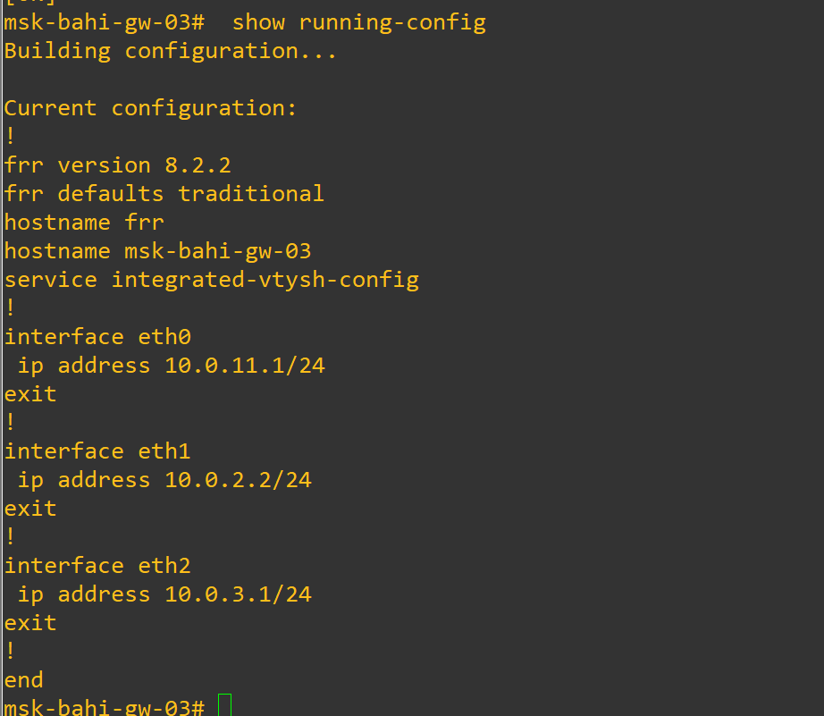

## Настройка IPv4-адресации на msk-user-gw-04

- Назначение IPv4-адресов:

  - eth0
  - eth1
- Активация интерфейсов
- Сохранение конфигурации
- Проверка корректности настроек

## 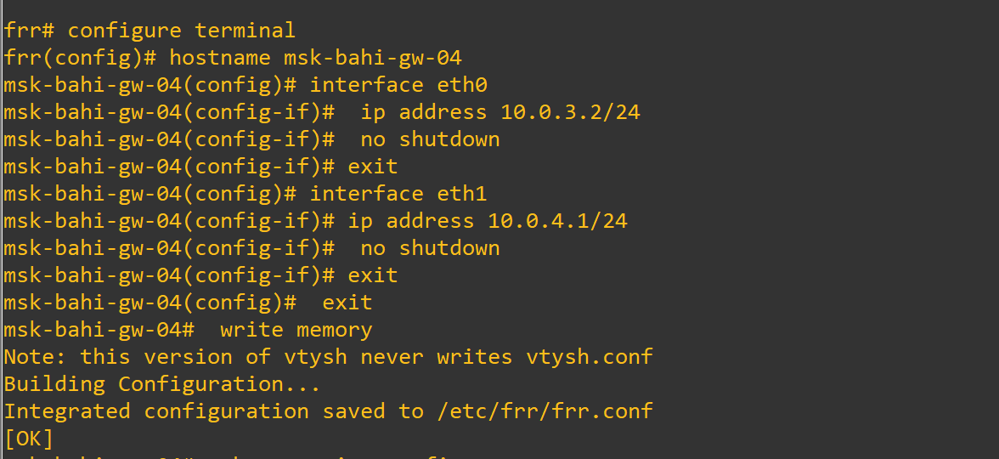

## Назначение IPv6-адресов оконечным устройствам

- Ручная настройка IPv6 через VPCS
- PC1:

  - IPv6: `2001:10::a/64`
  - Проверка `show ipv6`
- PC2:

  - IPv6: `2001:11::a/64`
  - Проверка `show ipv6`
- Подтверждение наличия global и link-local адресов

## 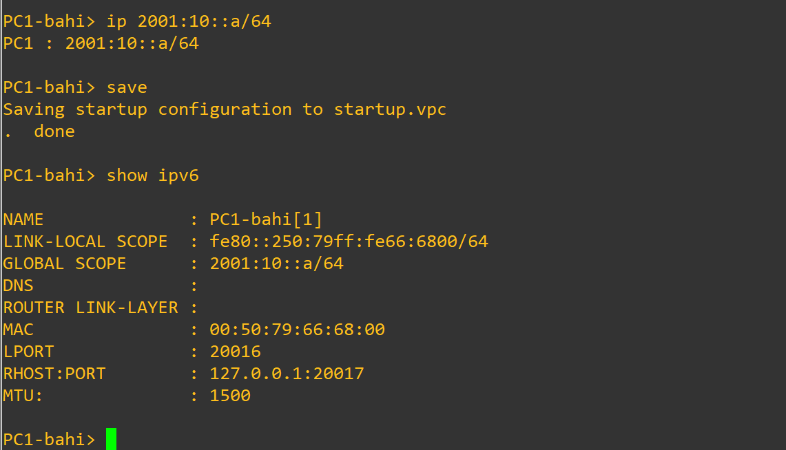
## 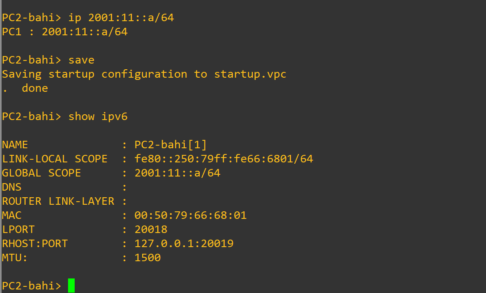

## Настройка IPv6-адресации на msk-user-gw-01

- Включение IPv6 forwarding
- Назначение IPv6-адресов:

  - eth0
  - eth1
  - eth2
- Включение Router Advertisement на eth0

## 

## Настройка IPv6-адресации на msk-user-gw-02

- Включение IPv6 forwarding
- Назначение IPv6-адресов:

  - eth0
  - eth1
- Активация интерфейсов
- Сохранение конфигурации

## 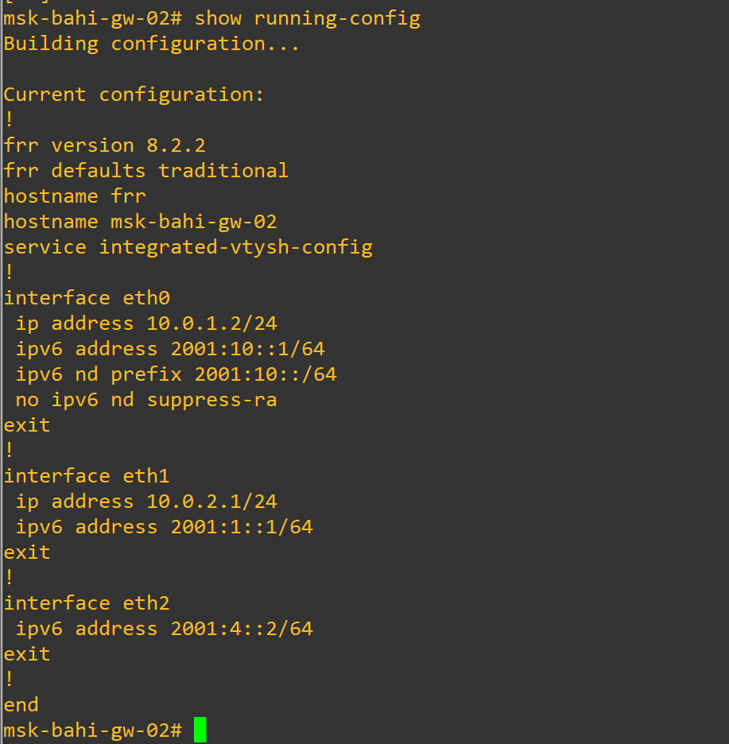

## Настройка IPv6-адресации на msk-user-gw-03

- Активация IPv6
- Назначение IPv6-адресов:

  - eth0
  - eth1
  - eth2
- Включение Router Advertisement на eth0
- Проверка конфигурации

## 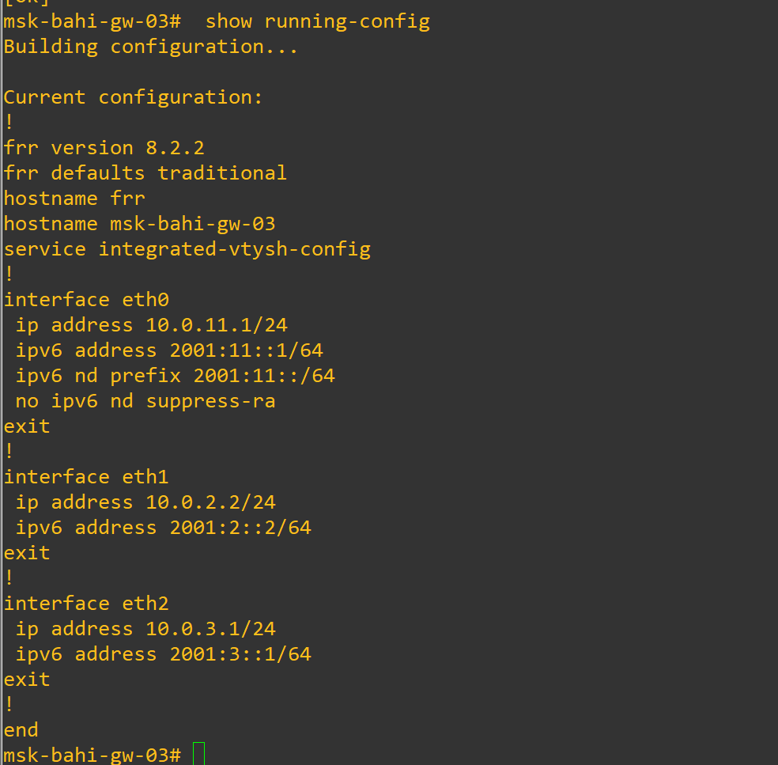

## Настройка IPv6-адресации на msk-user-gw-04

- Включение IPv6 forwarding
- Назначение IPv6-адресов:

  - eth0
  - eth1
- Активация интерфейсов
- Готовность к IPv6-маршрутизации

## 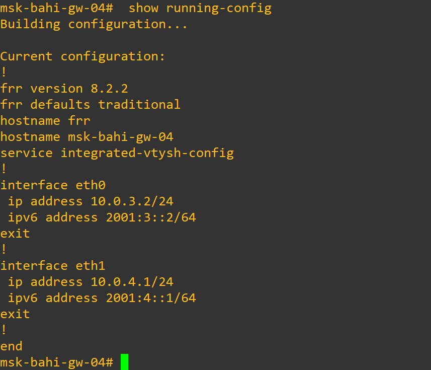

# Настройка динамической маршрутизации по протоколу RIP

## Настройка RIP на msk-user-gw-01

- Включение RIP версии 2
- Активация на интерфейсах:

  - eth0
  - eth1
  - eth2
- Объявление всех подключённых сетей
- Сохранение конфигурации

## 

## Настройка RIP на msk-user-gw-02

- Включение RIPv2
- Активация на интерфейсах:

  - eth0
  - eth1
- Участие в обмене маршрутами

## 

## Настройка RIP на msk-user-gw-03

- Включение RIPv2
- Активация на интерфейсах:

  - eth0
  - eth1
  - eth2
- Распространение маршрутной информации

## 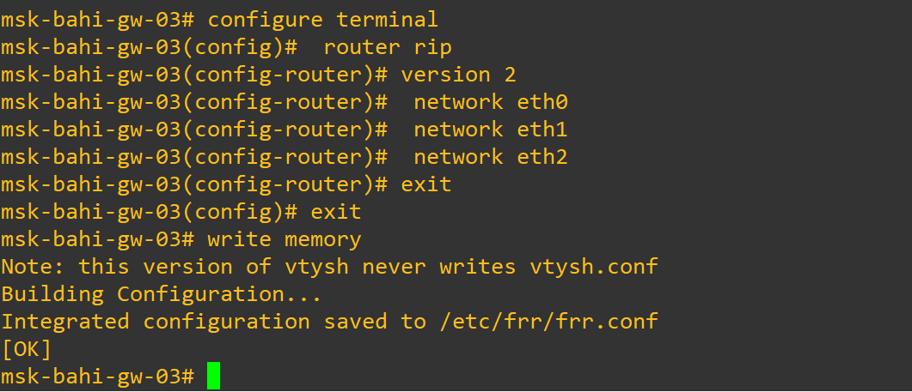

## Настройка RIP на msk-user-gw-04

- Включение RIPv2
- Активация на интерфейсах:

  - eth0
  - eth1
- Корректная работа RIP

## 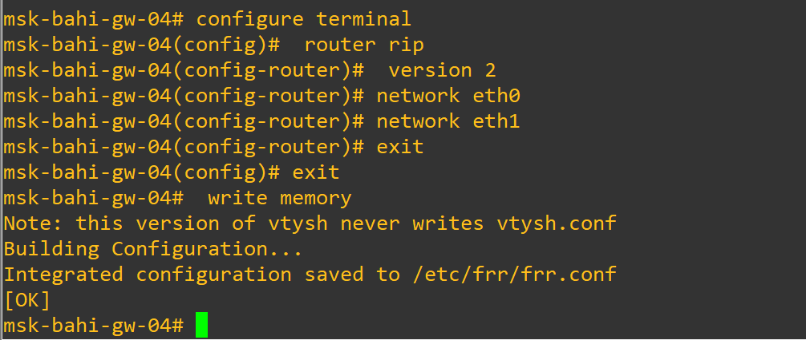

## Проверка корректности маршрутизации RIP

- Проверка команд:

  - `show ip route rip`
  - `show ip rip`
  - `show ip rip status`
- Получение удалённых маршрутов
- Метки `R` в таблице маршрутизации
- Период обновлений: 30 секунд

## 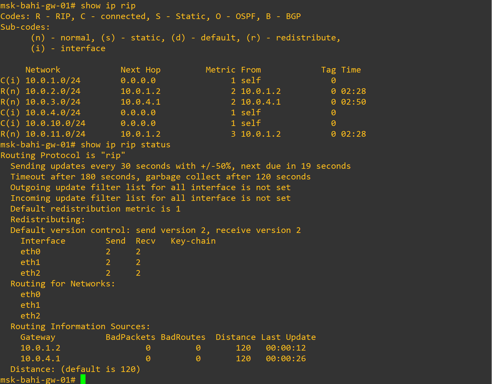
## 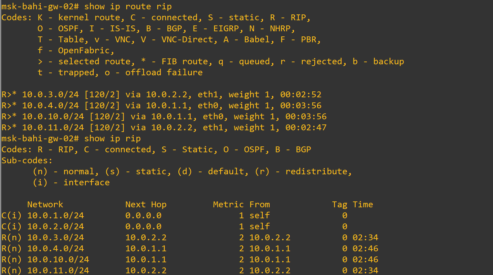
## 
## 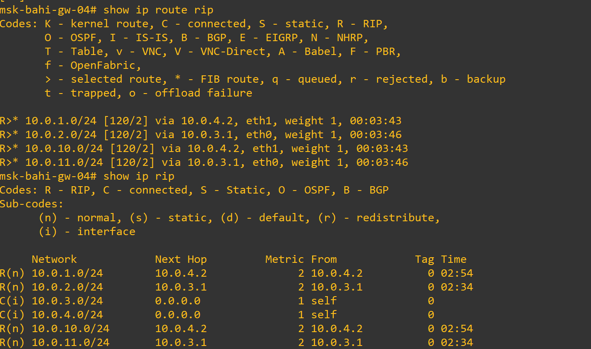

## Проверка связности PC1 → PC2 (нормальный режим)

- Ping `10.0.11.10`
- Успешные ICMP-ответы
- Traceroute показывает маршрут через несколько маршрутизаторов

## 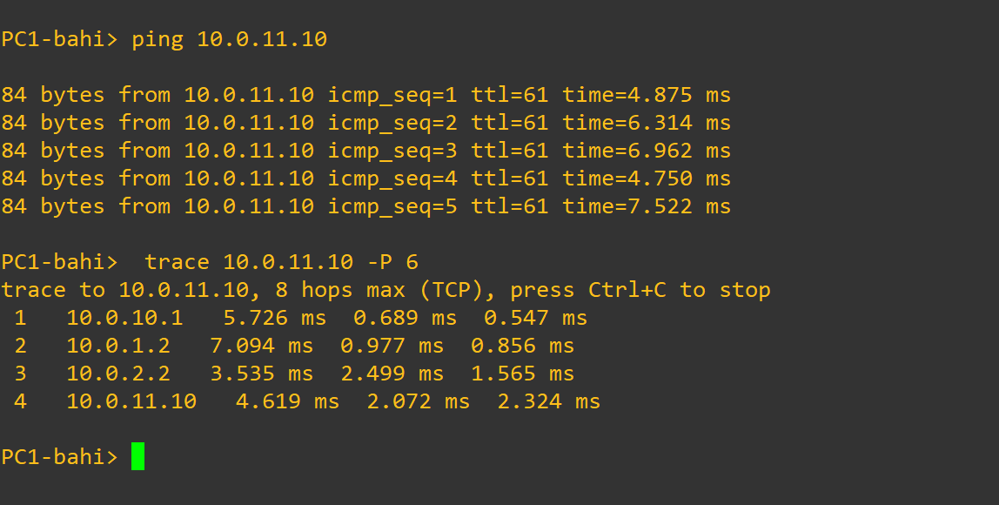

## Анализ метрик RIP в штатном режиме

- Выполнение `show ip rip`
- Метрики < 16
- Основной маршрут через msk-user-gw-02

## 

## Отказ интерфейса на msk-user-gw-02

- Отключение eth0 (`shutdown`)
- Маршруты получают метрику 16
- RIP помечает маршруты как недостижимые

## Потеря связности при отказе канала

- Ping PC1 → PC2 не проходит
- Traceroute:

  - `Destination host unreachable`
- Отсутствие активного маршрута

## Восстановление маршрута (RIP convergence)

- Получение альтернативных маршрутов
- Новый путь через msk-user-gw-04
- Успешный ping
- Время восстановления — десятки секунд

## Включение интерфейса msk-user-gw-02

- Команда `no shutdown`
- Возврат основного маршрута
- Метрики восстановлены

## Анализ перехваченного трафика RIP

- RIP-пакеты на `224.0.0.9`
- Объявление сетей и метрик
- Метрика 16 при отказе
- ICMP Echo Request / Reply
- Анализ TTL и IP-адресов

## 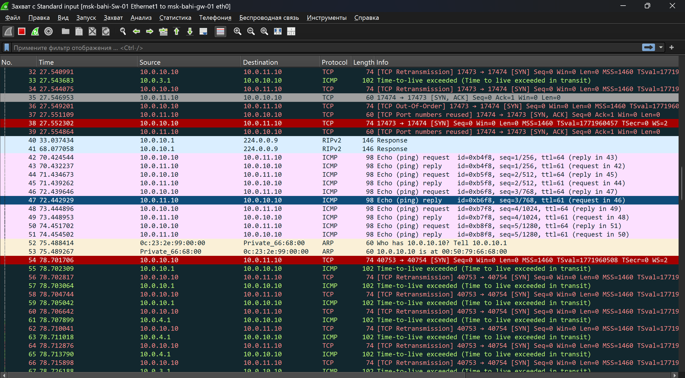
## 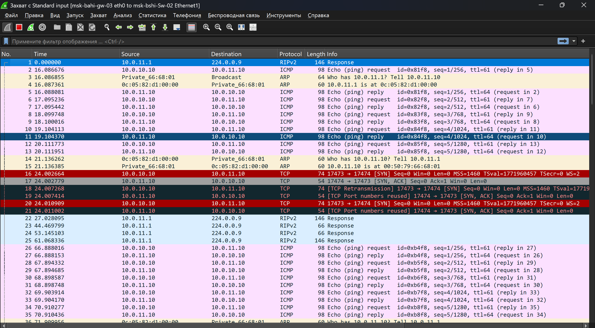

# Настройка динамической маршрутизации по протоколу OSPF

## Настройка OSPFv2 на msk-bahi-gw-01

- Активация протокола OSPFv2
- Добавление сетей:

  - 10.0.10.0/24
  - 10.0.1.0/24
  - 10.0.4.0/24
- Использование области 0.0.0.0
- Сохранение конфигурации

## 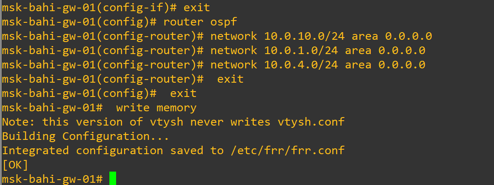

## Настройка OSPFv2 на msk-bahi-gw-02

- Включение процесса OSPFv2
- Объявление сетей:

  - 10.0.1.0/24
  - 10.0.2.0/24
- Добавление сетей в область 0.0.0.0
- Сохранение конфигурации FRR

## 

## Настройка OSPFv2 на msk-bahi-gw-03

- Активация OSPFv2
- Объявление сетей:

  - 10.0.11.0/24
  - 10.0.2.0/24
  - 10.0.3.0/24
- Использование области 0.0.0.0
- Сохранение конфигурации

## 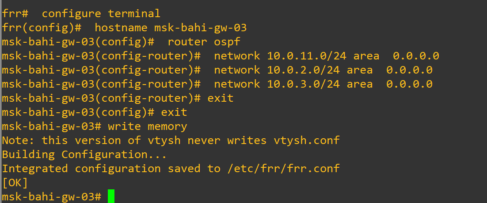

## Настройка OSPFv2 на msk-bahi-gw-04

- Включение OSPFv2
- Объявление сетей:

  - 10.0.3.0/24
  - 10.0.4.0/24
- Добавление в область 0.0.0.0
- Сохранение параметров маршрутизации

## 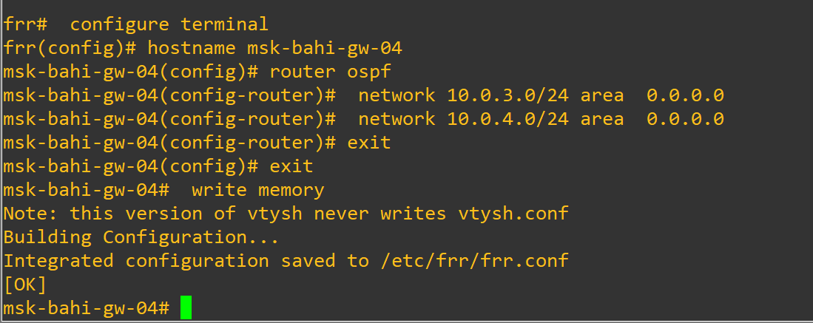

## Проверка связности PC1 → PC2 (IPv4, OSPFv2)

- Ping `10.0.11.10`
- Получены ICMP-ответы (TTL = 61)
- Traceroute:

  - 10.0.10.1
  - 10.0.1.2
  - 10.0.2.2
  - 10.0.11.10

## 

## Проверка соседства и маршрутов OSPFv2

- Команды проверки:

  - `show ip ospf neighbor`
  - `show ip ospf route`
- Соседи OSPF:

  - 10.0.1.2
  - 10.0.4.1
- Состояние: Full/Backup
- Два пути к сети 10.0.11.0/24

## 

## Моделирование отказа канала (OSPFv2)

- Отключение интерфейса eth0
- Команда: `shutdown`
- Выполнено на msk-bahi-gw-02

## 

## Состояние OSPFv2 после отказа

- Проверка `show ip ospf route`
- Пересчёт маршрутов
- Использование альтернативного пути через eth2
- Соседство OSPF сохранено

## 

## Повторная проверка связности (OSPFv2)

- Ping PC1 → PC2 успешен
- Traceroute:

  - 10.0.10.1
  - 10.0.4.1
  - 10.0.3.1
  - 10.0.11.10

## 

## Восстановление интерфейса msk-bahi-gw-02

- Команда: `no shutdown`
- Интерфейс eth0 снова активен

## 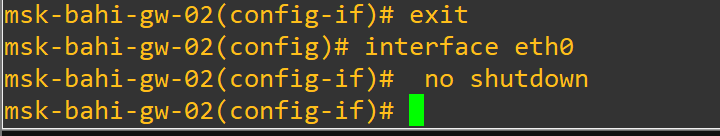

## Контроль связности после восстановления (OSPFv2)

- Ping PC1 → PC2 успешен
- Traceroute:

  - 10.0.10.1
  - 10.0.1.2
  - 10.0.3.1
  - 10.0.11.10

## 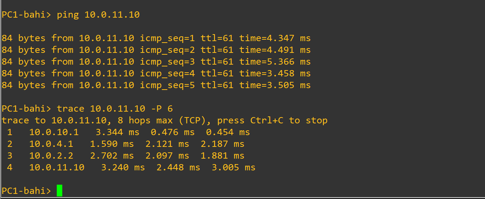

## Анализ ICMP и ARP трафика (IPv4)

- ARP-пакеты: сопоставление IP ↔ MAC
- ICMP Echo Request / Reply
- Уменьшение TTL
- Подтверждение прохождения через несколько маршрутизаторов

## 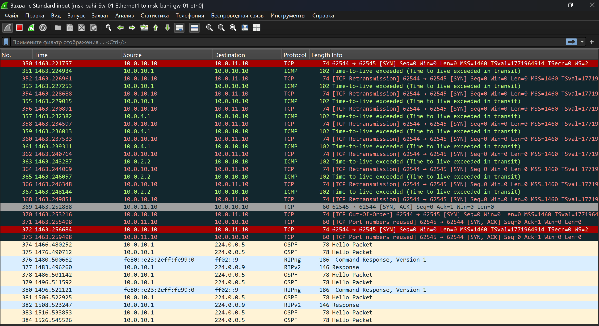

## ICMP Time Exceeded при трассировке

- ICMP Time-to-live exceeded
- Формируются промежуточными маршрутизаторами
- Используются для определения маршрута

## 

## Служебный трафик OSPF и RIP

- OSPF Hello:

  - Multicast 224.0.0.5
- RIP v2:

  - Multicast 224.0.0.9
- Подтверждение одновременной работы RIP и OSPF

## 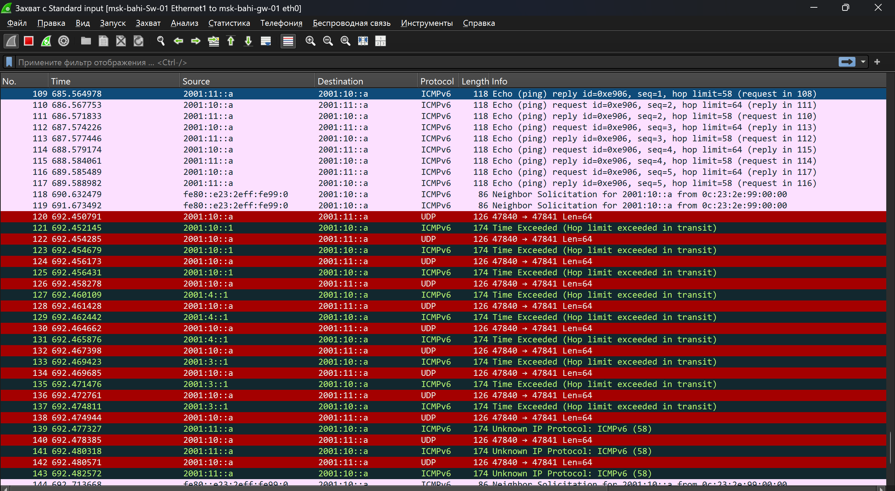

# Настройка OSPFv3 (IPv6)

## OSPFv3 на msk-bahi-gw-01

- Активация OSPFv3
- Router-ID: 1.1.1.1
- Включение на интерфейсах:

  - eth0
  - eth1
  - eth2
- Область: 0
- Сохранение конфигурации

## 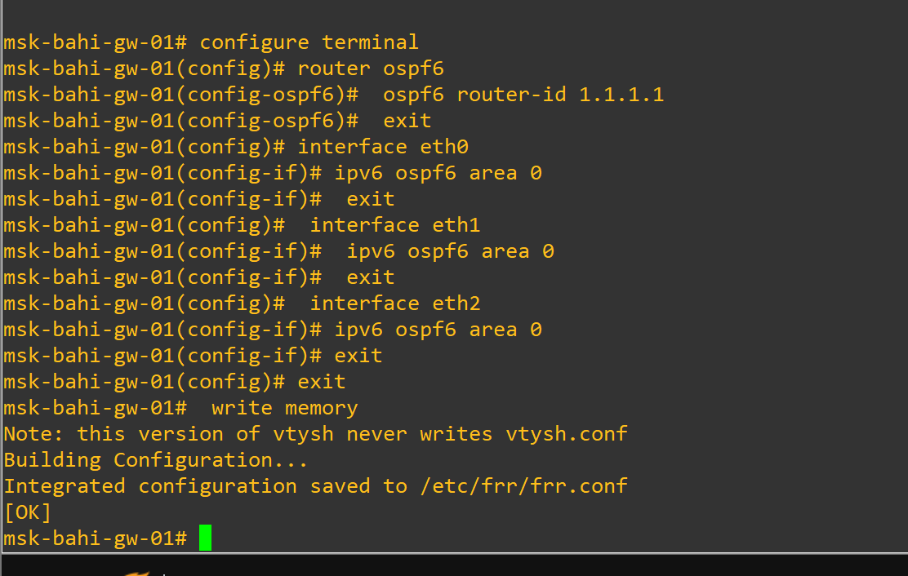

## OSPFv3 на msk-bahi-gw-02

- Router-ID: 2.2.2.2
- Активация OSPFv3
- Интерфейсы:

  - eth0
  - eth1
- Область: 0

## 

## OSPFv3 на msk-bahi-gw-03

- Router-ID: 3.3.3.3
- Интерфейсы:

  - eth0
  - eth1
  - eth2
- Участие всех IPv6-сегментов
- Сохранение конфигурации

## 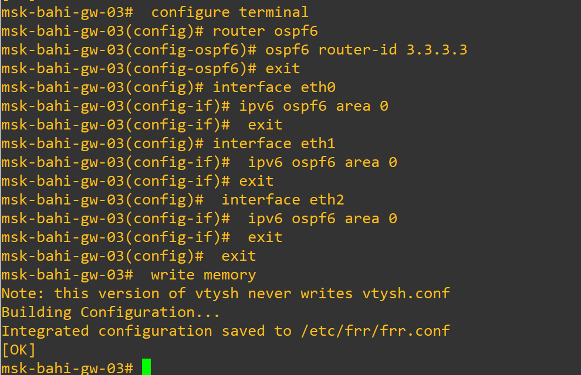

## OSPFv3 на msk-bahi-gw-04

- Router-ID: 4.4.4.4
- Интерфейсы:

  - eth0
  - eth1
- Область: 0

## 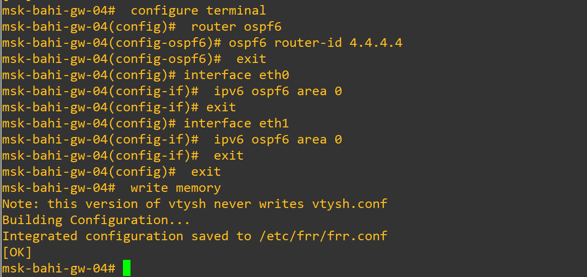

## Проверка связности IPv6 (OSPFv3)

- Ping `2001:11::a`
- Получены ICMPv6-ответы
- Hop limit = 58
- Traceroute:

  - 2001:10::1
  - 2001:1::2
  - 2001:2::2
  - 2001:11::a

## 

## Проверка соседства и маршрутов OSPFv3

- Команды:

  - `show ipv6 ospf6 neighbor`
  - `show ipv6 ospf6 route`
- Соседи:

  - 2.2.2.2
  - 4.4.4.4
- Состояние: Full/BDR
- IA-префиксы IPv6

## 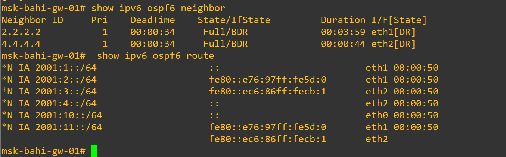

## Отказ интерфейса (OSPFv3)

- Отключение eth0
- Команда `shutdown`
- Выполнено на msk-bahi-gw-02

## 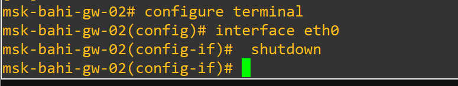

## Пересчёт маршрутов OSPFv3

- Проверка `show ipv6 ospf6 route`
- Выбор альтернативного next-hop
- Обновление таблицы маршрутов

## 

## Проверка связности после отказа (IPv6)

- Ping `2001:11::a` успешен
- Traceroute:

  - 2001:10::1
  - 2001:4::1
  - 2001:3::1
  - 2001:11::a

## 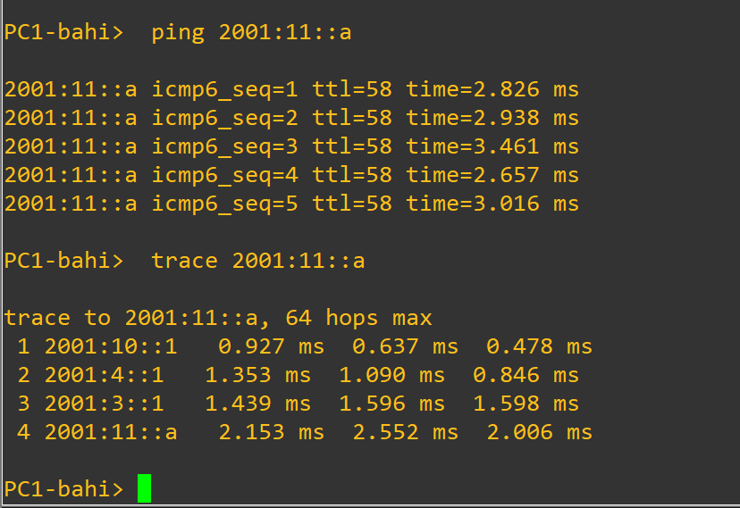

## Восстановление интерфейса (OSPFv3)

- Команда `no shutdown`
- Интерфейс eth0 восстановлен

## 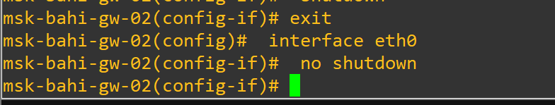

## Контрольная проверка IPv6-связности

- Ping успешен
- Traceroute фиксирует актуальный маршрут
- Работа OSPFv3 подтверждена

## 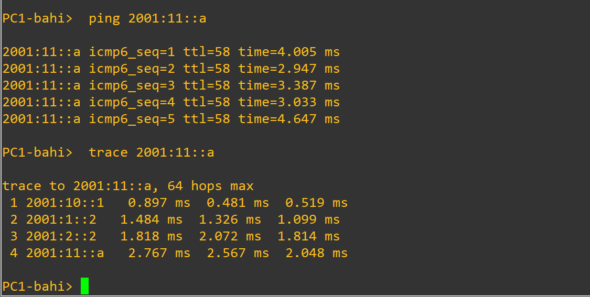

## Анализ перехваченного IPv6-трафика (ICMPv6)

- Зафиксированы ICMPv6 Echo Request и Echo Reply между узлами
  `2001:10::a` ↔ `2001:11::a`
- Подтверждена проверка связности на сетевом уровне
- Значения Hop Limit в ответах меньше исходных
- Зафиксировано прохождение пакетов через несколько маршрутизаторов
- В трассировке присутствуют ICMPv6 Time Exceeded
- Сообщения формируются промежуточными маршрутизаторами
- Используются для определения пути следования пакетов

## {#fig-44 width=70%}

## Служебный трафик OSPF, UDP и ICMPv6

- Зафиксированы OSPF Hello Packet
- Используются мультикаст-адреса:

  - ff02::5
  - 224.0.0.5
- Поддерживается OSPF-соседство между маршрутизаторами
- Зафиксированы UDP-пакеты
- Наблюдаются ICMPv6 Destination Unreachable (Port unreachable)
- Пакеты возникают при выполнении трассировки
- Анализ подтверждает:

  - активность протоколов маршрутизации
  - определение маршрута
  - реакцию сети на диагностические запросы

## 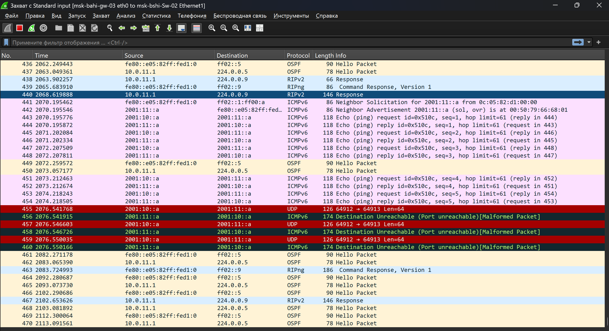{#fig-45 width=70%}

# Построение туннеля IPv6–IPv4

## Развёртывание топологии сети в GNS3

- Создан новый проект в GNS3
- Размещены маршрутизаторы VyOS, коммутаторы и узлы VPCS
- Топология включает:

  - два IPv6-сегмента
  - IPv4-транзитную сеть
  - логический IPv6-туннель
- Настроены имена устройств:

  - маршрутизаторы — `msk-user-gw-0x`
  - коммутаторы — `msk-user-sw-0x`
  - узлы — `PCx-user`
- Включён захват трафика между
  `msk-user-gw-01` и `msk-user-gw-03`

## 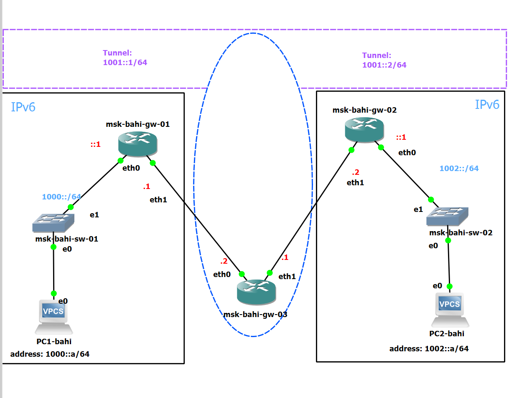{#fig-46 width=70%}

## Назначение IPv6-адресов оконечным устройствам

- На PC1-bahi настроен адрес:

  - `1000::a/64`
- На PC2-bahi настроен адрес:

  - `1002::a/64`
- Конфигурация сохранена
- Команда `show ipv6` подтвердила:

  - глобальные IPv6-адреса
  - link-local IPv6-адреса
- Настройка интерфейсов выполнена корректно

## {#fig-47 width=70%}

## 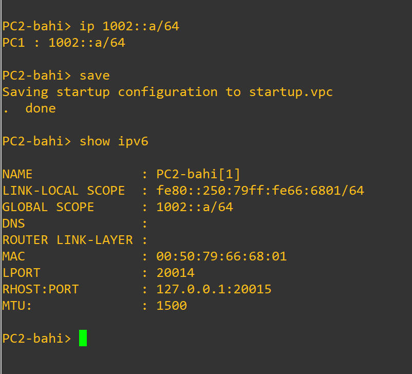{#fig-47-1 width=70%}

## Изменение имён маршрутизаторов VyOS

- Выполнен переход в режим конфигурирования
- Изменены системные имена маршрутизаторов
- Проверка выполнена командой `compare`
- Конфигурация применена (`commit`)
- Конфигурация сохранена (`save`)
- После перезагрузки имена вступили в силу

## {#fig-48 width=70%}

## 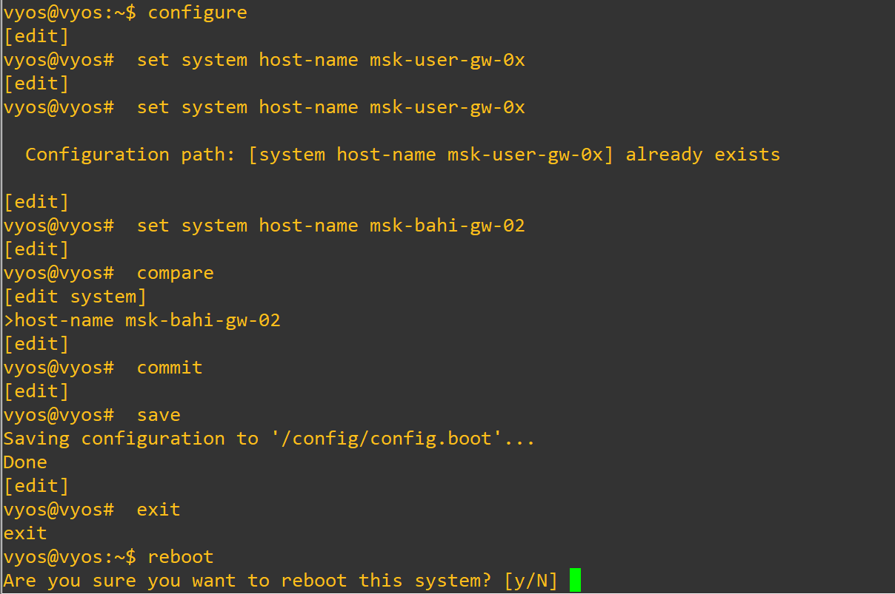{#fig-48-1 width=70%}

## {#fig-48-2 width=70%}

## Настройка IPv4- и IPv6-адресации на маршрутизаторах VyOS

- msk-bahi-gw-01

  - eth0: IPv6 `1000::1/64`
  - Включён Router Advertisement `1000::/64`
  - eth1: IPv4 `10.0.0.1/8`
- msk-bahi-gw-02

  - eth0: IPv6 `1002::1/64` + RA
  - eth1: IPv4 `20.0.0.2/8`
- msk-bahi-gw-03

  - eth0: IPv4 `10.0.0.2/8`
  - eth1: IPv4 `20.0.0.1/8`
- Интерфейсы проверены
- Конфигурации сохранены

## 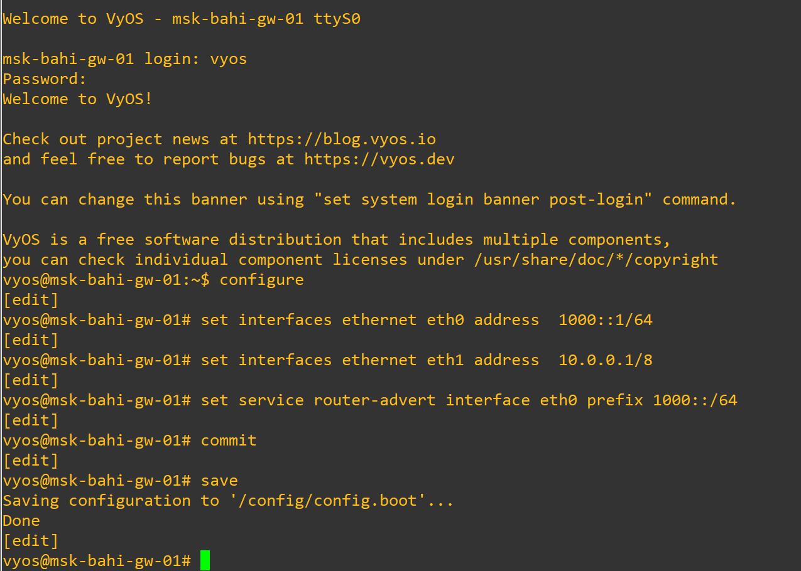{#fig-49 width=70%}

## {#fig-49-1 width=70%}

## 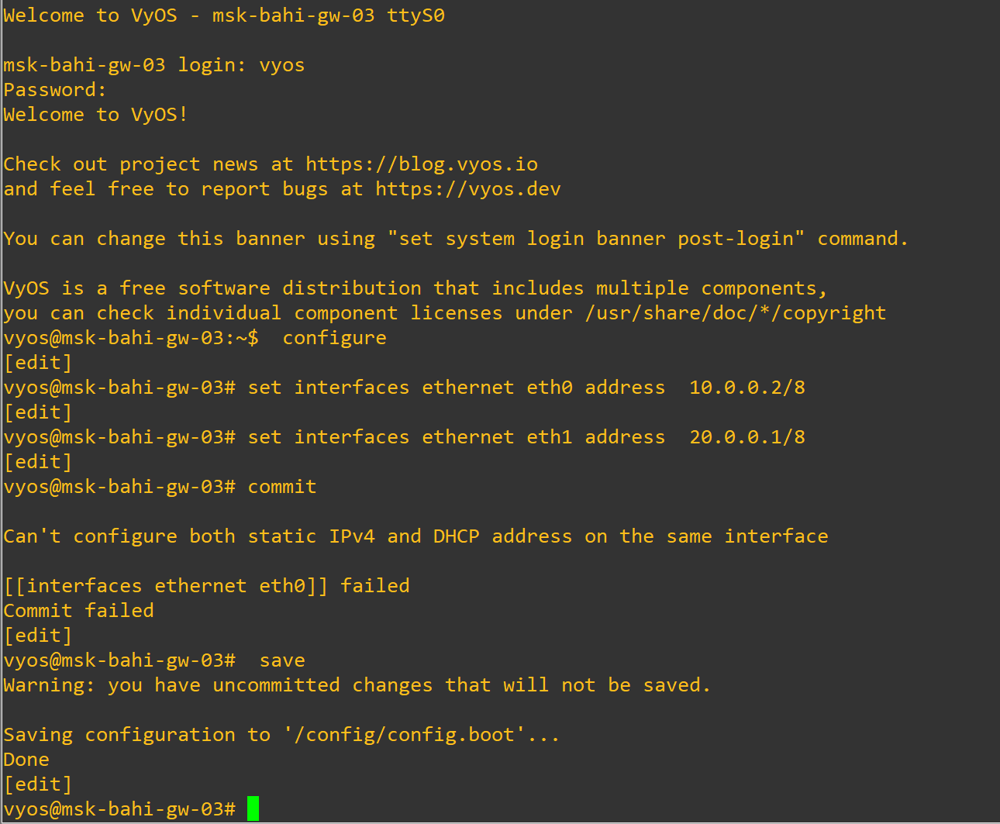{#fig-49-2 width=70%}

## Проверка получения IPv6-параметров по Router Advertisement

- Выполнена команда `show ipv6` на PC1 и PC2
- Зафиксированы:

  - link-local адреса `fe80::/64`
  - глобальные IPv6-адреса
- PC1 получил `1000::a/64`
- PC2 получил `1002::a/64`
- Отображён MAC-адрес ближайшего маршрутизатора
- Подтверждена корректная работа RA

## 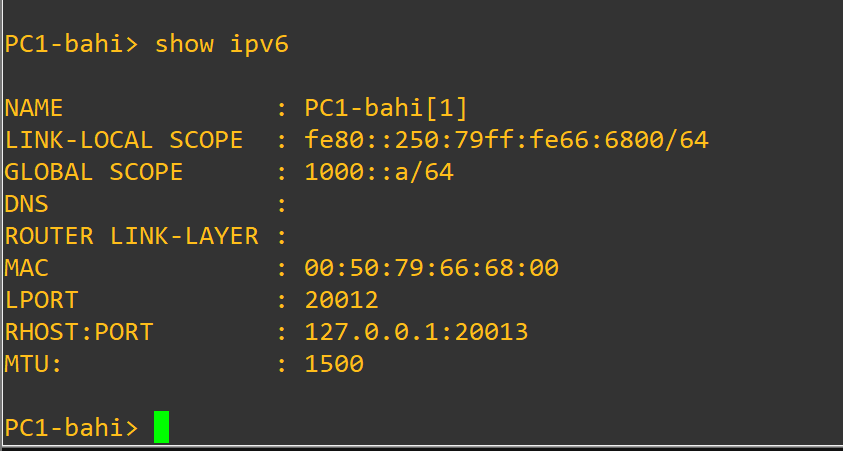{#fig-50 width=70%}

## 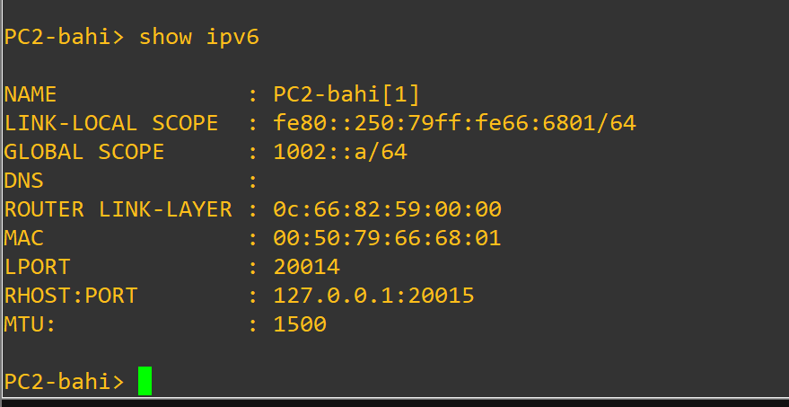{#fig-50-1 width=70%}

## Проверка связности до настройки маршрутизации

- Ping из `msk-bahi-gw-01` в сеть `10.0.0.0/8` успешен
- Подтверждена корректная IPv4-адресация
- Ping в сеть `20.0.0.0/8`:

  - Network is unreachable
- Отсутствует маршрут в таблице маршрутизации

## {#fig-51 width=70%}

## Анализ ICMP-трафика IPv4

- ICMP Echo Request / Reply без потерь
- Подтверждена работа ARP
- Корректная передача данных в сети `10.0.0.0/8`
- При ping в `20.0.0.0/8` ICMP не формируется
- Трафик отбрасывается на этапе маршрутизации

## 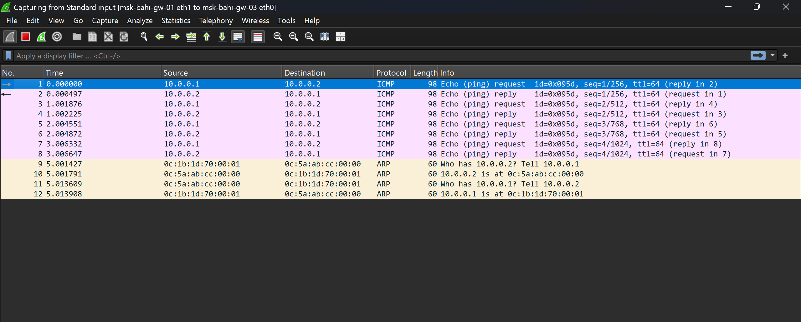{#fig-52 width=70%}

## Настройка динамической маршрутизации IPv4 (RIP)

- Настроен протокол RIP на всех маршрутизаторах
- msk-bahi-gw-01:

  - сеть `10.0.0.0/8`
- msk-bahi-gw-02:

  - сеть `20.0.0.0/8`
- msk-bahi-gw-03:

  - транзит между сетями
- Маршрутизаторы обмениваются маршрутами
- Обеспечена IPv4-связность без статических маршрутов

## {#fig-53 width=70%}

## {#fig-53-1 width=70%}

## 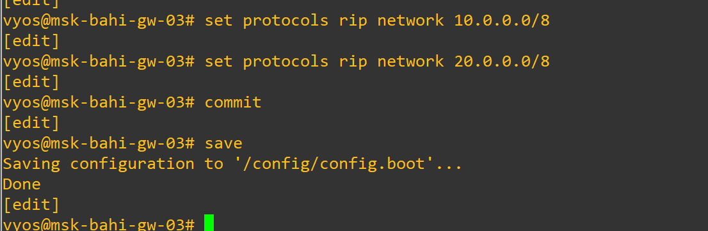{#fig-53-2 width=70%}

## Проверка маршрутов и анализ трафика (IPv4)

- Ping `10.0.0.2` успешен
- Ping `20.0.0.1` и `20.0.0.2` успешны
- Подтверждена работа RIP
- В трафике зафиксированы:

  - ICMP
  - ARP
  - RIP-обновления (224.0.0.9)

## {#fig-54 width=70%}

## Создание IPv6-туннеля поверх IPv4 (SIT)

- Настроен туннель tun0
- msk-bahi-gw-01

  - local IPv4: `10.0.0.1`
  - remote IPv4: `20.0.0.2`
  - IPv6: `1001::1/64`
- msk-bahi-gw-02

  - local IPv4: `20.0.0.2`
  - remote IPv4: `10.0.0.1`
  - IPv6: `1001::2/64`
- Туннель IPv6-over-IPv4 успешно создан

## {#fig-55 width=70%}

## Настройка статической маршрутизации IPv6

- msk-bahi-gw-01

  - маршрут `1002::/64` → `1001::2`
- msk-bahi-gw-02

  - маршрут `1000::/64` → `1001::1`
- Конфигурации применены и сохранены
- Обеспечена двусторонняя IPv6-маршрутизация

## {#fig-56 width=70%}

## Проверка IPv6-связности через туннель

- PC1:

  - `ping 1002::a`
  - `trace 1002::a`
- PC2:

  - `ping 1000::a`
  - `trace 1000::a`
- Трафик проходит через:

  - `1001::1 → 1001::2`
- В трафике:

  - IPv6 инкапсулирован в IPv4 (SIT)
  - Внешние IPv4-адреса: `10.0.0.1` ↔ `20.0.0.2`

## 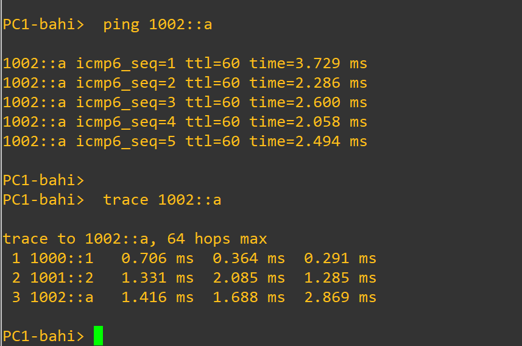{#fig-57 width=70%}

# Задание для самостоятельного выполнения

## Развёртывание топологии сети

- В GNS3 создан новый проект
- Развёрнута кольцевая топология из 4 маршрутизаторов
- Использованы:
  - 2 коммутатора
  - 2 узла VPCS
- PC1-user:
  - подключён к msk-user-gw-01
  - сети: `10.10.1.96/27`, `2001:DB8:1:1::/64`
- PC2-user:
  - подключён к msk-user-gw-02
  - сети: `10.10.1.64/28`, `2001:DB8:1:6::/64`
- Топология используется для анализа маршрутизации IPv4 / IPv6
## 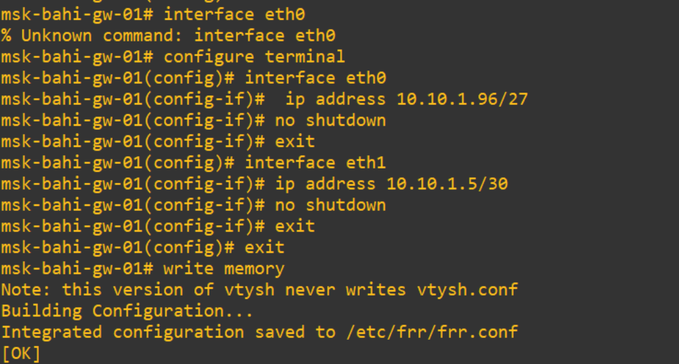{#fig-58 width=70%}

## Настройка IPv4-адресации на маршрутизаторе msk-bahi-gw-01

- Настроены интерфейсы:

  - eth0 — `10.10.1.97/27`
  - eth1 — `10.10.1.5/30`
- Интерфейсы переведены в состояние -up- (`no shutdown`)
- Конфигурация сохранена
- Корректность подтверждена командой `show running-config`

## Настройка IPv4-адресации на маршрутизаторе msk-bahi-gw-02

- Настроены интерфейсы:

  - eth0 — `10.10.1.65/28`
  - eth1 — `10.10.1.18/30`
  - eth2 — `10.10.1.33/30`
- Все интерфейсы активированы
- Конфигурация сохранена
- Проверка выполнена командой `show running-config`

## 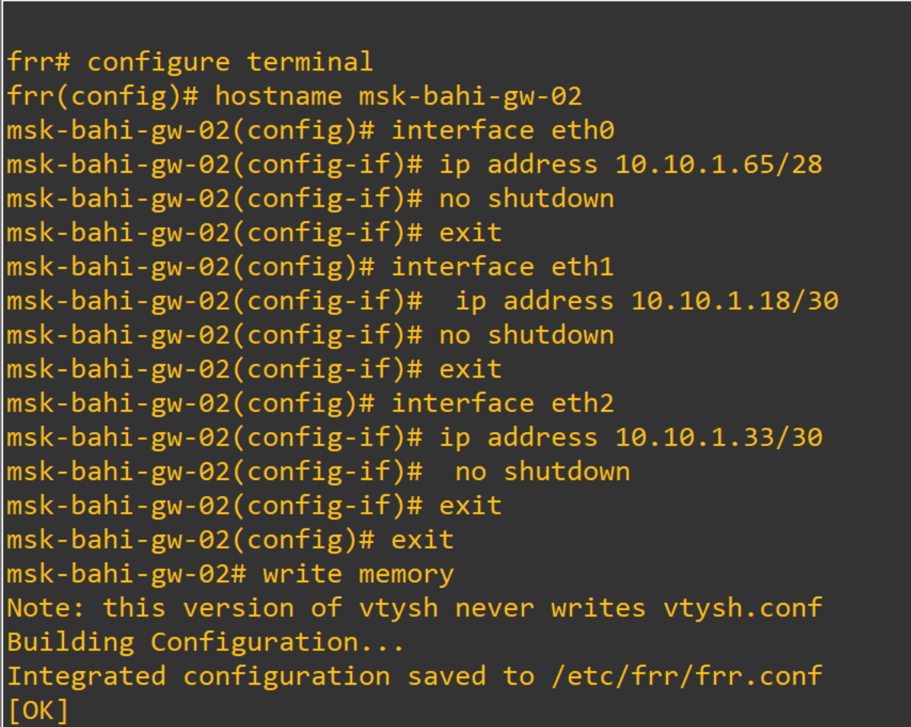{#fig-59 width=70%}

## Настройка IPv4-адресации на маршрутизаторе msk-bahi-gw-03

- Настроены интерфейсы:

  - eth0 — `10.10.1.6/30`
  - eth1 — `10.10.1.17/30`
- Интерфейсы включены
- Конфигурация сохранена
- Корректность подтверждена выводом текущих настроек

## 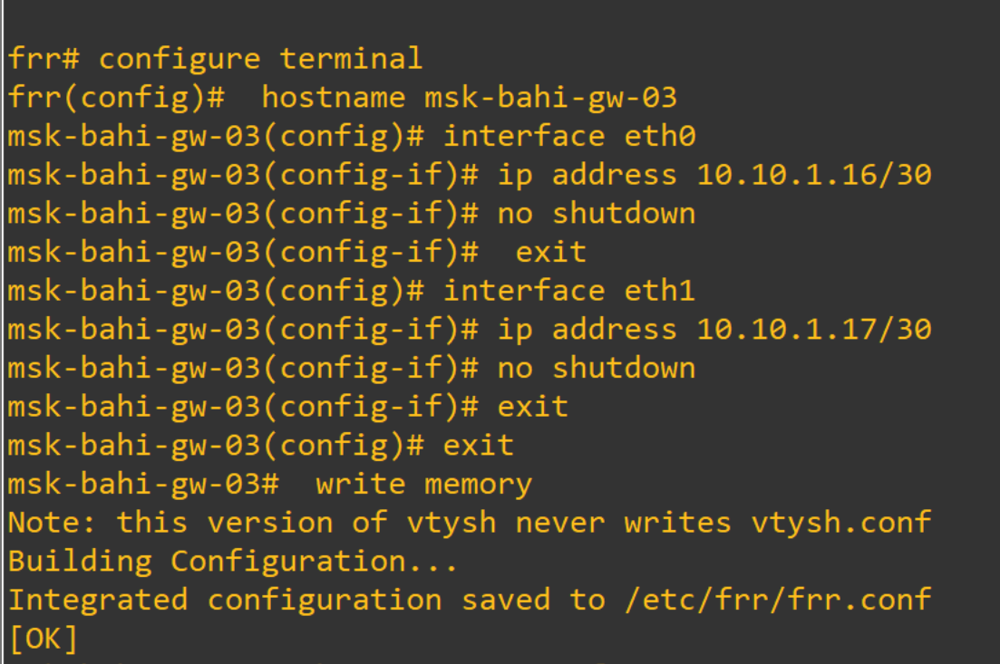{#fig-60 width=70%}

## Настройка IPv4-адресации на маршрутизаторе msk-bahi-gw-04

- Настроены интерфейсы:

  - eth0 — `10.10.1.9/30`
  - eth1 — `10.10.1.34/30`
- Интерфейсы активированы
- Конфигурация сохранена
- Проверка выполнена командой `show running-config`

## {#fig-61 width=70%}

## Настройка IPv4-адресации на узле PC1-bahi

- Назначен IPv4-адрес:

  - `10.10.1.98/27`
- Шлюз по умолчанию:

  - `10.10.1.97`
- Конфигурация сохранена
- Проверка выполнена командой `show ip`

## 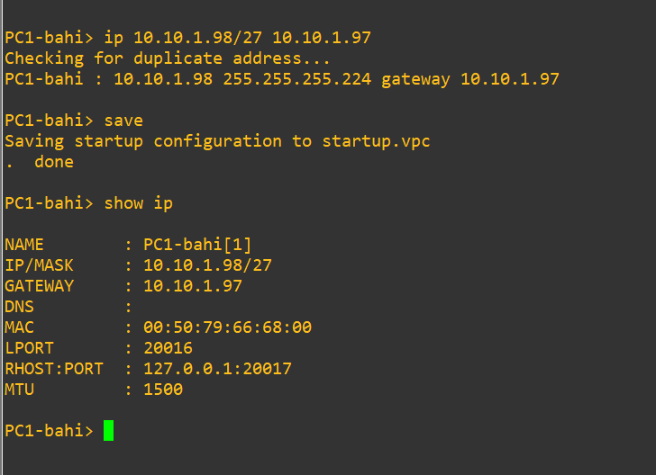{#fig-62 width=70%}

## Настройка IPv4-адресации на узле PC2-bahi

- Назначен IPv4-адрес:

  - `10.10.1.66/28`
- Шлюз по умолчанию:

  - `10.10.1.65`
- Конфигурация сохранена
- Параметры подтверждены командой `show ip`

## {#fig-63 width=70%}

## Включение IPv6 и настройка интерфейсов на msk-bahi-gw-01

- Включена пересылка IPv6 (`ipv6 forwarding`)
- Интерфейс eth0:

  - IPv6 `2001:db8:1:1::1/64`
  - Включён Router Advertisement
  - Префикс `2001:db8:1:1::/64`
- Интерфейс eth1:

  - IPv6 `2001:db8:1:2::1/64`
- Конфигурация сохранена и проверена

## {#fig-64 width=70%}

## Настройка IPv6-адресации на маршрутизаторе msk-bahi-gw-02

- Включена поддержка IPv6
- Назначены адреса:

  - eth0 — `2001:db8:1:6::1/64`
  - eth1 — `2001:db8:1:4::2/64`
  - eth2 — `2001:db8:1:5::2/64`
- Интерфейсы активированы
- Конфигурация сохранена

## 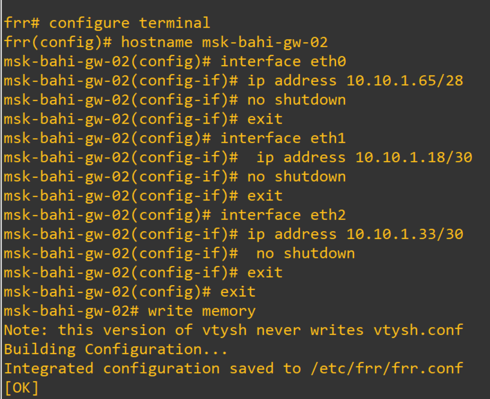{#fig-65 width=70%}

## Настройка IPv6-адресации на маршрутизаторе msk-bahi-gw-03

- Включена IPv6-маршрутизация
- Назначены адреса:

  - eth0 — `2001:db8:1:2::2/64`
  - eth1 — `2001:db8:1:4::1/64`
- Интерфейсы включены
- Конфигурация сохранена

## {#fig-66 width=70%}

## Настройка IPv6-адресации на маршрутизаторе msk-bahi-gw-04

- Включён IPv6 forwarding
- Назначены адреса:

  - eth0 — `2001:db8:1:3::1/64`
  - eth1 — `2001:db8:1:5::1/64`
- Интерфейсы активированы
- Конфигурация сохранена

## 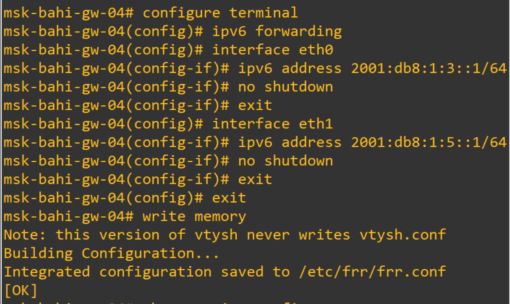{#fig-67 width=70%}

## Назначение IPv6-адреса на узле PC1-bahi

- Назначен глобальный IPv6-адрес:

  - `2001:db8:1:1::a/64`
- Конфигурация сохранена
- Проверка выполнена командой `show ipv6`
- Зафиксированы:

  - global IPv6
  - link-local IPv6

## 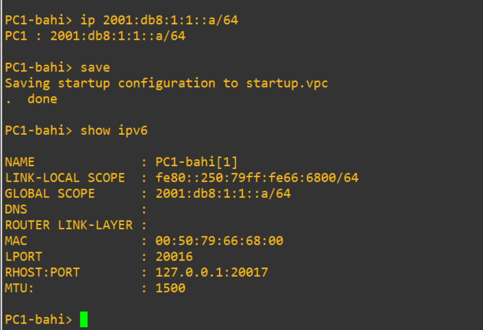{#fig-68 width=70%}

## Назначение IPv6-адреса на узле PC2-bahi

- Назначен IPv6-адрес:

  - `2001:db8:1:6::a/64`
- Конфигурация сохранена
- Проверка подтверждает корректное назначение адреса

## 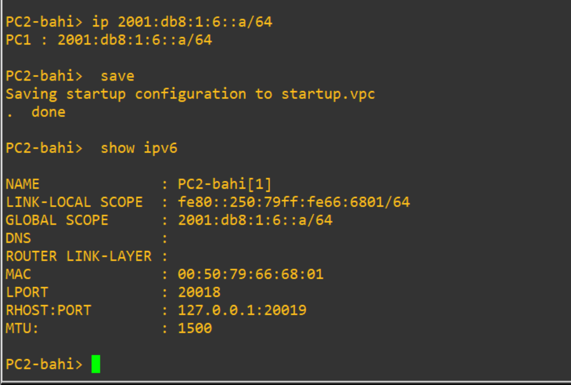{#fig-69 width=70%}

## Настройка и проверка RIP v2 на msk-bahi-gw-01

- Настроен RIP версии 2
- В процесс RIP добавлены:

  - eth0
  - eth1
  - eth2
- Получены маршруты:

  - `10.10.1.16/30`
  - `10.10.1.64/28`
- Next hop: `10.10.1.6`
- Проверка таблицы маршрутизации выполнена

## {#fig-70 width=70%}

## Настройка и проверка RIP v2 на msk-bahi-gw-02

- Включён RIP v2
- Интерфейсы:

  - eth0
  - eth1
  - eth2
- Получены сети:

  - `10.10.1.4/30`
  - `10.10.1.96/27`
- Источник маршрутов: `10.10.1.17`
- Обмен маршрутной информацией подтверждён

## {#fig-71 width=70%}

## Настройка и проверка RIP v2 на msk-bahi-gw-03

- Настроен RIP v2
- Интерфейсы:

  - eth0
  - eth1
  - eth2
- Получены маршруты:

  - `10.10.1.64/28`
  - `10.10.1.96/27`
- Источники:

  - `10.10.1.18`
  - `10.10.1.5`
- Подтверждена работа нескольких источников маршрутов

## 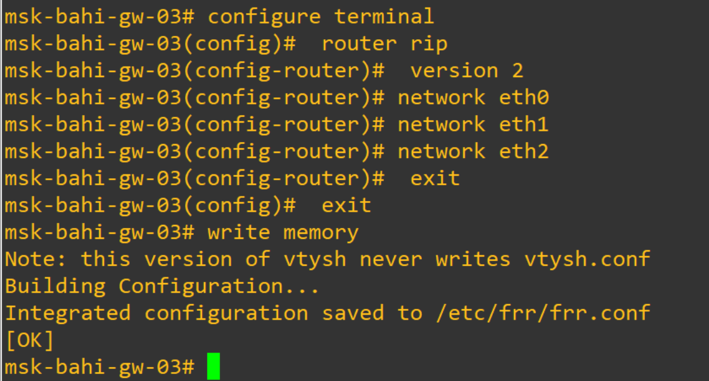{#fig-72 width=70%}

## Настройка и проверка RIP v2 на msk-bahi-gw-04

- Включён RIP v2
- Интерфейсы:

  - eth0
  - eth1
- В таблице RIP присутствуют:

  - `10.10.1.8/30`
  - `10.10.1.32/30`
- Конфигурация соответствует текущей топологии

## 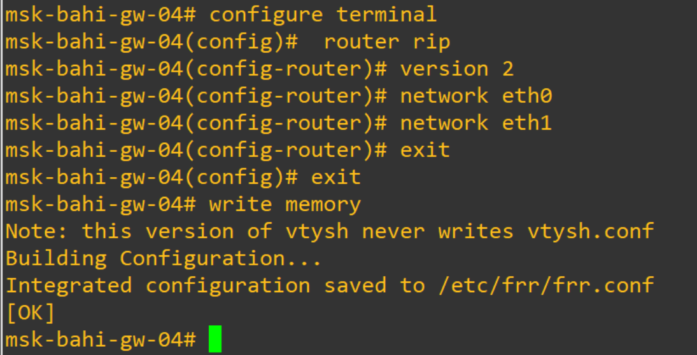{#fig-73 width=70%}

## Проверка IPv4-связности PC1-bahi → PC2-bahi

- Выполнен `ping 10.10.1.66`
- Все ICMP-пакеты получены без потерь
- Выполнена трассировка:

  - `10.10.1.97`
  - `10.10.1.6`
  - `10.10.1.18`
  - `10.10.1.66`
- Подтверждена корректная IPv4-маршрутизация

## 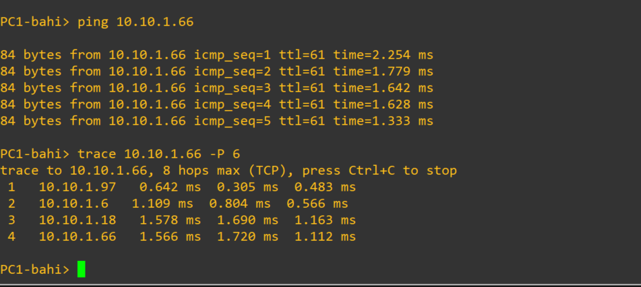{#fig-74 width=70%}

## Анализ таблицы маршрутизации RIP на msk-bahi-gw-01

- Просмотр выполнен командой `show ip rip`
- Присутствуют сети:

  - подключённые
  - динамически полученные
- Next hop: `10.10.1.6`
- Метрики соответствуют трассировке
- Подтверждён корректный RIP-обмен

## {#fig-75 width=70%}

## Настройка RIPng на msk-bahi-gw-01

- Включён протокол RIPng
- Добавлены интерфейсы:

  - eth0
  - eth1
  - eth2
- Все IPv6-сегменты участвуют в маршрутизации
- Конфигурация сохранена

## {#fig-76 width=70%}

## Настройка RIPng на msk-bahi-gw-02

- Активирован RIPng
- Добавлены интерфейсы:

  - eth0
  - eth1
- Конфигурация сохранена командой `write memory`

## {#fig-77 width=70%}

## Настройка RIPng на msk-bahi-gw-03

- Включён RIPng
- Добавлены интерфейсы:

  - eth0
  - eth1
  - eth2
- Обеспечено распространение IPv6-маршрутов
- Конфигурация сохранена

## 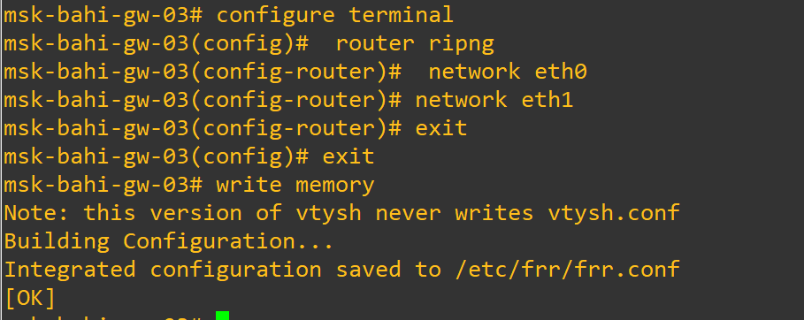{#fig-78 width=70%}

## Завершение настройки RIPng на маршрутизаторе msk-bahi-gw-04

- Включён протокол динамической маршрутизации IPv6 RIPng
- В процесс RIPng добавлены интерфейсы:

  - eth0
  - eth1
- Обеспечено участие соответствующих IPv6-сегментов в обмене маршрутами
- Конфигурация сохранена командой `write memory`

## {#fig-79 width=70%}

## Проверка IPv6-связности и трассировка маршрута с PC1-bahi

- С узла PC1-bahi выполнена команда:

  - `ping 2001:db8:1:6::a`
- Эхо-ответы не получены → отсутствует сквозная IPv6-связность
- Выполнена трассировка:

  - `trace 2001:db8:1:6::a`
- Зафиксирован маршрут:

  - 2001:db8:1:1::1
  - 2001:db8:1:2::2
  - 2001:db8:1:4::2
- Дальнейшая доставка пакетов не завершена

## 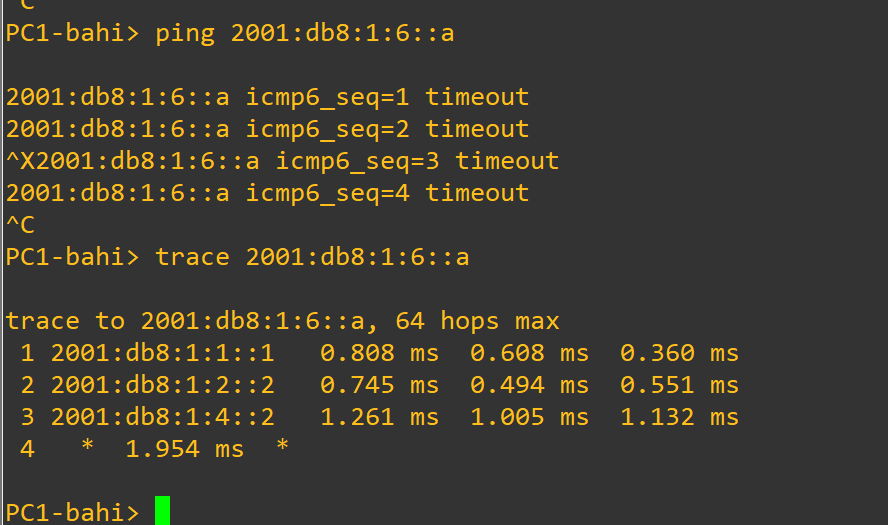{#fig-80 width=70%}

## Анализ таблицы маршрутизации RIPng на msk-bahi-gw-01

- Выполнена команда `show ipv6 ripng`
- В таблице присутствуют:

  - непосредственно подключённые сети:

    - `2001:db8:1:1::/64`
    - `2001:db8:1:2::/64`
  - динамически полученные маршруты:

    - `2001:db8:1:4::/64`
    - `2001:db8:1:6::/64`
- Next hop:

  - link-local `fe80::e7f:63ff:feb4:0`
- Интерфейс:

  - eth1
- Подтверждено корректное распространение IPv6-маршрутов по RIPng

## {#fig-81 width=70%}

## Настройка OSPFv2 на маршрутизаторе msk-bahi-gw-01

- Включён протокол динамической маршрутизации OSPFv2
- В область 0.0.0.0 добавлены сети:

  - `10.10.1.96/27`
  - `10.10.1.4/30`
- Конфигурация сохранена командой `write memory`

## 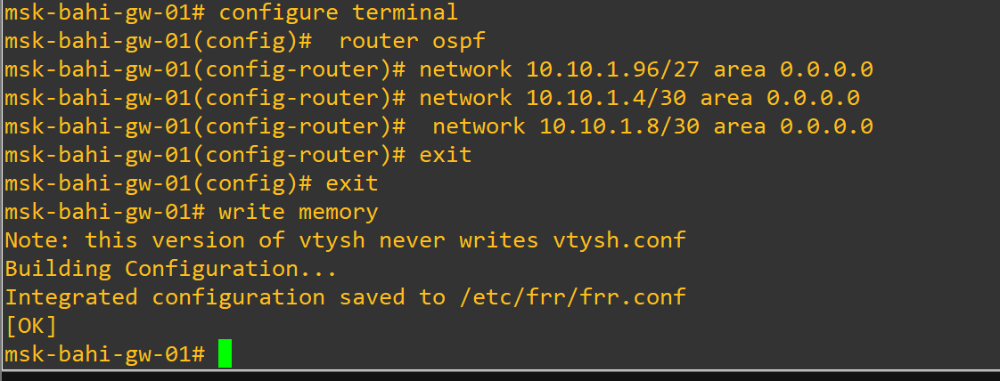{#fig-82 width=70%}

## Настройка OSPFv2 на маршрутизаторе msk-bahi-gw-02

- Включён протокол OSPFv2
- В область 0.0.0.0 добавлены сети:

  - `10.10.1.64/28`
  - `10.10.1.16/30`
  - `10.10.1.32/30`
- Конфигурация сохранена

## {#fig-83 width=70%}

## Настройка OSPFv2 на маршрутизаторе msk-bahi-gw-03

- Настроен протокол OSPFv2
- В магистральную область 0.0.0.0 добавлены сети:

  - `10.10.1.4/30`
  - `10.10.1.16/30`
- Параметры сохранены

## {#fig-84 width=70%}

## Настройка OSPFv2 на маршрутизаторе msk-bahi-gw-04

- Включён OSPFv2
- В область 0.0.0.0 добавлены сети:

  - `10.10.1.8/30`
  - `10.10.1.32/30`
- Завершена настройка OSPF на всех маршрутизаторах топологии

## 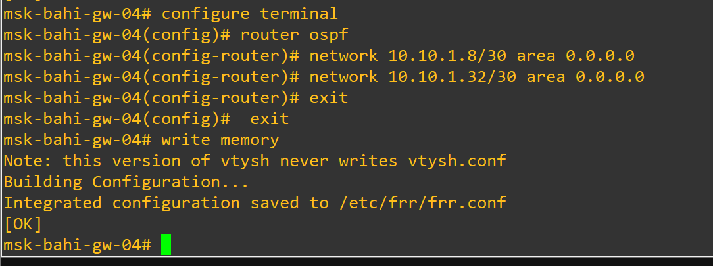{#fig-85 width=70%}

## Проверка IPv4-связности и трассировка маршрута при OSPF

- С узла PC1-bahi выполнена команда:

  - `ping 10.10.1.66`
- Эхо-ответы не получены → IPv4-связность отсутствует
- Выполнена трассировка:

  - `trace 10.10.1.66 -P 6`
- Зафиксирован маршрут:

  - `10.10.1.97`
  - `10.10.1.6`
  - `10.10.1.18`
- Дальнейшая доставка пакетов не завершена

## 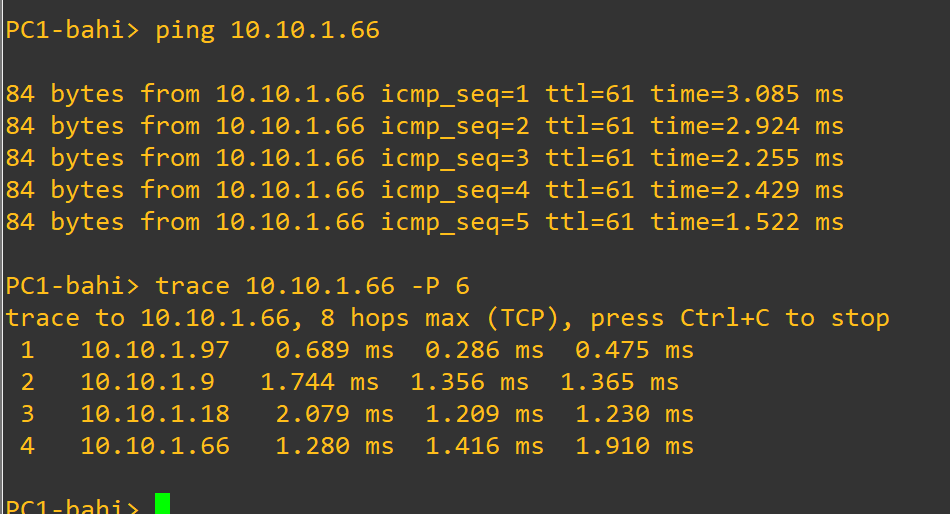{#fig-86 width=70%}

## Анализ соседства и таблицы маршрутизации OSPF на msk-bahi-gw-01

- Проверено состояние OSPF
- В таблице соседей:

  - сосед с router-id `10.10.1.17`
  - состояние Full / Backup
- В таблице маршрутизации:

  - подключённые сети:

    - `10.10.1.4/30`
    - `10.10.1.96/27`
  - динамические маршруты:

    - `10.10.1.16/30`
    - `10.10.1.32/30`
    - `10.10.1.64/28`
- Next hop:

  - `10.10.1.6`
- Подтверждён корректный OSPF-обмен

## {#fig-87 width=70%}

## Настройка OSPFv3 на маршрутизаторе msk-bahi-gw-01

- Включён протокол динамической маршрутизации IPv6 OSPFv3
- Назначен router-id:

  - `1.1.1.1`
- Интерфейсы eth0 и eth1 добавлены в область:

  - OSPFv3 area 0
- Конфигурация сохранена командой `write memory`

## {#fig-88 width=70%}

## Настройка OSPFv3 на маршрутизаторе msk-bahi-gw-02

- Включён OSPFv3
- Назначен router-id:

  - `2.2.2.2`
- Интерфейсы eth0 и eth1 добавлены в область 0
- Зафиксировано сообщение об ошибке сохранения в режиме конфигурации
- Настройка продолжена и завершена

## 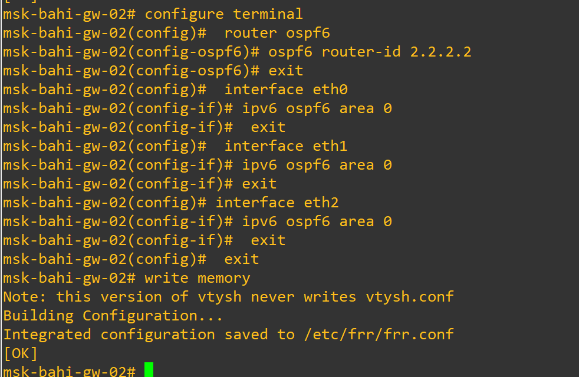{#fig-89 width=70%}

## Настройка OSPFv3 на маршрутизаторе msk-bahi-gw-03

- Настроен OSPFv3
- Router-id:

  - `3.3.3.3`
- Интерфейсы eth0 и eth1 подключены к области 0
- Конфигурация сохранена

## {#fig-90 width=70%}

## Настройка OSPFv3 на маршрутизаторе msk-bahi-gw-04

- Включён OSPFv3
- Назначен router-id:

  - `4.4.4.4`
- Интерфейсы eth0 и eth1 добавлены в область 0
- Конфигурация сохранена

## 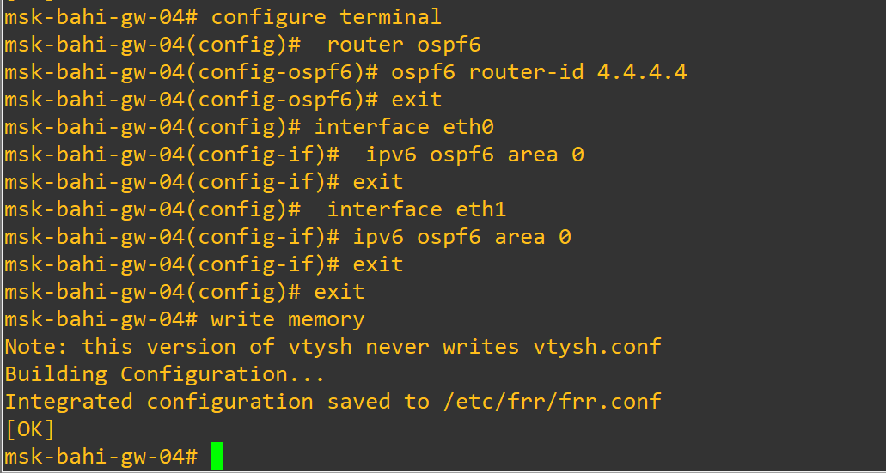{#fig-91 width=70%}

## Проверка IPv6-связности и трассировка маршрута при OSPFv3

- С узла PC1-bahi выполнена команда:

  - `ping 2001:db8:1:6::a`
- Эхо-ответы не получены
- Выполнена трассировка:

  - `trace 2001:db8:1:6::a`
- Зафиксирован маршрут:

  - `2001:db8:1:1::1`
  - `2001:db8:1:2::2`
  - `2001:db8:1:4::2`
- Дальнейшая доставка пакетов не завершена

## 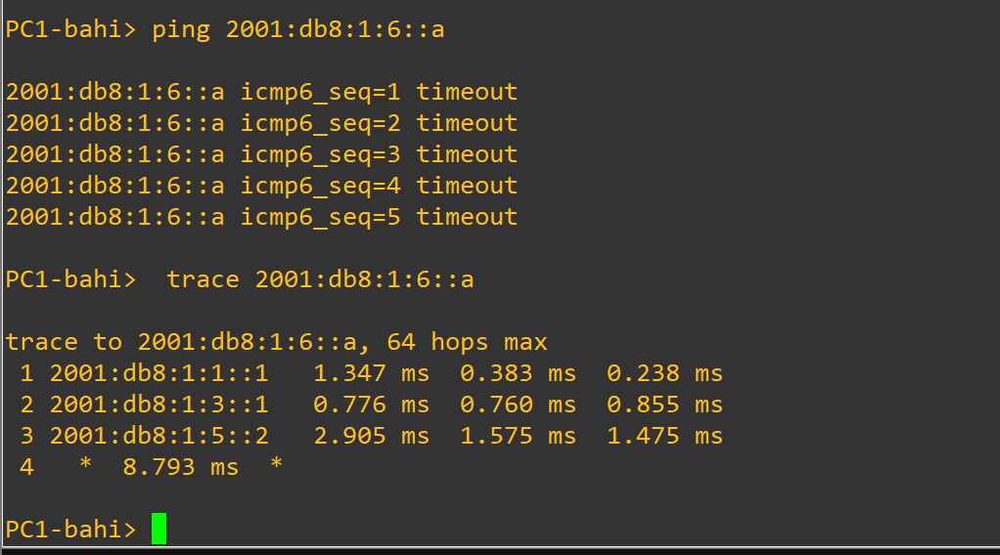{#fig-92 width=70%}

## Анализ соседства и таблицы маршрутизации OSPFv3 на msk-bahi-gw-01

- Проверено состояние OSPFv3
- В таблице соседей:

  - router-id `3.3.3.3`
  - состояние Full / BDR
- В таблице маршрутизации:

  - подключённые префиксы:

    - `2001:db8:1:1::/64`
    - `2001:db8:1:2::/64`
  - динамические маршруты:

    - `2001:db8:1:4::/64`
    - `2001:db8:1:6::/64`
- Next hop:

  - link-local по интерфейсу eth1
- Подтверждено корректное формирование базы маршрутов OSPFv3

## 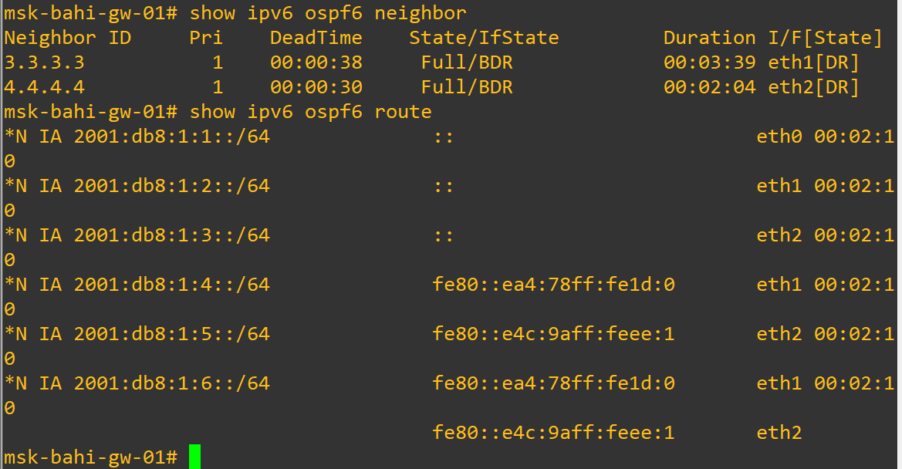{#fig-93 width=70%}

## Выводы

- Смоделирована сеть с поддержкой IPv4 и IPv6 в среде GNS3
- Выполнена настройка адресации в соответствии с заданной топологией
- Настроены и исследованы протоколы:

  - RIP / RIPng
  - OSPFv2 / OSPFv3
- Проанализированы:

  - таблицы маршрутизации
  - соседство маршрутизаторов
  - пути прохождения пакетов
- Подтверждена корректная реакция протоколов на изменение состояния интерфейсов
- Полученные результаты соответствуют цели и требованиям лабораторной работы

