---
## Author
author:
  name: Бахи сиди али темассини
  degrees: Student (3 курс)
  orcid: ""
  email: 1032234211@pfur.ru
  affiliation:
    - name: Российский университет дружбы народов
      country: Российская Федерация
      postal-code: 117198
      city: Москва
      address: ул. Миклухо-Маклая, д. 6

## Title
title: "Отчёт по лабораторной работе №8"
subtitle: "Дисциплина: Сетевые технологии"
license: "CC BY"
---

## Цель работы

Изучение принципов маршрутизации в IPv4- и IPv6-сетях и принципов настройки сетевого оборудования.

## Настройка динамической маршрутизации в сетях IPv4 и IPv6

- Развёртывание моделируемой сети в GNS3

В начале выполнения лабораторной работы была запущена GNS3 VM и программа GNS3, после чего создан новый проект. В рабочем пространстве были размещены и соединены сетевые устройства в соответствии с топологией, представленной на рисунке 8.4, с использованием маршрутизаторов FRR, коммутаторов и узлов VPCS.

Подключение устройств выполнено таким образом, чтобы сформировать кольцевую топологию из четырёх маршрутизаторов (gw-01, gw-02, gw-03, gw-04). Узел PC1 был подключён через коммутатор sw-01 к маршрутизатору gw-01, а узел PC2 — через коммутатор sw-02 к маршрутизатору gw-03.

Далее были изменены отображаемые имена устройств в соответствии с требованиями задания: коммутаторы получили имена по шаблону msk-user-sw-0x, маршрутизаторы — msk-user-gw-0x, а узлы VPCS — PCx-user, где user — имя bahi учётной записи пользователя, x — порядковый номер устройства.

На завершающем этапе был включён захват трафика на соединениях между sw-01 и gw-01, а также между sw-02 и gw-03, что позволило в дальнейшем проанализировать работу протоколов маршрутизации и передачу пользовательского трафика ([рис. @fig-1]).

{#fig-1 width=70%}

- Назначение IPv4-адресов оконечным устройствам

В соответствии с таблицей адресации (табл. 8.2) были настроены IPv4-адреса на оконечных устройствах PC1 и PC2 с использованием команд VPCS.
На узле PC1 был назначен IP-адрес 10.0.10.10/24 с указанием шлюза по умолчанию 10.0.10.1. Конфигурация была сохранена, после чего с помощью команды show ip подтверждена корректность заданных параметров. Аналогично, на узле PC2 был назначен IP-адрес 10.0.11.10/24 с шлюзом по умолчанию 10.0.11.1. После сохранения конфигурации проверка команды show ip показала корректное применение настроек. Таким образом, оконечные устройства были успешно сконфигурированы ([рис. @fig-2], [рис. @fig-3]).

{#fig-2 width=70%}

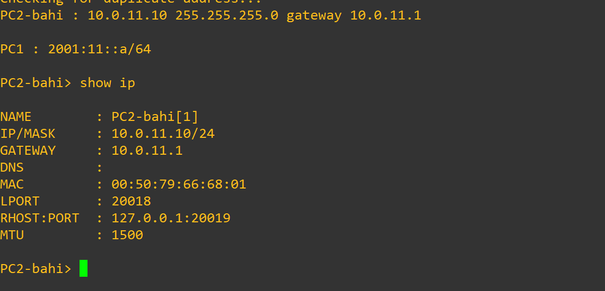{#fig-3 width=70%}

- Настройка IPv4-адресации на маршрутизаторе msk-user-gw-01

На маршрутизаторе msk-user-gw-01 были настроены IPv4-адреса на интерфейсах eth0, eth1 и eth2 в соответствии с таблицей адресации. После назначения адресов интерфейсы были переведены в активное состояние с помощью команды no shutdown. Конфигурация была сохранена, а корректность настроек подтверждена командой show running-config ([рис. @fig-4]).

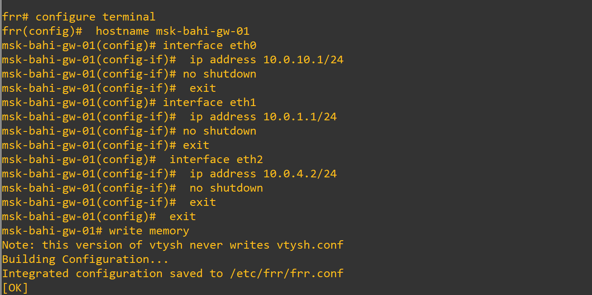{#fig-4 width=70%}

- Настройка IPv4-адресации на маршрутизаторе msk-user-gw-02

На маршрутизаторе msk-user-gw-02 была выполнена настройка IPv4-адресов на интерфейсах eth0 и eth1 согласно заданной схеме сети. Все интерфейсы были активированы, после чего конфигурация сохранена в энергонезависимой памяти. Проверка текущей конфигурации подтвердила правильность назначения IP-адресов ([рис. @fig-5]).

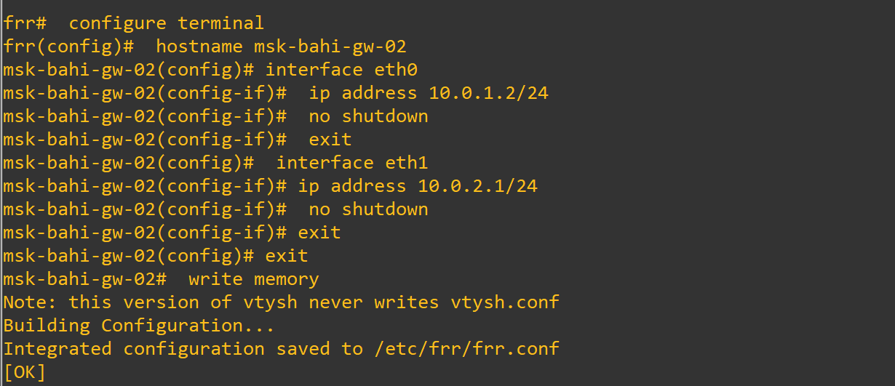{#fig-5 width=70%}

- Настройка IPv4-адресации на маршрутизаторе msk-user-gw-03

На маршрутизаторе msk-user-gw-03 были назначены IPv4-адреса на интерфейсах eth0, eth1 и eth2, обеспечивающих подключение к локальной сети и соседним маршрутизаторам. Все интерфейсы успешно активированы, конфигурация сохранена, а результаты настройки подтверждены выводом команды show running-config ([рис. @fig-6]).

{#fig-6 width=70%}

- Настройка IPv4-адресации на маршрутизаторе msk-user-gw-04

На маршрутизаторе msk-user-gw-04 выполнена настройка IPv4-адресов на интерфейсах eth0 и eth1 в соответствии с топологией сети. После включения интерфейсов и сохранения конфигурации была выполнена проверка, подтвердившая корректность параметров ([рис. @fig-6]).

{#fig-6 width=70%}

- Назначение IPv6-адресов оконечным устройствам

В соответствии с таблицей адресации (табл. 8.2) на оконечных устройствах PC1 и PC2 были вручную настроены IPv6-адреса с использованием команд VPCS.

На узле PC1 был назначен глобальный IPv6-адрес 2001:10::a/64. После сохранения конфигурации проверка с помощью команды show ipv6 подтвердила корректное назначение глобального и link-local адресов.

Аналогично, на узле PC2 был назначен глобальный IPv6-адрес 2001:11::a/64. Конфигурация была сохранена, а вывод команды show ipv6 подтвердил корректность параметров IPv6 ([рис. @fig-7], [рис. @fig-8]).

{#fig-7 width=70%}

{#fig-8 width=70%}

- Настройка IPv6-адресации на маршрутизаторе msk-user-gw-01

На маршрутизаторе msk-user-gw-01 была включена поддержка пересылки IPv6 (ipv6 forwarding) и настроены IPv6-адреса на интерфейсах eth0, eth1 и eth2 в соответствии с таблицей адресации. На интерфейсе eth0 дополнительно включена рассылка Router Advertisement для узлов локальной сети ([рис. @fig-9]).

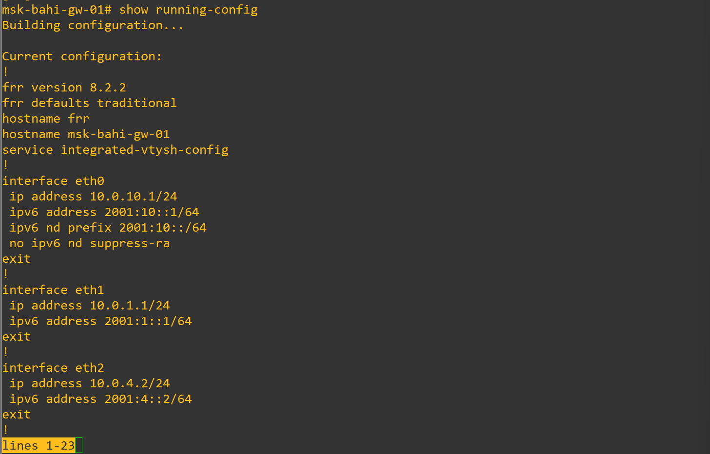{#fig-9 width=70%}

- Настройка IPv6-адресации на маршрутизаторе msk-user-gw-02

На маршрутизаторе msk-user-gw-02 выполнено включение IPv6-пересылки и назначение IPv6-адресов на интерфейсах eth0 и eth1, обеспечивающих соединение с соседними маршрутизаторами. Все интерфейсы активированы, конфигурация сохранена, корректность настроек подтверждена ([рис. @fig-10]).

{#fig-10 width=70%}

- Настройка IPv6-адресации на маршрутизаторе msk-user-gw-03

На маршрутизаторе msk-user-gw-03 была активирована поддержка IPv6 и назначены IPv6-адреса на интерфейсах eth0, eth1 и eth2. На интерфейсе eth0 включена рассылка Router Advertisement для автоматической конфигурации узлов сети. После сохранения конфигурации параметры IPv6 были успешно проверены ([рис. @fig-11]).

{#fig-11 width=70%}

- Настройка IPv6-адресации на маршрутизаторе msk-user-gw-04

На маршрутизаторе msk-user-gw-04 выполнена настройка IPv6-адресов на интерфейсах eth0 и eth1 с предварительным включением пересылки IPv6. Все интерфейсы переведены в активное состояние, конфигурация сохранена, что подтверждает готовность маршрутизатора к дальнейшей маршрутизации IPv6 ([рис. @fig-12]).

{#fig-12 width=70%}

##  Настройка динамической маршрутизации по протоколу RIP.

- Настройка RIP на маршрутизаторе msk-user-gw-01

На маршрутизаторе msk-user-gw-01 был включён протокол динамической маршрутизации RIP версии 2. Маршрутизация активирована на интерфейсах eth0, eth1 и eth2, что позволило объявлять все непосредственно подключённые сети и получать маршруты от соседних маршрутизаторов. Конфигурация сохранена в памяти устройства ([рис. @fig-13]).

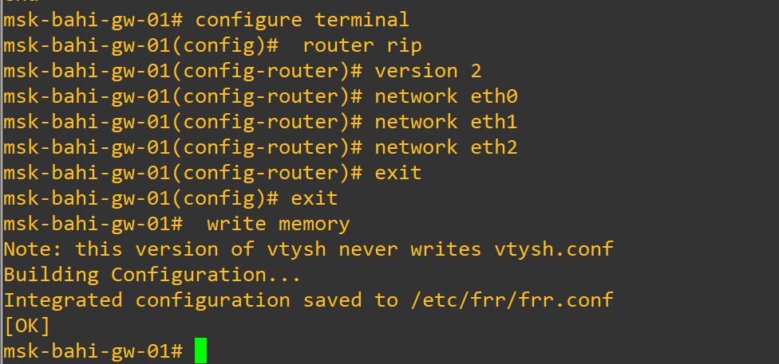{#fig-13 width=70%}

- Настройка RIP на маршрутизаторе msk-user-gw-02

На маршрутизаторе msk-user-gw-02 выполнена настройка RIPv2 с активацией протокола на интерфейсах eth0 и eth1, обеспечивающих связь с соседними маршрутизаторами. После сохранения конфигурации маршрутизатор начал участвовать в обмене маршрутной информацией ([рис. @fig-14]).

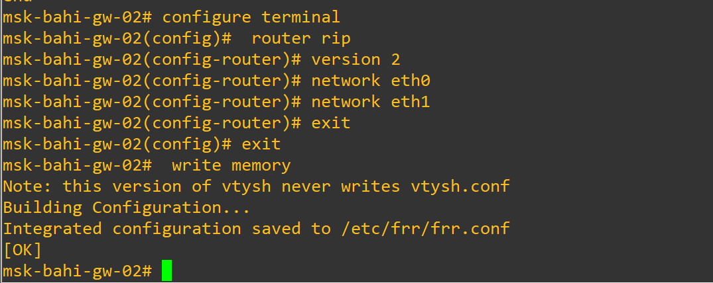{#fig-14 width=70%}

- Настройка RIP на маршрутизаторе msk-user-gw-03

На маршрутизаторе msk-user-gw-03 был настроен протокол RIPv2 и включён на интерфейсах eth0, eth1 и eth2. Это обеспечило распространение информации о локальных и транзитных сетях, а также получение маршрутов от соседних узлов. Конфигурация успешно сохранена ([рис. @fig-15]).

{#fig-15 width=70%}

- Настройка RIP на маршрутизаторе msk-user-gw-04

На маршрутизаторе msk-user-gw-04 выполнена настройка RIPv2 с включением протокола на интерфейсах eth0 и eth1. После сохранения параметров маршрутизатор корректно участвует в динамической маршрутизации сети ([рис. @fig-16]).

{#fig-16 width=70%}

- Проверка корректности настройки маршрутизации RIP

Для проверки правильности настройки динамической маршрутизации по протоколу RIP версии 2 на всех маршрутизаторах были использованы команды show ip route rip, show ip rip и show ip rip status.

Результаты команды show ip route rip показали, что маршрутизаторы успешно получили маршруты к удалённым сетям по протоколу RIP, с указанием следующего перехода (Next Hop) и соответствующих метрик. Наличие записей с кодом R подтверждает участие маршрутизаторов в RIP-маршрутизации ([рис. @fig-17], [рис. @fig-18]).

Вывод команды show ip rip отразил список объявляемых и полученных сетей, значения метрик и источники маршрутной информации. Это подтверждает корректный обмен маршрутными обновлениями между соседними маршрутизаторами ([рис. @fig-19]).

Команда show ip rip status показала, что используется RIP версии 2, обновления отправляются каждые 30 секунд, таймеры протокола соответствуют стандартным значениям, а также что маршрутизация активна на всех требуемых интерфейсах ([рис. @fig-20]).

Таким образом, динамическая маршрутизация по протоколу RIP настроена корректно и функционирует в соответствии с заданной топологией сети.

{#fig-17 width=70%}

{#fig-18 width=70%}

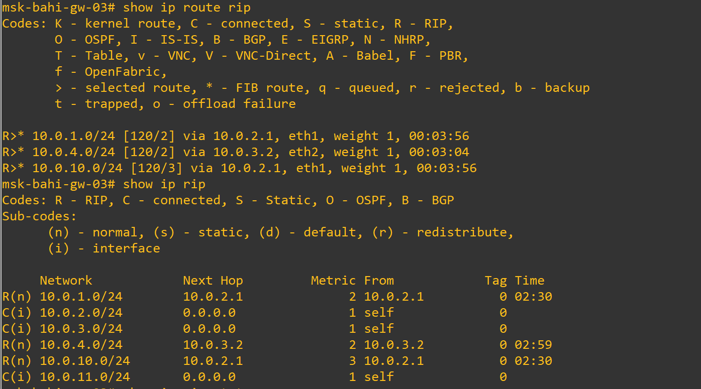{#fig-19 width=70%}

{#fig-20 width=70%}

#### Проверка путей прохождения пакетов и реакции RIP на отказ интерфейса

- Проверка связности между PC1 и PC2 (нормальный режим)

На первом этапе с узла PC1 была выполнена проверка связности с узлом PC2 с помощью команды `ping 10.0.11.10`. Ответы ICMP были успешно получены, что подтверждает корректную маршрутизацию в сети.

С помощью команды `trace 10.0.11.10 -P 6` был определён путь следования пакетов. Трассировка показала прохождение трафика через несколько маршрутизаторов, что соответствует заданной топологии и подтверждает работу динамической маршрутизации RIP ([рис. @fig-21]).

{#fig-21 width=70%}

- Анализ метрик RIP в штатном режиме

На маршрутизаторе msk-user-gw-01 была выполнена команда `show ip rip`.
В таблице маршрутизации отображались сети, полученные по протоколу RIP, с корректными значениями метрик (меньше 16). Это означает, что маршруты считаются доступными, а основной путь к сети 10.0.11.0/24 проходит через маршрутизатор msk-user-gw-02 ([рис. @fig-22]).

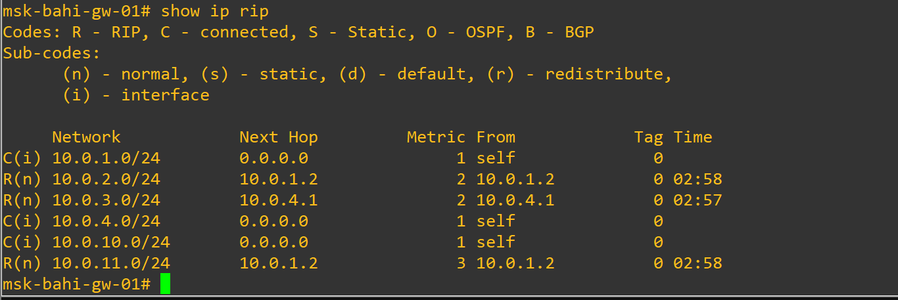{#fig-22 width=70%}

- Отключение интерфейса на маршрутизаторе msk-user-gw-02

Далее был искусственно смоделирован отказ канала связи путём отключения интерфейса eth0 на маршрутизаторе msk-user-gw-02 с помощью команды `shutdown`.

После этого на маршрутизаторе msk-user-gw-01 повторно была проверена таблица RIP.
В выводе команды `show ip rip` маршруты, ранее проходившие через msk-user-gw-02, получили метрику 16, что в протоколе RIP означает недостижимый маршрут. Это подтверждает корректное обнаружение отказа и распространение информации о недоступности сети.

- Проверка связности при отказе канала

После отключения интерфейса повторная попытка `ping` с PC1 на PC2 завершилась неудачно (тайм-ауты), что свидетельствует о временной потере маршрута.
Команда `trace` показала сообщения об ошибке *Destination host unreachable*, подтверждая отсутствие доступного пути в данный момент.

- Восстановление маршрута и перестроение сети

Через некоторое время RIP получил обновления от других маршрутизаторов и выбрал альтернативный маршрут (через msk-user-gw-04). Это отразилось в таблице маршрутизации msk-user-gw-01, где для сети 10.0.11.0/24 появился новый Next Hop и допустимая метрика.

После этого повторный `ping` с PC1 на PC2 снова стал успешным, а команда `trace` показала новый путь прохождения пакетов через альтернативные маршрутизаторы.

Примерное время восстановления маршрута соответствует таймерам RIP и составляет несколько десятков секунд.

- Включение интерфейса msk-user-gw-02

На заключительном этапе интерфейс eth0 на маршрутизаторе msk-user-gw-02 был снова включён командой `no shutdown`. После очередного обмена RIP-обновлениями основной маршрут был восстановлен, а метрики вернулись к исходным значениям.

#### Анализ перехваченного сетевого трафика

В процессе выполнения работы был проанализирован перехваченный трафик на каналах между коммутаторами и маршрутизаторами, что позволило зафиксировать работу протокола RIPv2 и передачу пользовательского трафика ([рис. @fig-18]). В захвате присутствуют RIP-пакеты, отправляемые на мультикаст-адрес 224.0.0.9, которые содержат информацию об объявляемых сетях и соответствующих метриках маршрутов. В момент отказа канала наблюдается появление маршрутов с метрикой 16, что указывает на их недостижимость и подтверждает корректную реакцию протокола RIP. Также в трафике зафиксированы ICMP Echo Request и Echo Reply, возникающие при выполнении команды ping, по которым можно определить наличие или отсутствие связности между узлами. Анализ значений TTL и IP-адресов источника и назначения позволяет проследить путь следования пакетов и его изменение после перестроения маршрутизации ([рис. @fig-18-1]).

{#fig-18 width=70%}

{#fig-18-1 width=70%}

## Настройка динамической маршрутизации по протоколу OSPF

- Настройка OSPFv2 на маршрутизаторе msk-bahi-gw-01

На маршрутизаторе msk-bahi-gw-01 выполнена настройка протокола динамической маршрутизации OSPFv2. В процесс OSPF добавлены сети 10.0.10.0/24, 10.0.1.0/24 и 10.0.4.0/24, все они включены в область 0.0.0.0. После завершения конфигурирования изменения сохранены в постоянную конфигурацию ([рис. @fig-19]).

{#fig-19 width=70%}

- Настройка OSPFv2 на маршрутизаторе msk-bahi-gw-02

На маршрутизаторе msk-bahi-gw-02 активирован процесс OSPFv2 и выполнено объявление сетей 10.0.1.0/24 и 10.0.2.0/24 в область 0.0.0.0. После выхода из режима конфигурирования текущая конфигурация была сохранена в файл настроек FRR ([рис. @fig-20]).

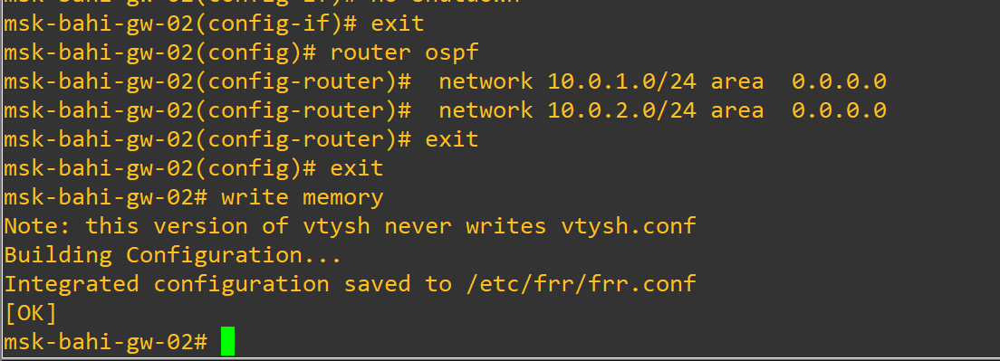{#fig-20 width=70%}

- Настройка OSPFv2 на маршрутизаторе msk-bahi-gw-03

На маршрутизаторе msk-bahi-gw-03 в процесс OSPFv2 включены сети 10.0.11.0/24, 10.0.2.0/24 и 10.0.3.0/24, относящиеся к области 0.0.0.0. Конфигурация маршрутизатора сохранена после завершения настройки ([рис. @fig-21]).

{#fig-21 width=70%}

- Настройка OSPFv2 на маршрутизаторе msk-bahi-gw-04

На маршрутизаторе msk-bahi-gw-04 выполнена настройка OSPFv2 с добавлением сетей 10.0.3.0/24 и 10.0.4.0/24 в магистральную область 0.0.0.0. После завершения конфигурирования параметры маршрутизации сохранены в постоянной конфигурации ([рис. @fig-22]).

{#fig-22 width=70%}

- С узла PC1 выполнена проверка связности с узлом PC2 (10.0.11.10) командой `ping`, получены ответы ICMP (icmp_seq=1–5) с TTL=61. Командой `trace 10.0.11.10 -P 6` определён маршрут прохождения пакетов: 10.0.10.1 → 10.0.1.2 → 10.0.2.2 → 10.0.11.10 ([рис. @fig-23]).

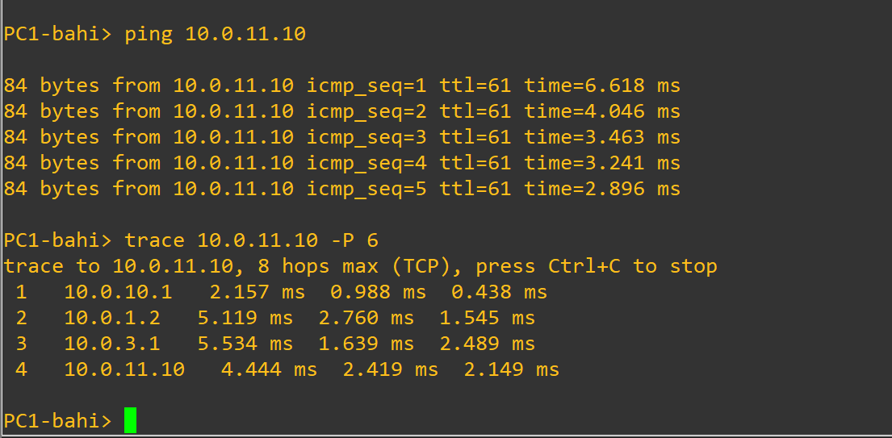{#fig-23 width=70%}

- На маршрутизаторе msk-bahi-gw-01 проверено состояние соседства OSPFv2 и таблица маршрутов протокола командами `show ip ospf neighbor` и `show ip ospf route`. В выводе `show ip ospf neighbor` отображаются два соседа в состоянии Full/Backup (адреса соседей: 10.0.1.2 и 10.0.4.1). В таблице OSPF присутствуют маршруты к сетям 10.0.2.0/24 и 10.0.3.0/24 через соответствующие next-hop, а также к сети 10.0.11.0/24 сразу по двум направлениям: via 10.0.1.2 (eth1) и via 10.0.4.1 (eth2) ([рис. @fig-24]).

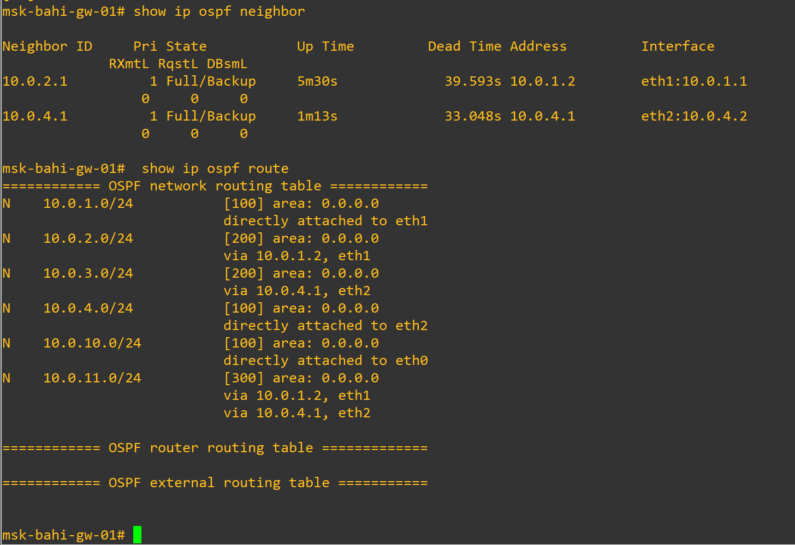{#fig-24 width=70%}

- Для моделирования отказа канала на маршрутизаторе msk-bahi-gw-02 выполнено отключение интерфейса eth0 командой `shutdown` в режиме конфигурирования (`configure terminal` → `interface eth0`). Операция выполнялась без изменения остальных параметров маршрутизации ([рис. @fig-25]).

{#fig-25 width=70%}

- После отключения интерфейса на msk-bahi-gw-02 повторно проверены соседство и маршруты OSPFv2 на msk-bahi-gw-01. В выводе `show ip ospf route` маршрут к сети 10.0.2.0/24 отображается через 10.0.4.1 (eth2), а маршрут к сети 10.0.11.0/24 остаётся доступным через 10.0.4.1 (eth2), то есть используется альтернативный путь. Состояние соседства OSPF отображается в таблице `show ip ospf neighbor` ([рис. @fig-26]).

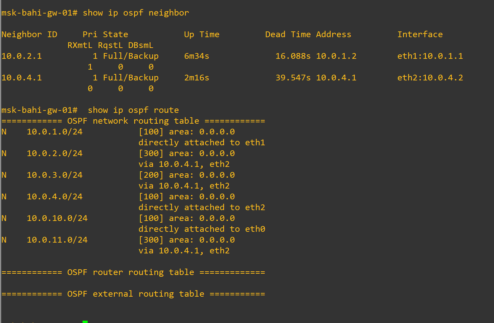{#fig-26 width=70%}

- Затем снова выполнены `ping` и `trace 10.0.11.10 -P 6` с узла PC1 для контроля связности и нового пути прохождения пакетов. Связность с 10.0.11.10 сохраняется (получены ответы ICMP), а трассировка показывает изменённый маршрут: 10.0.10.1 → 10.0.4.1 → 10.0.3.1 → 10.0.11.10 ([рис. @fig-27]).

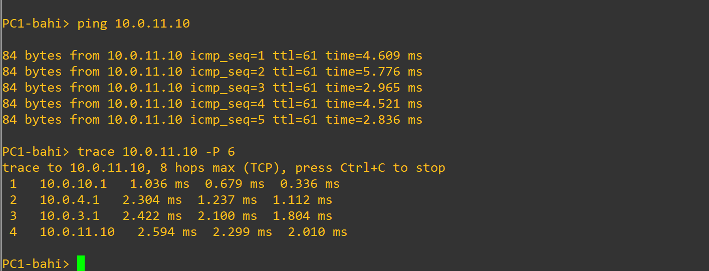{#fig-27 width=70%}

- На маршрутизаторе msk-bahi-gw-02 выполнено восстановление работоспособности интерфейса eth0 командой `no shutdown` в режиме конфигурирования (`configure terminal` → `interface eth0`). Тем самым интерфейс был вновь включён после ранее выполненного отключения ([рис. @fig-28]).

{#fig-28 width=70%}

- После включения интерфейса на msk-bahi-gw-02 на узле PC1 повторно проверена связность с PC2 (10.0.11.10) командой `ping`, получены ответы ICMP. Командой `trace 10.0.11.10 -P 6` определён маршрут прохождения пакетов: 10.0.10.1 → 10.0.1.2 → 10.0.3.1 → 10.0.11.10 ([рис. @fig-29]).

{#fig-29 width=70%}

- В захваченном трафике на соединении между коммутатором и маршрутизатором msk-bahi-gw-01 фиксируются ARP-пакеты, используемые для сопоставления IPv4-адресов с MAC-адресами, а также ICMP Echo Request и Echo Reply между узлами 10.0.10.10 и 10.0.11.10, что подтверждает проверку связности на сетевом уровне. Значения поля TTL в ICMP-ответах уменьшаются относительно исходного, что указывает на прохождение пакетов через несколько маршрутизаторов ([рис. @fig-30]).

{#fig-30 width=70%}

- В процессе трассировки маршрута в захвате наблюдаются ICMP-сообщения Time-to-live exceeded (Time to live exceeded in transit), которые формируются промежуточными маршрутизаторами при истечении значения TTL. Эти пакеты позволяют определить количество переходов и порядок следования маршрута между источником и получателем ([рис. @fig-31]).

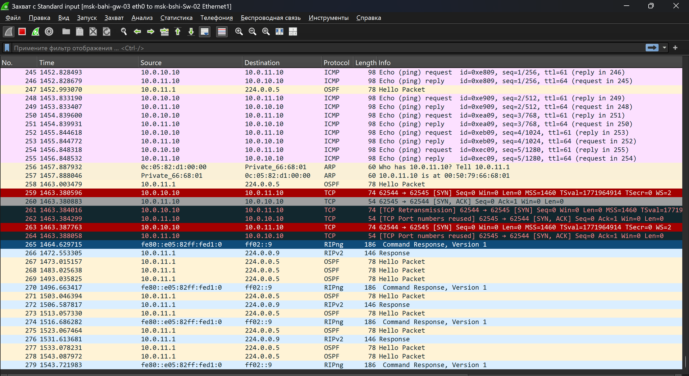{#fig-31 width=70%}

- Кроме диагностического трафика, зафиксированы служебные пакеты протоколов маршрутизации OSPF (Hello Packet), передаваемые на мультикаст-адрес 224.0.0.5, а также пакеты RIP v2, отправляемые на адрес 224.0.0.9. Это подтверждает одновременную работу протоколов динамической маршрутизации и обмен маршрутной информацией между маршрутизаторами в сети ([рис. @fig-32]).

{#fig-32 width=70%}

- Настройка OSPFv3 на маршрутизаторе msk-bahi-gw-01

На маршрутизаторе msk-bahi-gw-01 активирован процесс маршрутизации OSPFv3 для IPv6 и задан идентификатор маршрутизатора 1.1.1.1. Далее протокол OSPFv3 был включён на интерфейсах eth0, eth1 и eth2 с привязкой к области 0. После завершения настройки конфигурация сохранена в постоянную память ([рис. @fig-33]).

{#fig-33 width=70%}

- Настройка OSPFv3 на маршрутизаторе msk-bahi-gw-02

На маршрутизаторе msk-bahi-gw-02 выполнено включение OSPFv3 с назначением router-id 2.2.2.2. Протокол OSPFv3 активирован на интерфейсах eth0 и eth1, которые добавлены в магистральную область 0. После выхода из режима конфигурирования изменения сохранены ([рис. @fig-34]).

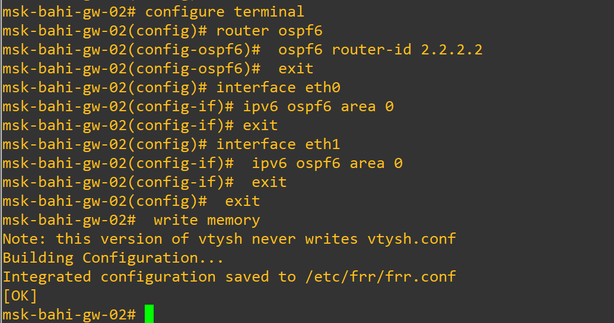{#fig-34 width=70%}

- Настройка OSPFv3 на маршрутизаторе msk-bahi-gw-03

На маршрутизаторе msk-bahi-gw-03 настроен процесс OSPFv3 с идентификатором маршрутизатора 3.3.3.3. Интерфейсы eth0, eth1 и eth2 подключены к области 0, что обеспечивает участие всех IPv6-сегментов данного маршрутизатора в динамической маршрутизации. Конфигурация сохранена командой `write memory` ([рис. @fig-35]).

{#fig-35 width=70%}

- Настройка OSPFv3 на маршрутизаторе msk-bahi-gw-04

На маршрутизаторе msk-bahi-gw-04 активирован OSPFv3 с router-id 4.4.4.4. Протокол включён на интерфейсах eth0 и eth1 и привязан к области 0. После завершения конфигурирования параметры маршрутизации сохранены в файл конфигурации FRR ([рис. @fig-36]).

{#fig-36 width=70%}

- С узла PC1 выполнена проверка связности с PC2 по IPv6-адресу 2001:11::a с помощью `ping`; получены ответы ICMPv6 (icmp6_seq=1–5) с hop limit=58. Командой `trace 2001:11::a` определён маршрут прохождения пакетов: 2001:10::1 → 2001:1::2 → 2001:2::2 → 2001:11::a ([рис. @fig-37]).

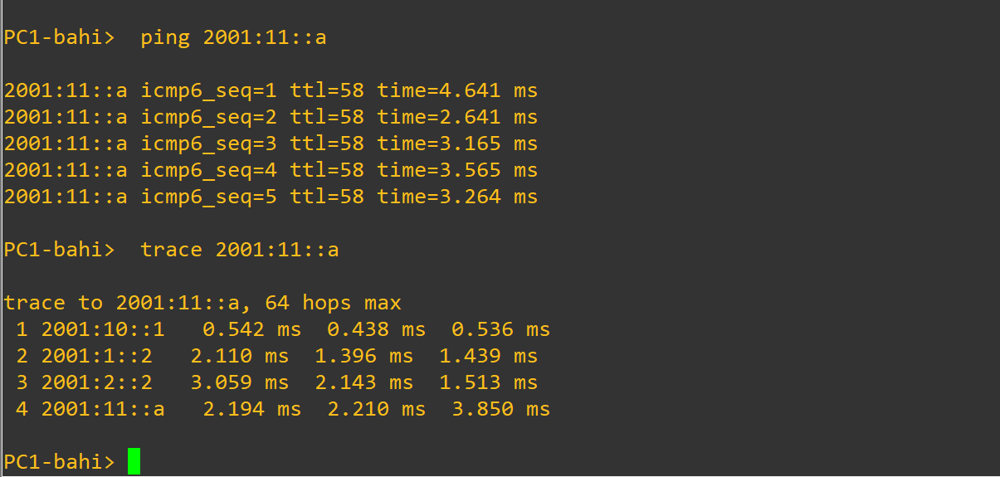{#fig-37 width=70%}

- На маршрутизаторе msk-bahi-gw-01 проверено состояние соседства OSPFv3 и таблица маршрутизации протокола командами `show ipv6 ospf6 neighbor` и `show ipv6 ospf6 route`. В списке соседей отображаются router-id 2.2.2.2 и 4.4.4.4 в состоянии Full/BDR, а в таблице маршрутов присутствуют IA-префиксы 2001:1::/64, 2001:2::/64, 2001:3::/64, 2001:4::/64, 2001:10::/64 и 2001:11::/64 с указанием интерфейсов и next-hop (link-local) ([рис. @fig-38]).

{#fig-38 width=70%}

- Для моделирования отказа на маршрутизаторе msk-bahi-gw-02 выполнено отключение интерфейса eth0 командой `shutdown` в режиме конфигурирования (`configure terminal` → `interface eth0`). Действие выполнено без изменения других параметров маршрутизации ([рис. @fig-39]).

{#fig-39 width=70%}

- После отключения интерфейса на msk-bahi-gw-02 на маршрутизаторе msk-bahi-gw-01 повторно просмотрена таблица маршрутизации OSPFv3 командой `show ipv6 ospf6 route`. В выводе маршруты к IA-префиксам отображаются с выбором доступного next-hop через link-local адрес и привязкой к соответствующему интерфейсу, что отражает пересчёт маршрутов после изменения топологии ([рис. @fig-40]).

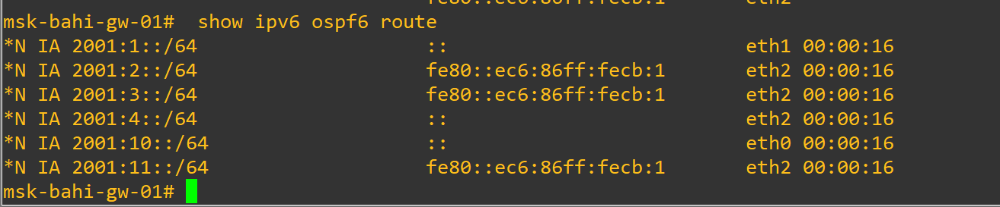{#fig-40 width=70%}

- Затем на PC1 повторно выполнены `ping 2001:11::a` и `trace 2001:11::a` для проверки связности и нового пути. Связность сохраняется (получены ответы ICMPv6), а трассировка показывает изменённый маршрут: 2001:10::1 → 2001:4::1 → 2001:3::1 → 2001:11::a ([рис. @fig-41]).

{#fig-41 width=70%}

- После проверки альтернативного пути на маршрутизаторе msk-bahi-gw-02 выполнено включение интерфейса eth0 командой `no shutdown` в режиме конфигурирования. Тем самым интерфейс был возвращён в рабочее состояние ([рис. @fig-42]).

{#fig-42 width=70%}

- После включения интерфейса на msk-bahi-gw-02 на узле PC1 снова выполнены `ping 2001:11::a` и `trace 2001:11::a` для контроля связности и маршрута. Получены ответы ICMPv6, а трассировка фиксирует текущий путь прохождения пакетов: 2001:10::1 → 2001:4::1 → 2001:3::1 → 2001:11::a ([рис. @fig-43]).

{#fig-43 width=70%}

В захваченном трафике фиксируются ICMPv6-пакеты Echo Request и Echo Reply между узлами с IPv6-адресами 2001:10::a и 2001:11::a, что подтверждает проверку связности на сетевом уровне. Значения поля Hop Limit в ответах (меньше исходного) позволяют определить факт прохождения пакетов через несколько маршрутизаторов. Также в трассировке присутствуют ICMPv6-сообщения Time Exceeded (Hop limit exceeded in transit), которые формируются промежуточными маршрутизаторами при истечении лимита переходов и используются для определения пути следования пакетов ([рис. @fig-44]).

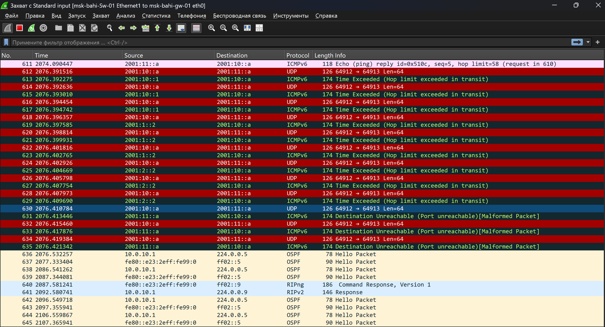{#fig-44 width=70%}

Помимо ICMPv6, в захвате наблюдаются пакеты OSPF (Hello Packet), отправляемые на мультикаст-адреса ff02::5 и 224.0.0.5, что указывает на поддержание соседства между маршрутизаторами и обмен служебной информацией протокола маршрутизации. Также зафиксированы UDP-пакеты с последующими ICMPv6-сообщениями Destination Unreachable (Port unreachable), возникающими при работе механизма трассировки маршрута. Совокупность этих пакетов позволяет проанализировать активность протоколов маршрутизации, процесс определения маршрута и реакцию сети на диагностические запросы ([рис. @fig-45]).

{#fig-45 width=70%}

## Построение туннеля IPv6–IPv4

- Развёртывание топологии сети в GNS3

В среде GNS3 был создан новый проект, после чего выполнено размещение и соединение сетевых устройств в соответствии с заданной топологией, включающей маршрутизаторы VyOS, коммутаторы и узлы VPCS ([рис. @fig-46]). Топология состоит из двух IPv6-сегментов, соединённых через IPv4-транзитную сеть, а также логического IPv6-туннеля между граничными маршрутизаторами. Имена всех устройств приведены в соответствие с требованиями задания: маршрутизаторы — msk-user-gw-0x, коммутаторы — msk-user-sw-0x, оконечные узлы — PCx-user. Для последующего анализа сетевых взаимодействий был включён захват трафика на соединении между маршрутизаторами msk-user-gw-01 и msk-user-gw-03.

{#fig-46 width=70%}

- Назначение IPv6-адресов оконечным устройствам

На оконечных узлах PC1-bahi и PC2-bahi были вручную настроены глобальные IPv6-адреса в соответствии с таблицей адресации ([рис. @fig-47]). Узлу PC1-bahi был назначен адрес 1000::a/64, а узлу PC2-bahi — адрес 1002::a/64. После сохранения конфигурации команды show ipv6 подтвердили наличие как глобальных, так и link-local IPv6-адресов, что свидетельствует о корректной настройке интерфейсов оконечных устройств.

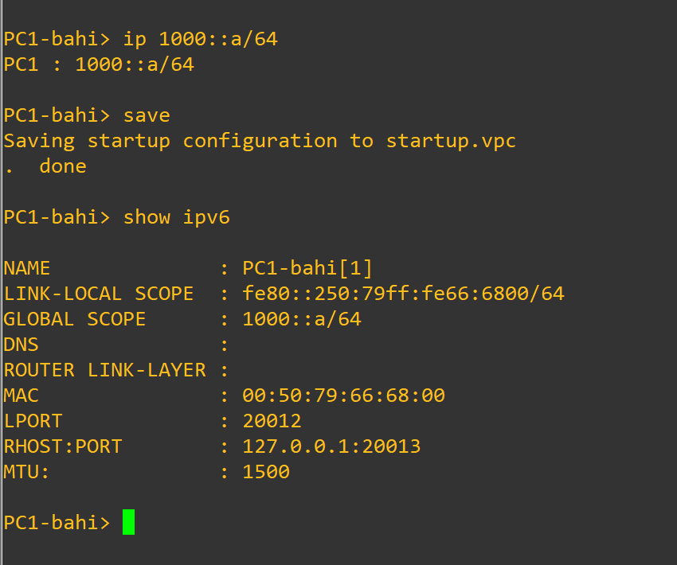{#fig-47 width=70%}

{#fig-47-1 width=70%}

- Изменение имён маршрутизаторов VyOS

На всех маршрутизаторах VyOS был выполнен переход в режим конфигурирования и изменены системные имена в соответствии с требованиями задания ([рис. @fig-48]). Для каждого устройства имя было проверено командой compare, затем конфигурация применена с помощью commit и сохранена командой save. После перезагрузки маршрутизаторов новые имена вступили в силу, что подтверждает корректность выполненных изменений.

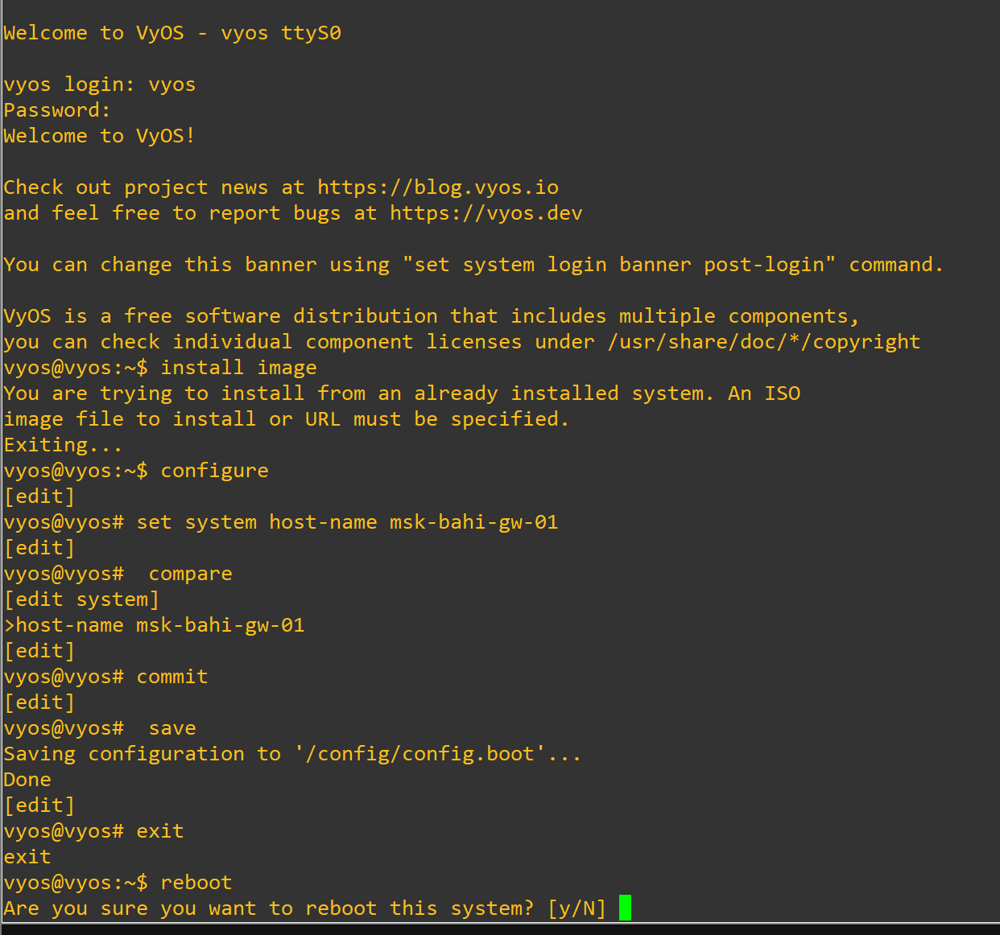{#fig-48 width=70%}

{#fig-48-1 width=70%}

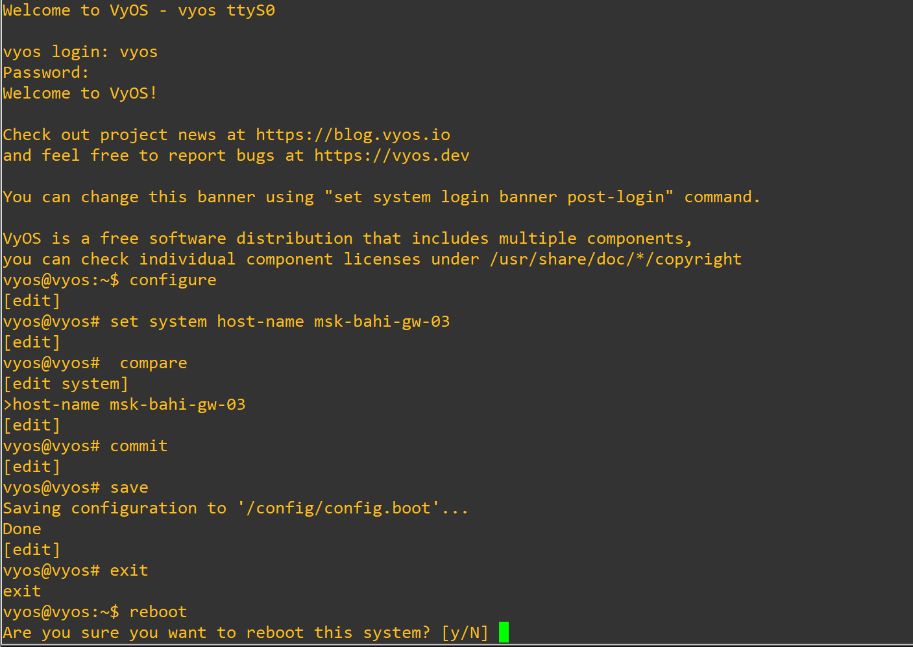{#fig-48-2 width=70%}

- Настройка IPv4- и IPv6-адресации на маршрутизаторах VyOS

На маршрутизаторах VyOS была выполнена настройка IPv4- и IPv6-адресов на интерфейсах в соответствии с заданной топологией сети ([рис. @fig-49]). На маршрутизаторе msk-bahi-gw-01 на интерфейсе eth0 был назначен IPv6-адрес 1000::1/64 и включена рассылка Router Advertisement с префиксом 1000::/64, а на интерфейсе eth1 настроен IPv4-адрес 10.0.0.1/8. На маршрутизаторе msk-bahi-gw-02 на интерфейсе eth0 был назначен IPv6-адрес 1002::1/64 с включённым Router Advertisement, а на eth1 — IPv4-адрес 20.0.0.2/8. На маршрутизаторе msk-bahi-gw-03 была выполнена настройка IPv4-адресов на интерфейсах eth0 (10.0.0.2/8) и eth1 (20.0.0.1/8). После проверки состояния интерфейсов конфигурации были сохранены, что обеспечило корректную работу IPv4-транзитной сети и автоматическую IPv6-настройку оконечных узлов.

{#fig-49 width=70%}

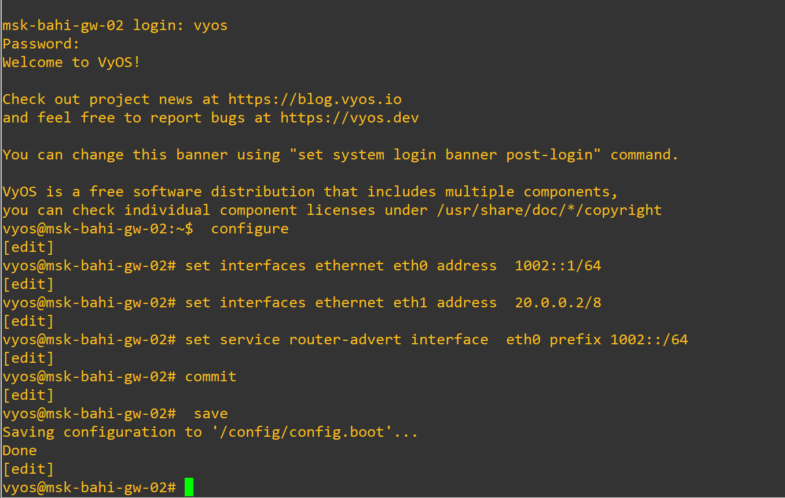{#fig-49-1 width=70%}

{#fig-49-2 width=70%}

- Проверка получения IPv6-параметров по Router Advertisement

На оконечных устройствах PC1-bahi и PC2-bahi с помощью команды show ipv6 была проверена автоматическая конфигурация IPv6-параметров по механизму Router Advertisement ([рис. @fig-50], [рис. @fig-50-1]). В выводе команд зафиксировано наличие link-local IPv6-адресов из диапазона fe80::/64, а также глобальных IPv6-адресов из соответствующих подсетей. Для PC1-bahi был получен адрес 1000::a/64, для PC2-bahi — адрес 1002::a/64. В поле Router link-layer отображается MAC-адрес ближайшего маршрутизатора, что подтверждает корректное обнаружение маршрутизатора и получение параметров IPv6 по RA.

{#fig-50 width=70%}

{#fig-50-1 width=70%}

- Проверка связности между маршрутизаторами до настройки маршрутизации

С маршрутизатора msk-bahi-gw-01 была выполнена проверка связности с соседним маршрутизатором в сети 10.0.0.0/8 с помощью команды ping, которая завершилась успешно ([рис. @fig-51]). Это подтверждает корректную настройку IPv4-адресации и работу канального уровня. Попытки выполнения ping в сеть 20.0.0.0/8 завершились сообщением Network is unreachable, что указывает на отсутствие маршрута к данной сети в таблице маршрутизации маршрутизатора.

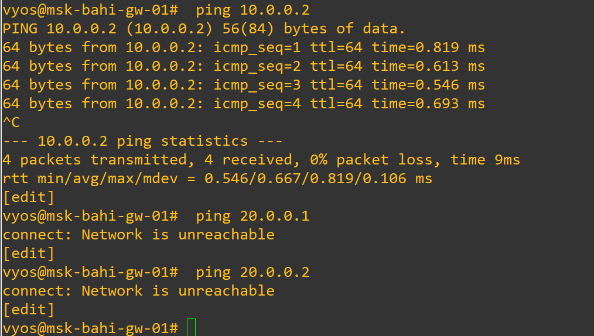{#fig-51 width=70%}

- Анализ ICMP-трафика при проверке IPv4-связности

При выполнении команды ping 10.0.0.2 с маршрутизатора msk-bahi-gw-01 в перехваченном трафике зафиксированы ICMP Echo Request и Echo Reply без потерь пакетов ([рис. @fig-52]). Это подтверждает корректную работу ARP-механизма и успешную передачу данных между маршрутизаторами в одной IPv4-подсети. При попытках ping к адресам 20.0.0.1 и 20.0.0.2 ICMP-пакеты не формировались, так как маршрутизатор отбрасывал трафик на этапе маршрутизации из-за отсутствия записи о сети назначения.

{#fig-52 width=70%}

- Настройка динамической маршрутизации IPv4 по протоколу RIP

На маршрутизаторах VyOS была настроена динамическая маршрутизация IPv4 с использованием протокола RIP ([рис. @fig-53], [рис. @fig-53-1], [рис. @fig-53-2]). На msk-bahi-gw-01 в RIP была добавлена сеть 10.0.0.0/8, на msk-bahi-gw-02 — сеть 20.0.0.0/8. Маршрутизатор msk-bahi-gw-03 был настроен для участия сразу в обеих сетях, что позволило ему выполнять транзитную функцию между IPv4-доменами. После применения и сохранения конфигурации маршрутизаторы начали обмен маршрутной информацией, в результате чего была обеспечена IPv4-связность между сетями 10.0.0.0/8 и 20.0.0.0/8 без использования статической маршрутизации.

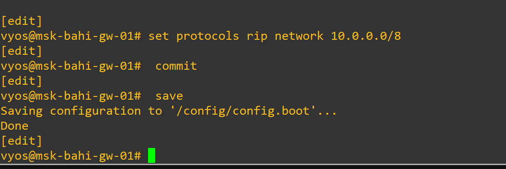{#fig-53 width=70%}

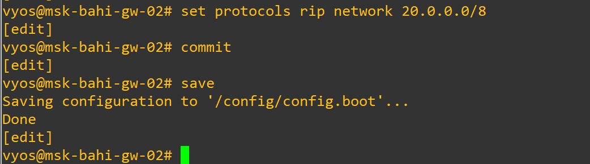{#fig-53-1 width=70%}

{#fig-53-2 width=70%}

- Проверка маршрутов с R1 с учётом анализа трафика

С маршрутизатора msk-bahi-gw-01 выполнены проверки связности с узлами IPv4-сетей ([рис. @fig-54]). Команда ping 10.0.0.2 завершилась успешно, что подтверждает корректную связность внутри сети 10.0.0.0/8 и доступность соседнего маршрутизатора. Проверка ping 20.0.0.1 и ping 20.0.0.2 также показала успешную доставку пакетов, что свидетельствует о корректной работе динамической маршрутизации RIP между сетями 10.0.0.0/8 и 20.0.0.0/8. В захваченном трафике наблюдаются ICMP Echo Request/Echo Reply, ARP-обмен и RIP-обновления на адрес 224.0.0.9, подтверждающие нормальную работу канального и сетевого уровней.

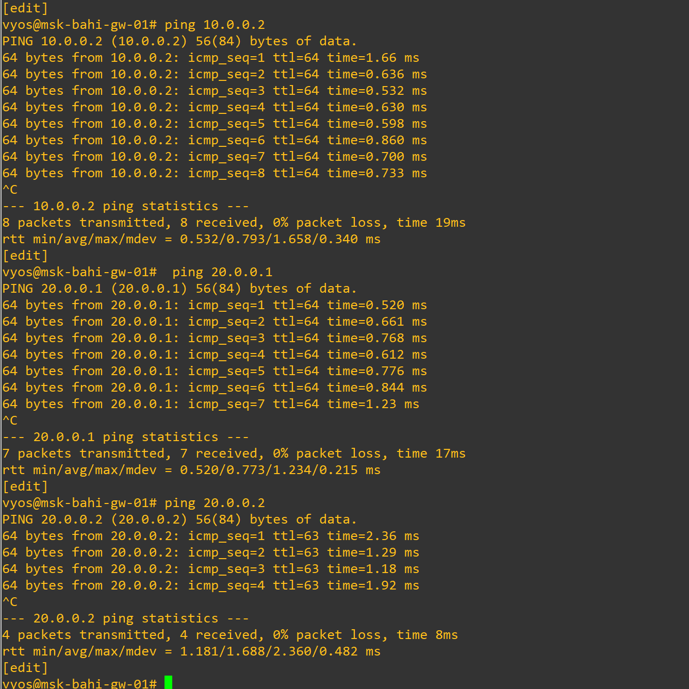{#fig-54 width=70%}

- Создание IPv6-туннеля через IPv4

На маршрутизаторах msk-bahi-gw-01 и msk-bahi-gw-02 был настроен IPv6-туннель поверх IPv4 с использованием механизма SIT ([рис. @fig-55]). На msk-bahi-gw-01 создан интерфейс tun0 с локальным IPv4-адресом 10.0.0.1, удалённым адресом 20.0.0.2 и IPv6-адресом туннеля 1001::1/64. На msk-bahi-gw-02 интерфейс tun0 настроен с локальным IPv4-адресом 20.0.0.2, удалённым адресом 10.0.0.1 и IPv6-адресом 1001::2/64. После выполнения commit и save между маршрутизаторами сформирован логический IPv6-канал поверх IPv4-сети.

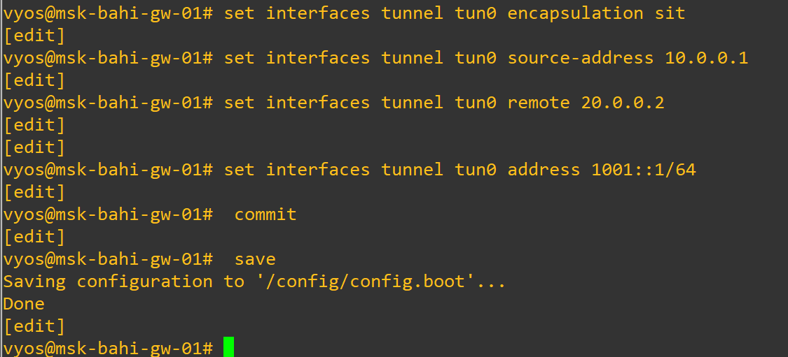{#fig-55 width=70%}

- Настройка статической маршрутизации IPv6

Для обеспечения связности между IPv6-подсетями через созданный туннель была настроена статическая маршрутизация IPv6 ([рис. @fig-56]). На маршрутизаторе msk-bahi-gw-01 добавлен маршрут к сети 1002::/64 с указанием следующего перехода 1001::2. На маршрутизаторе msk-bahi-gw-02 добавлен маршрут к сети 1000::/64 через следующий переход 1001::1. После применения и сохранения конфигурации обеспечена двусторонняя маршрутизация IPv6-трафика между удалёнными сегментами.

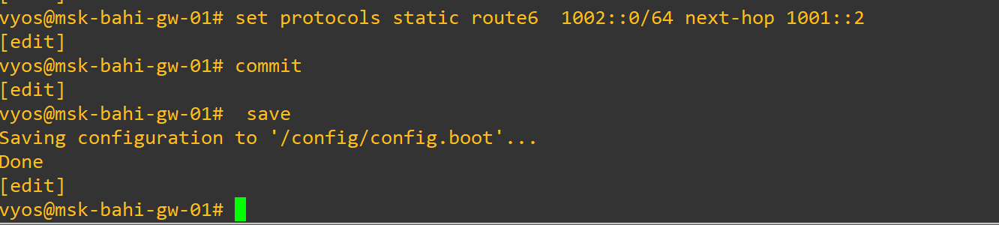{#fig-56 width=70%}

- Проверка доступности оконечных устройств и анализ туннеля IPv6-over-IPv4

С узла PC1 успешно выполнены команды ping 1002::a и trace 1002::a, что подтверждает достижимость узла PC2 по IPv6 ([рис. @fig-57]). Аналогично, с узла PC2 успешно выполнены ping 1000::a и trace 1000::a, подтверждающие обратную связность. Трассировка показывает прохождение трафика через туннельные IPv6-адреса 1001::1 → 1001::2. Анализ перехваченного трафика демонстрирует инкапсуляцию IPv6-пакетов в IPv4 (SIT), где во внешнем IPv4-заголовке используются адреса 10.0.0.1 и 20.0.0.2, а полезной нагрузкой является IPv6-пакет между адресами 1000::a и 1002::a.

{#fig-57 width=70%}

##  Задание для самостоятельного выполнения

- В среде GNS3 был создан новый проект и развернута сеть в соответствии с топологией, представленной на рисунке 8.6. В состав сети вошли четыре маршрутизатора (msk-user-gw-01 – msk-user-gw-04), соединённые в кольцевую топологию, два коммутатора и два оконечных узла VPCS.

Узел PC1-user подключён через коммутатор msk-user-sw-01 к маршрутизатору msk-user-gw-01 и использует адресацию сети 10.10.1.96/27 и 2001:DB8:1:1::/64. Узел PC2-user подключён через коммутатор msk-user-sw-02 к маршрутизатору msk-user-gw-02 и размещён в сети 10.10.1.64/28 и 2001:DB8:1:6::/64. Данная топология предназначена для последующей настройки и анализа маршрутизации в сетях IPv4 и IPv6 ([рис. @fig-58]).

{#fig-58 width=70%}

- Настройка IPv4-адресации на маршрутизаторе msk-bahi-gw-01

На маршрутизаторе msk-bahi-gw-01 выполнена базовая настройка IPv4-адресации интерфейсов eth0 и eth1. Интерфейсу eth0 назначен адрес 10.10.1.97/27, а интерфейсу eth1 — адрес 10.10.1.5/30. Интерфейсы переведены в активное состояние командой `no shutdown`. Конфигурация сохранена и подтверждена выводом текущих настроек командой `show running-config` ([рис. @fig-58-1]).

- Настройка IPv4-адресации на маршрутизаторе msk-bahi-gw-02

На маршрутизаторе msk-bahi-gw-02 выполнена настройка трёх интерфейсов. Интерфейсу eth0 присвоен адрес 10.10.1.65/28, интерфейсу eth1 — адрес 10.10.1.18/30, интерфейсу eth2 — адрес 10.10.1.33/30. Все интерфейсы активированы. Конфигурация сохранена в постоянную память и проверена с помощью команды `show running-config` ([рис. @fig-59]).

{#fig-59 width=70%}

- Настройка IPv4-адресации на маршрутизаторе msk-bahi-gw-03

На маршрутизаторе msk-bahi-gw-03 настроены интерфейсы eth0 и eth1. Интерфейсу eth0 назначен IPv4-адрес 10.10.1.6/30, интерфейсу eth1 — адрес 10.10.1.17/30. Интерфейсы включены и конфигурация сохранена. Корректность параметров подтверждена выводом текущей конфигурации ([рис. @fig-60]).

{#fig-60 width=70%}

- Настройка IPv4-адресации на маршрутизаторе msk-bahi-gw-04

На маршрутизаторе msk-bahi-gw-04 выполнена настройка интерфейсов eth0 и eth1. Интерфейсу eth0 присвоен адрес 10.10.1.9/30, интерфейсу eth1 — адрес 10.10.1.34/30. После активации интерфейсов конфигурация сохранена и проверена командой `show running-config` ([рис. @fig-61]).

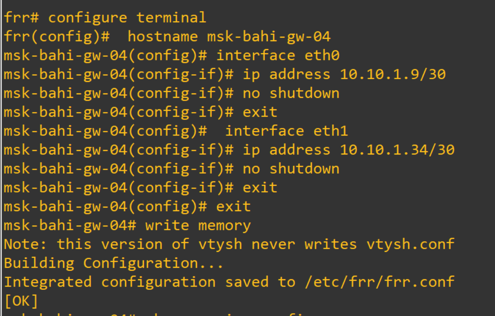{#fig-61 width=70%}

- Настройка IPv4-адресации на узле PC1-bahi

На узле PC1-bahi вручную настроен IPv4-адрес 10.10.1.98/27 с указанием шлюза по умолчанию 10.10.1.97. Конфигурация сохранена, после чего выполнена проверка параметров сетевого интерфейса командой `show ip`, подтвердившая корректность заданных значений ([рис. @fig-62]).

{#fig-62 width=70%}

- Настройка IPv4-адресации на узле PC2-bahi

На узле PC2-bahi задан IPv4-адрес 10.10.1.66/28 и шлюз по умолчанию 10.10.1.65. После сохранения конфигурации выполнен просмотр текущих сетевых параметров командой `show ip`, что подтверждает корректную настройку адресации узла ([рис. @fig-63]).

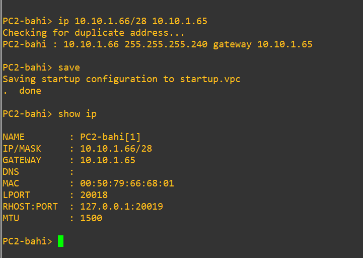{#fig-63 width=70%}

- Включение IPv6 и настройка интерфейсов на маршрутизаторе msk-bahi-gw-01

На маршрутизаторе msk-bahi-gw-01 включена пересылка IPv6-пакетов командой `ipv6 forwarding`. На интерфейсе eth0 настроен IPv6-адрес 2001:db8:1:1::1/64, включена рассылка Router Advertisement и задан IPv6-префикс 2001:db8:1:1::/64. На интерфейсе eth1 назначен IPv6-адрес 2001:db8:1:2::1/64. Конфигурация сохранена и подтверждена выводом текущих настроек ([рис. @fig-64]).

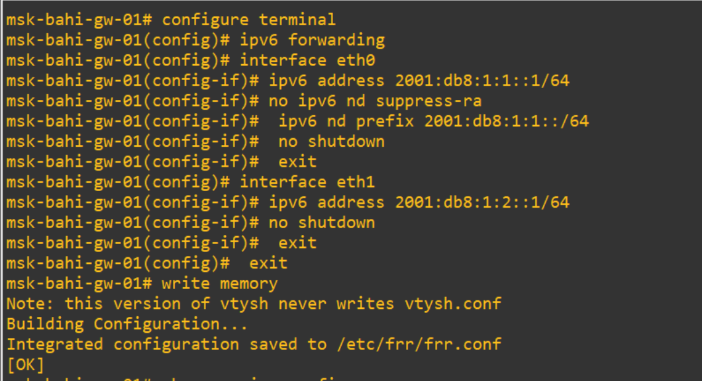{#fig-64 width=70%}

- Настройка IPv6-адресации на маршрутизаторе msk-bahi-gw-02

На маршрутизаторе msk-bahi-gw-02 активирована поддержка IPv6. Интерфейсу eth0 присвоен адрес 2001:db8:1:6::1/64, интерфейсу eth1 — адрес 2001:db8:1:4::2/64, интерфейсу eth2 — адрес 2001:db8:1:5::2/64. Все интерфейсы переведены в рабочее состояние. Конфигурация сохранена и проверена командой `show running-config` ([рис. @fig-65]).

{#fig-65 width=70%}

- Настройка IPv6-адресации на маршрутизаторе msk-bahi-gw-03

На маршрутизаторе msk-bahi-gw-03 включена маршрутизация IPv6. На интерфейсе eth0 настроен IPv6-адрес 2001:db8:1:2::2/64, а на интерфейсе eth1 — адрес 2001:db8:1:4::1/64. Интерфейсы активированы, конфигурация сохранена и подтверждена выводом текущих параметров ([рис. @fig-66]).

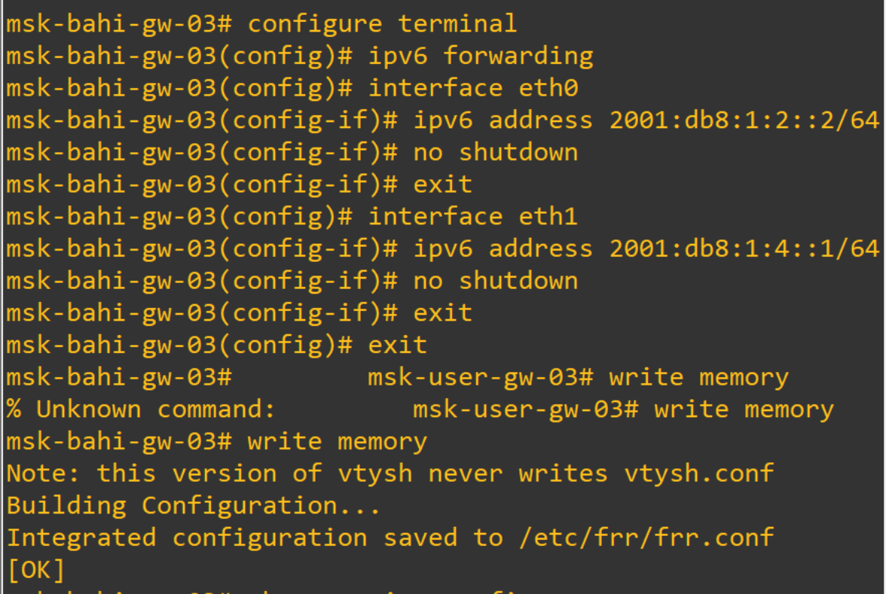{#fig-66 width=70%}

- Настройка IPv6-адресации на маршрутизаторе msk-bahi-gw-04

На маршрутизаторе msk-bahi-gw-04 выполнено включение IPv6 forwarding и назначение IPv6-адресов. Интерфейсу eth0 присвоен адрес 2001:db8:1:3::1/64, интерфейсу eth1 — адрес 2001:db8:1:5::1/64. После активации интерфейсов конфигурация сохранена и проверена ([рис. @fig-67]).

{#fig-67 width=70%}

- Назначение IPv6-адреса на узле PC1-bahi

На узле PC1-bahi вручную задан глобальный IPv6-адрес 2001:db8:1:1::a/64. Конфигурация сохранена, после чего выполнена проверка параметров командой `show ipv6`, подтвердившая наличие link-local и global IPv6-адресов ([рис. @fig-68]).

{#fig-68 width=70%}

- Назначение IPv6-адреса на узле PC2-bahi

На узле PC2-bahi выполнена настройка IPv6-адреса 2001:db8:1:6::a/64. После сохранения конфигурации произведён вывод текущих IPv6-параметров, подтверждающий корректное назначение адреса и формирование link-local адреса ([рис. @fig-69]).

{#fig-69 width=70%}

- Настройка и проверка RIP v2 на маршрутизаторе msk-bahi-gw-01

На маршрутизаторе msk-bahi-gw-01 выполнена настройка динамической маршрутизации по протоколу RIP версии 2. В процесс RIP добавлены интерфейсы eth0, eth1 и eth2. После сохранения конфигурации выполнена проверка таблицы маршрутизации, в которой зафиксировано получение маршрутов 10.10.1.16/30 и 10.10.1.64/28 с указанием следующего узла 10.10.1.6 и соответствующих метрик. Состояние RIP подтверждено выводом параметров протокола и источника маршрутной информации ([рис. @fig-70]).

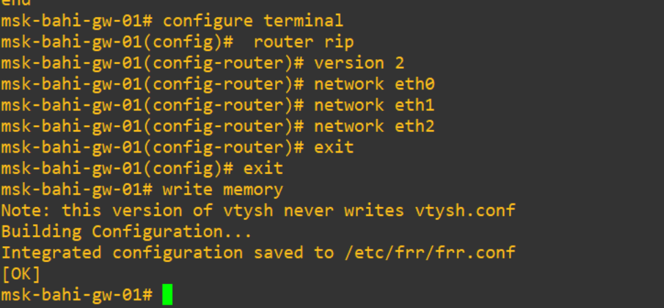{#fig-70 width=70%}

- Настройка и проверка RIP v2 на маршрутизаторе msk-bahi-gw-02

На маршрутизаторе msk-bahi-gw-02 настроен протокол RIP версии 2 с включением интерфейсов eth0, eth1 и eth2. После применения конфигурации в таблице RIP отображаются удалённые сети 10.10.1.4/30 и 10.10.1.96/27, полученные от маршрутизатора с адресом 10.10.1.17. Вывод состояния RIP подтверждает корректный обмен маршрутной информацией и работу протокола на всех задействованных интерфейсах ([рис. @fig-71]).

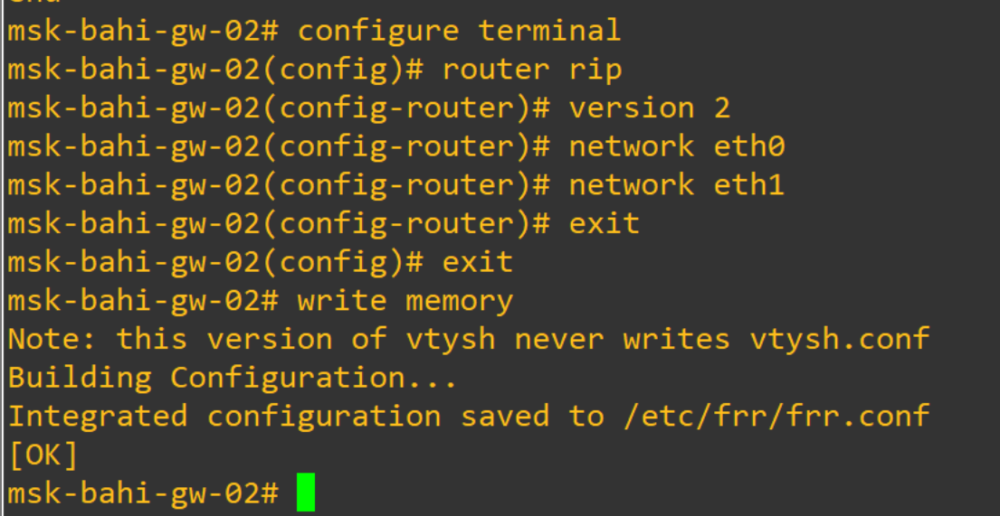{#fig-71 width=70%}

- Настройка и проверка RIP v2 на маршрутизаторе msk-bahi-gw-03

На маршрутизаторе msk-bahi-gw-03 выполнена настройка RIP версии 2 с добавлением интерфейсов eth0, eth1 и eth2. В таблице маршрутизации зафиксировано получение маршрутов к сетям 10.10.1.64/28 и 10.10.1.96/27 через соседние маршрутизаторы 10.10.1.18 и 10.10.1.5. Состояние RIP подтверждает регулярную рассылку обновлений и наличие двух источников маршрутной информации ([рис. @fig-72]).

{#fig-72 width=70%}

- Настройка и проверка RIP v2 на маршрутизаторе msk-bahi-gw-04

На маршрутизаторе msk-bahi-gw-04 настроен протокол RIP версии 2 с участием интерфейсов eth0 и eth1. В таблице RIP отображаются только непосредственно подключённые сети 10.10.1.8/30 и 10.10.1.32/30, что соответствует текущему состоянию маршрутизатора. Вывод параметров протокола подтверждает активную работу RIP и корректную конфигурацию версий отправки и приёма обновлений ([рис. @fig-73]).

{#fig-73 width=70%}

- Проверка IPv4-связности и пути следования пакетов между PC1-bahi и PC2-bahi

С узла PC1-bahi выполнена проверка связности с узлом PC2-bahi командой `ping 10.10.1.66`. Получены ответы на все эхо-запросы без потерь пакетов, что подтверждает корректную маршрутизацию IPv4 между конечными узлами. Для определения пути следования пакетов выполнена команда `trace 10.10.1.66 -P 6`, в результате которой зафиксировано прохождение трафика через узлы 10.10.1.97, 10.10.1.6 и 10.10.1.18 с последующим достижением адреса назначения 10.10.1.66 ([рис. @fig-74]).

{#fig-74 width=70%}

- Анализ таблицы маршрутизации RIP на маршрутизаторе msk-bahi-gw-01

На маршрутизаторе msk-bahi-gw-01 выполнен анализ состояния протокола RIP командой `show ip rip`. В таблице отображаются непосредственно подключённые сети 10.10.1.4/30 и 10.10.1.96/27, а также динамически полученные маршруты 10.10.1.16/30, 10.10.1.32/30 и 10.10.1.64/28 с указанием следующего узла 10.10.1.6 и соответствующих метрик. Наличие данных записей подтверждает корректный обмен маршрутной информацией по протоколу RIP и согласованность таблицы маршрутизации с результатами трассировки ([рис. @fig-75]).

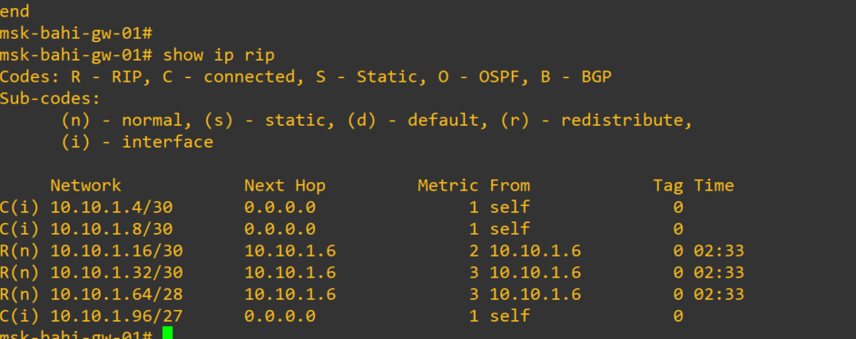{#fig-75 width=70%}

- Настройка RIPng на маршрутизаторе msk-bahi-gw-01

На маршрутизаторе msk-bahi-gw-01 выполнена настройка динамической маршрутизации IPv6 с использованием протокола RIPng. В процесс RIPng добавлены интерфейсы eth0, eth1 и eth2, что обеспечивает участие всех IPv6-сегментов, подключённых к маршрутизатору, в обмене маршрутной информацией. После завершения конфигурирования параметры сохранены в постоянную память ([рис. @fig-76]).

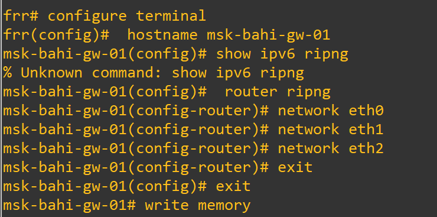{#fig-76 width=70%}

- Настройка RIPng на маршрутизаторе msk-bahi-gw-02

На маршрутизаторе msk-bahi-gw-02 активирован протокол RIPng для поддержки динамической маршрутизации IPv6. В конфигурацию RIPng включены интерфейсы eth0 и eth1, через которые осуществляется обмен маршрутной информацией с соседними маршрутизаторами. Конфигурация сохранена командой `write memory`, что подтверждает завершение этапа настройки ([рис. @fig-77]).

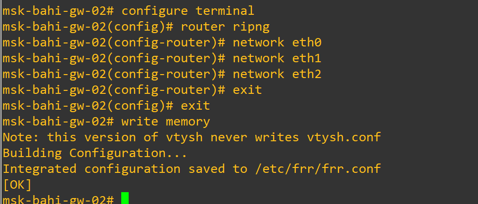{#fig-77 width=70%}

- Настройка RIPng на маршрутизаторе msk-bahi-gw-03

На маршрутизаторе msk-bahi-gw-03 выполнено включение RIPng с добавлением интерфейсов eth0, eth1 и eth2. Данная конфигурация обеспечивает распространение маршрутов IPv6 между всеми подключёнными сегментами сети. После применения настроек конфигурация сохранена, что фиксирует корректную инициализацию протокола RIPng на маршрутизаторе ([рис. @fig-78]).

{#fig-78 width=70%}

- Завершение настройки RIPng на маршрутизаторе msk-bahi-gw-04

На маршрутизаторе msk-bahi-gw-04 выполнено включение протокола динамической маршрутизации IPv6 RIPng. В процесс RIPng добавлены интерфейсы eth0 и eth1, что обеспечивает участие соответствующих IPv6-сегментов в обмене маршрутной информацией. После завершения конфигурирования настройки сохранены в постоянную память командой `write memory` ([рис. @fig-79]).

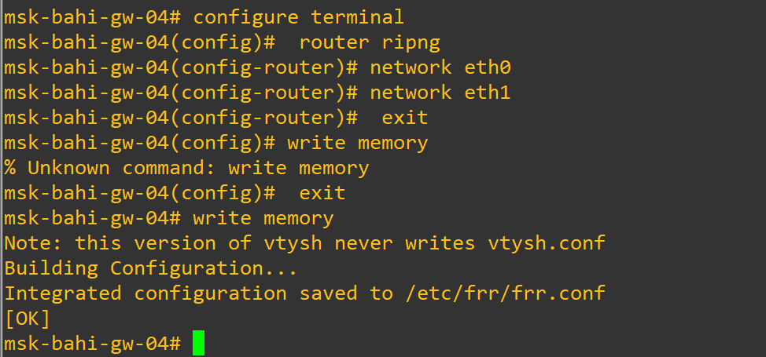{#fig-79 width=70%}

- Проверка IPv6-связности и трассировка маршрута с узла PC1-bahi

С узла PC1-bahi выполнена проверка связности IPv6 с узлом PC2-bahi командой `ping 2001:db8:1:6::a`. Эхо-ответы не получены, что указывает на отсутствие сквозной IPv6-связности на момент проверки. Для анализа пути следования пакетов выполнена команда `trace 2001:db8:1:6::a`, в результате которой зафиксировано прохождение пакетов через узлы с адресами 2001:db8:1:1::1, 2001:db8:1:2::2 и 2001:db8:1:4::2, после чего дальнейшая доставка пакетов не была завершена ([рис. @fig-80]).

{#fig-80 width=70%}

- Анализ таблицы маршрутизации RIPng на маршрутизаторе msk-bahi-gw-01

На маршрутизаторе msk-bahi-gw-01 выполнен анализ таблицы маршрутизации RIPng с помощью команды `show ipv6 ripng`. В таблице присутствуют непосредственно подключённые сети 2001:db8:1:1::/64 и 2001:db8:1:2::/64, а также динамически полученные маршруты к сетям 2001:db8:1:4::/64 и 2001:db8:1:6::/64 через link-local адрес следующего узла fe80::e7f:63ff:feb4:0 по интерфейсу eth1. Данные записи подтверждают корректное распространение IPv6-маршрутов по протоколу RIPng ([рис. @fig-81]).

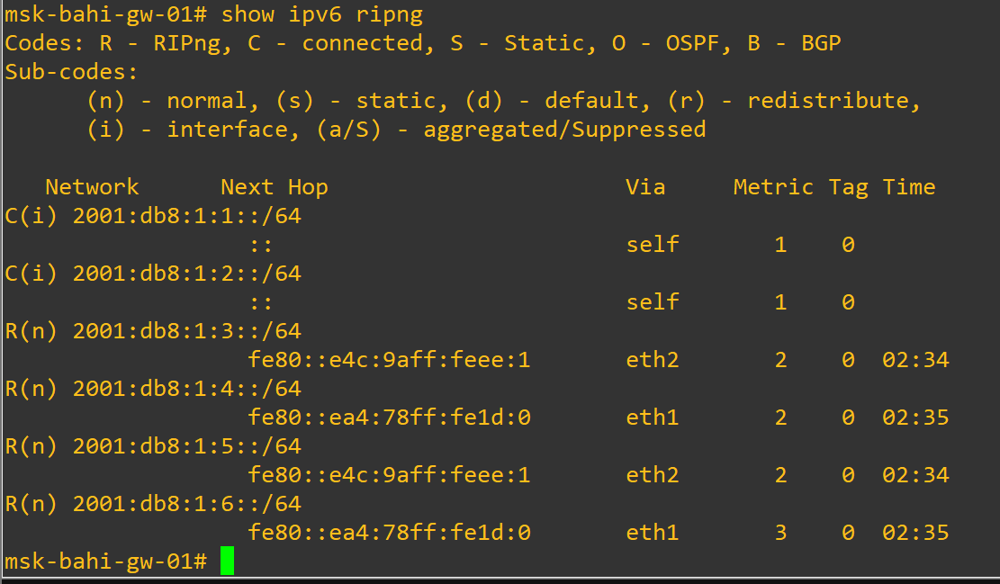{#fig-81 width=70%}

- Настройка OSPFv2 на маршрутизаторе msk-bahi-gw-01

На маршрутизаторе msk-bahi-gw-01 выполнена настройка динамической маршрутизации IPv4 по протоколу OSPF. В область 0.0.0.0 добавлены сети 10.10.1.96/27 и 10.10.1.4/30. После завершения конфигурирования параметры сохранены в постоянную память командой `write memory` ([рис. @fig-82]).

{#fig-82 width=70%}

- Настройка OSPFv2 на маршрутизаторе msk-bahi-gw-02

На маршрутизаторе msk-bahi-gw-02 выполнена настройка протокола OSPF с включением сетей 10.10.1.64/28, 10.10.1.16/30 и 10.10.1.32/30 в область 0.0.0.0. Конфигурация сохранена, что завершает этап инициализации OSPF на данном маршрутизаторе ([рис. @fig-83]).

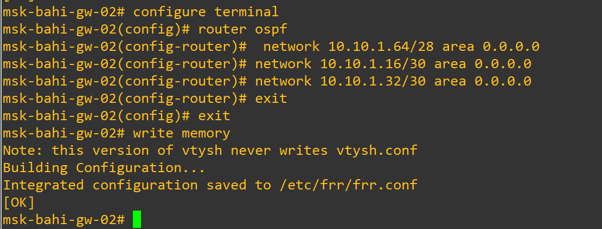{#fig-83 width=70%}

- Настройка OSPFv2 на маршрутизаторе msk-bahi-gw-03

На маршрутизаторе msk-bahi-gw-03 настроен протокол OSPF с добавлением сетей 10.10.1.4/30 и 10.10.1.16/30 в магистральную область 0.0.0.0. После применения конфигурации параметры сохранены в постоянную память ([рис. @fig-84]).

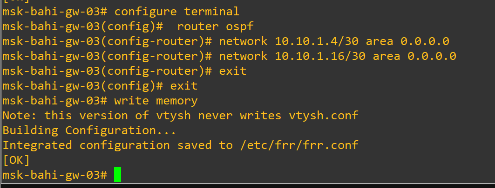{#fig-84 width=70%}

- Настройка OSPFv2 на маршрутизаторе msk-bahi-gw-04

На маршрутизаторе msk-bahi-gw-04 выполнена настройка OSPF с включением сетей 10.10.1.8/30 и 10.10.1.32/30 в область 0.0.0.0. Конфигурация сохранена, что завершает настройку OSPF на всех маршрутизаторах топологии ([рис. @fig-85]).

{#fig-85 width=70%}

- Проверка IPv4-связности и трассировка маршрута при работе OSPF

С узла PC1-bahi выполнена проверка связности с узлом PC2-bahi командой `ping 10.10.1.66`. Эхо-ответы не получены, что указывает на отсутствие сквозной IPv4-связности на момент проверки. Команда `trace 10.10.1.66 -P 6` показала прохождение пакетов через маршрутизаторы с адресами 10.10.1.97, 10.10.1.6 и 10.10.1.18, после чего доставка пакетов не была завершена ([рис. @fig-86]).

{#fig-86 width=70%}

- Анализ соседства и таблицы маршрутизации OSPF на msk-bahi-gw-01

На маршрутизаторе msk-bahi-gw-01 выполнена проверка состояния OSPF. В таблице соседей зафиксировано установленное соседство с маршрутизатором с идентификатором 10.10.1.17 в состоянии Full/Backup. Таблица маршрутизации OSPF содержит непосредственно подключённые сети 10.10.1.4/30 и 10.10.1.96/27, а также сети 10.10.1.16/30, 10.10.1.32/30 и 10.10.1.64/28, полученные через следующий узел 10.10.1.6. Данные подтверждают корректный обмен маршрутной информацией по протоколу OSPF ([рис. @fig-87]).

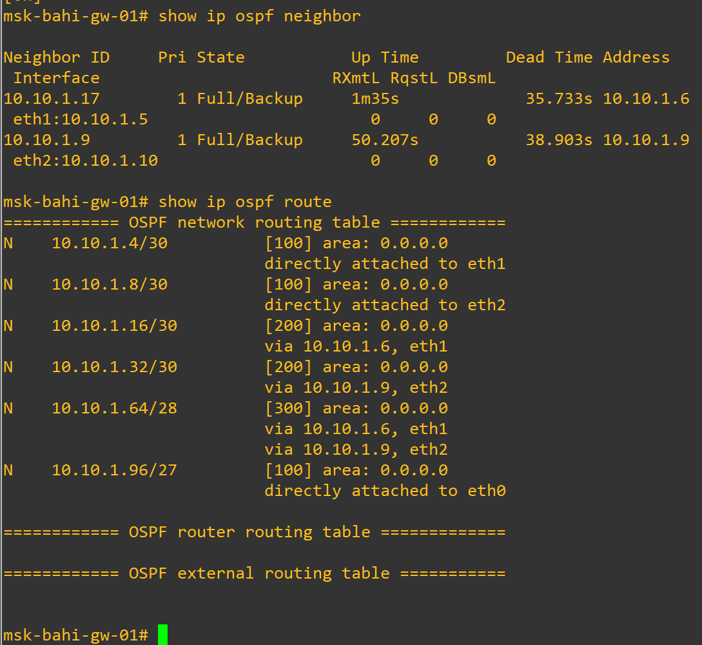{#fig-87 width=70%}

- Настройка OSPFv3 на маршрутизаторе msk-bahi-gw-01

На маршрутизаторе msk-bahi-gw-01 выполнена настройка динамической маршрутизации IPv6 по протоколу OSPFv3. Задан идентификатор маршрутизатора `1.1.1.1`, после чего на интерфейсах eth0 и eth1 включено участие в области OSPFv3 с номером 0. Конфигурация сохранена в постоянную память командой `write memory` ([рис. @fig-88]).

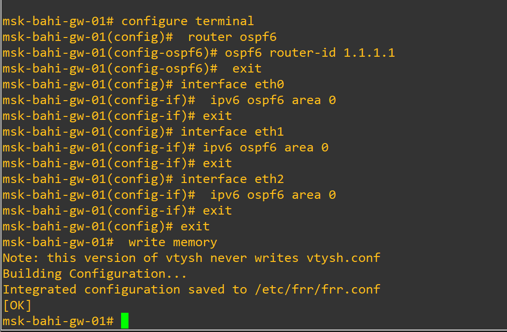{#fig-88 width=70%}

- Настройка OSPFv3 на маршрутизаторе msk-bahi-gw-02

На маршрутизаторе msk-bahi-gw-02 выполнено включение протокола OSPFv3 с назначением идентификатора маршрутизатора `2.2.2.2`. Интерфейсы eth0 и eth1 добавлены в область OSPFv3 0. В процессе конфигурирования зафиксировано сообщение об ошибке при вводе команды сохранения конфигурации из режима конфигурирования, после чего настройка была продолжена ([рис. @fig-89]).

{#fig-89 width=70%}

- Настройка OSPFv3 на маршрутизаторе msk-bahi-gw-03

На маршрутизаторе msk-bahi-gw-03 настроен протокол OSPFv3 с идентификатором маршрутизатора `3.3.3.3`. Интерфейсы eth0 и eth1 подключены к области 0, что обеспечивает участие маршрутизатора в обмене IPv6-маршрутами. Конфигурация успешно сохранена ([рис. @fig-90]).

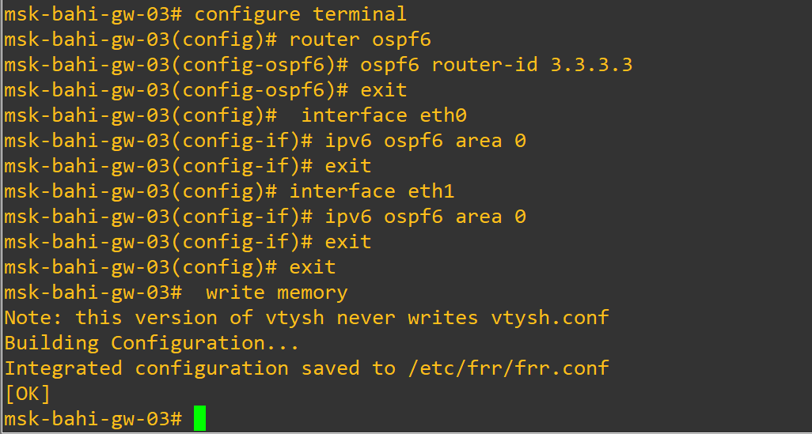{#fig-90 width=70%}

- Настройка OSPFv3 на маршрутизаторе msk-bahi-gw-04

На маршрутизаторе msk-bahi-gw-04 выполнена настройка OSPFv3 с назначением router-id `4.4.4.4`. Интерфейсы eth0 и eth1 включены в область OSPFv3 0. После завершения конфигурирования параметры сохранены в постоянную память ([рис. @fig-91]).

{#fig-91 width=70%}

- Проверка IPv6-связности и трассировка маршрута при использовании OSPFv3

С узла PC1-bahi выполнена проверка IPv6-связности с узлом PC2-bahi командой `ping 2001:db8:1:6::a`. Эхо-ответы не получены. Для анализа пути следования пакетов выполнена команда `trace 2001:db8:1:6::a`, в результате которой зафиксировано прохождение пакетов через маршрутизаторы с адресами 2001:db8:1:1::1, 2001:db8:1:2::2 и 2001:db8:1:4::2, после чего дальнейшая доставка пакетов не была завершена ([рис. @fig-92]).

{#fig-92 width=70%}

- Анализ соседства и таблицы маршрутизации OSPFv3 на msk-bahi-gw-01

На маршрутизаторе msk-bahi-gw-01 выполнена проверка состояния OSPFv3. В таблице соседей зафиксировано установленное соседство с маршрутизатором, имеющим идентификатор `3.3.3.3`, в состоянии Full/BDR. Таблица маршрутизации OSPFv3 содержит IPv6-префиксы 2001:db8:1:1::/64 и 2001:db8:1:2::/64 как непосредственно подключённые, а также маршруты к сетям 2001:db8:1:4::/64 и 2001:db8:1:6::/64, полученные через link-local адрес следующего узла по интерфейсу eth1. Данные подтверждают корректное формирование базы маршрутов OSPFv3 ([рис. @fig-93]).

{#fig-93 width=70%}

## Выводы

В ходе выполнения лабораторной работы была смоделирована сеть с поддержкой IPv4 и IPv6 в среде GNS3 и выполнена настройка адресации в соответствии с заданной топологией и таблицами адресов. Были настроены и исследованы протоколы динамической маршрутизации RIP/RIPng и OSPFv2/OSPFv3, а также проверены таблицы маршрутизации, соседство и пути прохождения пакетов. Экспериментально подтверждена работа механизмов динамической маршрутизации и их реакция на изменение состояния интерфейсов, а также особенности маршрутизации в сетях IPv4 и IPv6. Полученные результаты соответствуют поставленной цели работы и требованиям задания.